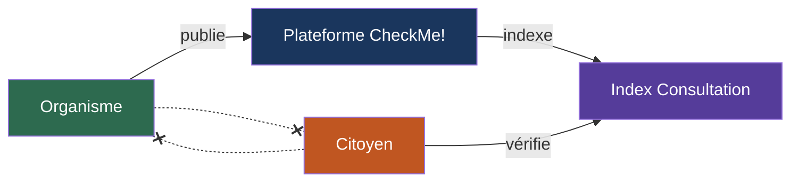
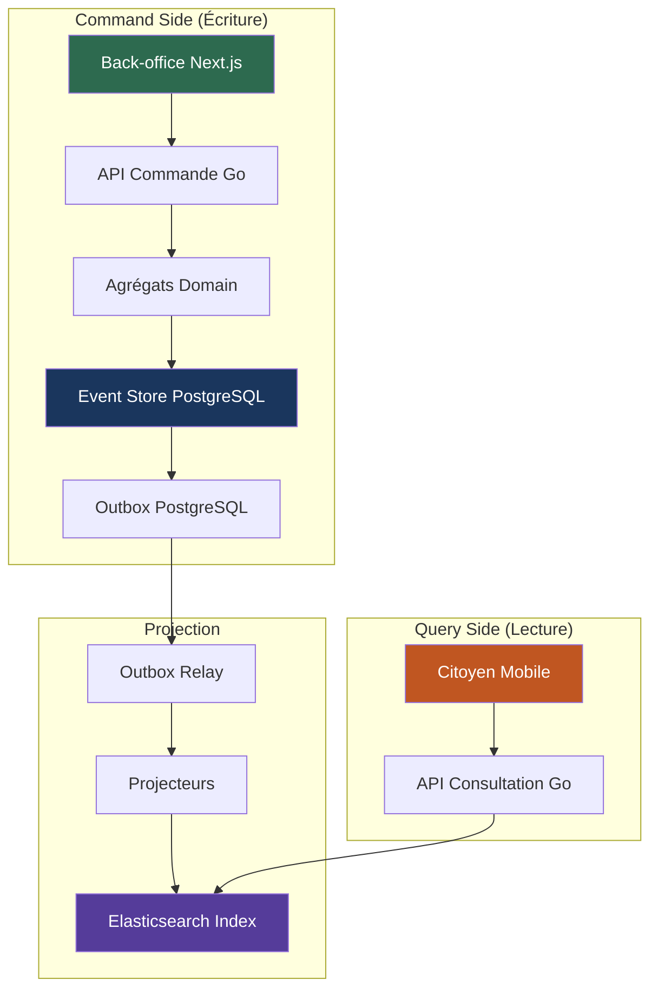
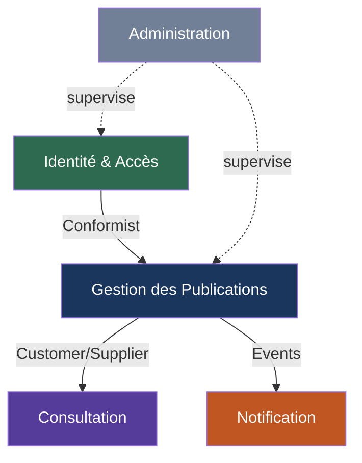
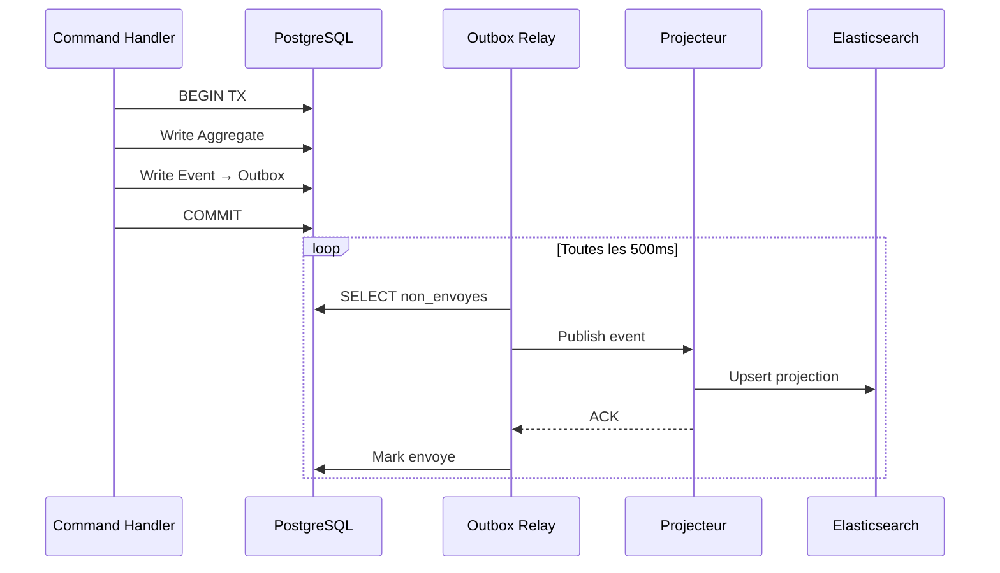
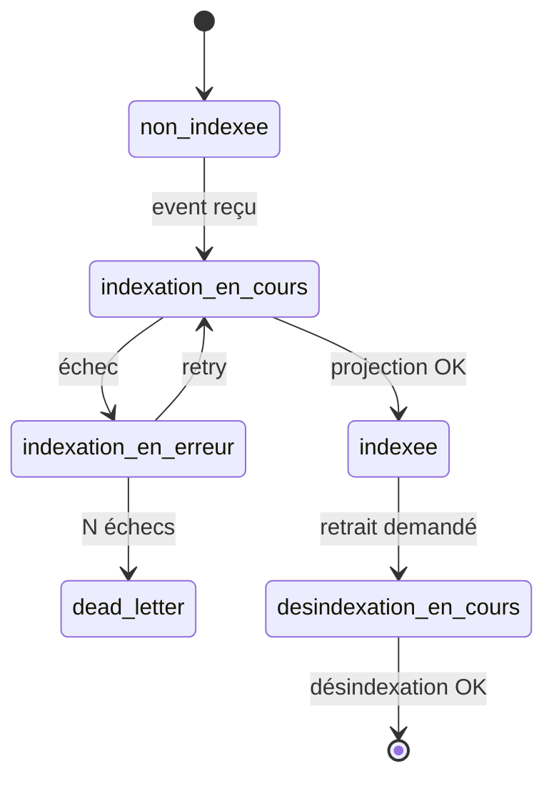
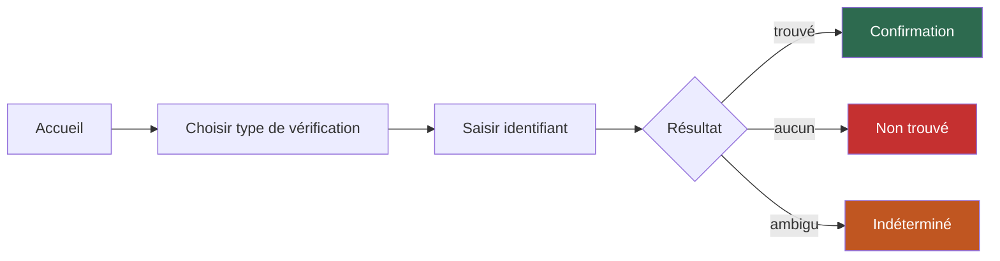
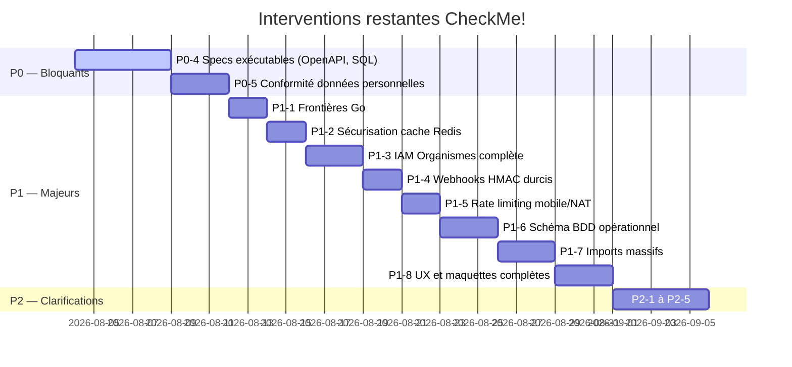

> [!danger] Document sous réexamen intégral — 2026-09-06
> Le porteur a décidé de **reprendre la conception depuis l'intention**. Aucun énoncé de ce document ne vaut engagement, y compris ceux qu'il présente comme tranchés, canonisés ou terminés. Il est conservé comme **état de travail antérieur**, pas comme référence opposable — `DEC-C-016` au [[checkme/90-pilotage/Journal des décisions|Journal des décisions]].

> [!warning] Trois liens `file://` de ce document sont morts
> Les tableaux du point 7.2 et le point 9.3 pointent vers `/home/oswiser9/Incubo/CheckMe! copie/files/`, un chemin qui n'existe plus. Deux des fichiers visés — les maquettes citoyen — ont de surcroît été supprimés le 2026-09-06 (`DEC-C-019`). Ces liens sont laissés en l'état : les réécrire modifierait le corps d'un document d'analyse daté.

# Analyse approfondie du projet CheckMe!

> **Date** : 2026-08-04  
> **Portée** : Analyse exhaustive de l'ensemble de la documentation — 14 fichiers historiques (`files/`) + 4 documents corrigés (`documents_corriges/`) + historique d'intervention  
> **Objectif** : Comprendre le projet dans ses moindres recoins, évaluer sa maturité, identifier les forces, faiblesses, risques et zones d'ombre

---

## 1. Qu'est-ce que CheckMe! ?

### 1.1 Vision fondamentale

CheckMe! est une **plateforme numérique de vérification civique** conçue pour le Burkina Faso. Elle permet à un citoyen de vérifier sa présence sur des listes officielles — listes électorales, résultats d'examens, recensements, allocations — **sans créer de compte et sans laisser de trace**.

Le modèle repose sur une **asymétrie intentionnelle** :



- L'**organisme** (CENI, université, ministère) publie des données structurées
- La **plateforme** indexe et rend ces données vérifiables
- Le **citoyen** interroge l'index pour confirmer sa présence
- **L'organisme ne sait pas qui cherche. Le citoyen ne parcourt pas les listes.**

### 1.2 Principes fondateurs non négociables

| Principe | Implication technique |
|---|---|
| **Zéro tracking citoyen** | Pas de compte, pas de session, pas de cookie identifiant, pas de journalisation des recherches |
| **Données vérifiables, non consultables** | Le citoyen ne peut pas « parcourir » une liste — il ne peut que confirmer sa présence |
| **Séparation écriture/lecture** | CQRS strict : le back-office (commande) et le front citoyen (consultation) n'ont aucun modèle partagé |
| **L'organisme reste maître** | Publication et retrait à volonté, la plateforme n'altère jamais les données |
| **Frugalité réseau** | Conçu pour les réseaux mobiles burkinabè (2G/3G) |

### 1.3 Langage ubiquitaire (Ubiquitous Language)

| Terme | Définition |
|---|---|
| **Publication** | Ensemble structuré de données publié par un organisme (ex: « liste électorale Ouaga 2024 ») |
| **Situation** | Une entrée individuelle dans une publication (ex: « Jean Ouédraogo, CNIB 12345 ») |
| **SituationCherchable** | Projection normalisée d'une Situation, optimisée pour la recherche |
| **Consultation** | Modèle de lecture (read-side du CQRS) exposé aux citoyens |
| **Organisme** | Entité qui publie (CENI, universités, ministères) |
| **Agent** | Opérateur humain au sein d'un organisme |
| **Citoyen** | Utilisateur final, anonyme, qui vérifie sa présence |
| **Recherche** | Acte de vérification par le citoyen |

---

## 2. Architecture et choix techniques

### 2.1 Stack technique cible

| Couche | Technologie | Justification |
|---|---|---|
| Backend | **Go** | Performance, typage fort, concurrence native |
| Frontend | **Next.js** (React) | SSR pour la frugalité réseau, écosystème riche |
| Base écriture | **PostgreSQL** | Event store, outbox, données relationnelles |
| Base lecture | **Elasticsearch** | Recherche indexée performante |
| Cache | **Redis** | Sessions back-office, cache de projections |
| Transport événements | **Outbox Pattern** (PostgreSQL) | Fiabilité sans broker externe au MVP |

### 2.2 Architecture CQRS + Event Sourcing



**Source de vérité** : Les événements métier dans l'event store PostgreSQL.  
**Modèle de lecture** : Projections dénormalisées dans Elasticsearch, construites par consommation des événements.  
**Livraison** : At-least-once via outbox relay → les projecteurs DOIVENT être idempotents.

### 2.3 Bounded Contexts (DDD Stratégique)



| Bounded Context | Responsabilité | Maturité documentaire |
|---|---|---|
| **Identité & Accès** | Organismes, agents, auth, rôles | Moyenne — IAM incomplète (P1-3) |
| **Gestion des Publications** | Cycle de vie complet des publications et situations | Bonne — agrégats et events bien définis |
| **Consultation** | Projection read-side, recherche citoyenne | Bonne — durcie par P0-2 et P0-3 |
| **Notification** | Webhooks aux organismes | Faible — peu détaillé |
| **Administration** | Super-admin, monitoring | Faible — presque absent |

### 2.4 Agrégats et événements clés

**Agrégat `Publication`** (BC Gestion des Publications) — agrégat central :

| État | Transitions possibles | Événement émis |
|---|---|---|
| `brouillon` | → `en_validation` | `PublicationSoumise` |
| `en_validation` | → `publiee` / → `brouillon` | `PublicationPubliee` / `PublicationRefusee` |
| `publiee` | → `retiree` / → `archivee` | `PublicationRetiree` / `PublicationArchivee` |
| `retiree` | → `publiee` / → `archivee` | `PublicationRepubliee` / `PublicationArchivee` |

**Agrégat `Organisme`** (BC Identité & Accès) :
- Événements : `OrganismeCree`, `AgentInvite`, `AgentActive`, `RoleAttribue`

### 2.5 Structure Go cible

```
cmd/                → points d'entrée (serveur API, workers)
internal/
  domain/           → agrégats, events, value objects
  application/      → use cases, command/query handlers
  infra/            → repositories, projections, adapters
  api/              → handlers HTTP, middlewares
pkg/                → bibliothèques partagées
```

Architecture hexagonale (ports & adapters) avec séparation stricte command/query handlers.

---

## 3. Stratégie de recherche (P0-2 — corrigé)

### 3.1 Classification des identifiants

> [!IMPORTANT]
> La distinction identifiant fort / faible est la clé de voûte de la sécurité anti-fuite de CheckMe!.

| Type | Exemples | Mode de recherche | Risque si flou |
|---|---|---|---|
| **Identifiant exact (fort)** | CNIB, récépissé, matricule, n° candidat, n° dossier | Égalité stricte UNIQUEMENT | Faux positifs sur données civiques |
| **Identifiant faible** | Nom, prénom, date de naissance | Jamais seul — nécessite floue_contrôlée + désambiguïsation | Énumération de personnes |

### 3.2 Modes de recherche

| Mode | Comportement | Usage |
|---|---|---|
| `exact` | Correspondance stricte sur identifiant fort | **Défaut du MVP** |
| `floue_controlee` | Identifiant faible + critères de désambiguïsation obligatoires | Uniquement si le modèle l'autorise explicitement |

### 3.3 Contrat de résultat

| Statut | Signification | Données retournées |
|---|---|---|
| `trouve` | Correspondance unique et certaine | La situation complète |
| `ambigu` | Plusieurs correspondances possibles | **RIEN** — ni liste, ni nombre |
| `aucun` | Pas de correspondance | Message explicite |

> [!CAUTION]
> **Jamais** de résultat « probable », de suggestion, d'autocomplétion, ou de révélation du nombre de résultats ambigus. C'est une règle de sécurité anti-énumération.

### 3.4 Normalisation

Avant stockage ET recherche :
- Normalisation Unicode (NFC)
- Normalisation de casse (minuscules)
- Suppression des espaces superflus
- Normalisation des tirets et apostrophes
- Règles spécifiques pour les noms burkinabè (particules, accents)

---

## 4. Fiabilité de la projection (P0-3 — corrigé)

### 4.1 Outbox Pattern



### 4.2 Statuts d'indexation



> [!IMPORTANT]
> **Règle cardinale** : une publication n'est JAMAIS consultable par un citoyen si son statut d'indexation n'est pas `indexee`.

### 4.3 Garanties

| Garantie | Mécanisme |
|---|---|
| **Livraison** | At-least-once (outbox relay) |
| **Idempotence** | Déduplication par `(event_id, event_type)` |
| **Cohérence** | Garde : un retrait back-office n'est « terminé » que si la projection est mise à jour |
| **Résilience** | Retry avec backoff exponentiel → dead-letter après N échecs |
| **Reconstruction** | Rebuild par génération (nouvel index, projection complète, bascule d'alias) |

---

## 5. Sécurité

### 5.1 Ce qui est spécifié

| Aspect | Détail |
|---|---|
| Authentification | JWT pour agents back-office, aucune auth citoyen |
| Autorisation | RBAC par organisme |
| Chiffrement | At-rest (PostgreSQL) + in-transit (TLS) |
| Webhooks | HMAC-SHA256 |
| Rate limiting | Par IP pour API publique |
| CORS / CSP | Configuration stricte |
| Audit trail | Journalisation actions back-office |

### 5.2 Ce qui manque (identifié par l'audit)

| Lacune | Priorité | Risque |
|---|---|---|
| IAM incomplète (MFA, politique mdp, sessions) | P1-3 | Compromission de comptes organisme |
| Webhooks sans timestamp/nonce/anti-rejeu | P1-4 | Replay attacks |
| Rate limiting ignorant le NAT mobile | P1-5 | Blocage de citoyens légitimes OU abus non détecté |
| Cache Redis peut fuiter des données personnelles | P1-2 | Exposition de situations via cache |
| Pas de rotation des secrets | Non classé | Compromission prolongée si fuite |
| Pas de pentesting planifié | Non classé | Vulnérabilités non découvertes |

---

## 6. Base de données

### 6.1 Schéma principal (PostgreSQL)

| Table | Rôle | Observations |
|---|---|---|
| `organismes` | Entités qui publient | OK |
| `agents` | Opérateurs des organismes | OK mais IAM incomplète |
| `publications` | Cycle de vie des publications | OK |
| `situations` | Entrées individuelles (JSONB) | Pas de validation JSONB |
| `evenements` | Event store | Pas de partitionnement |
| `outbox` | Queue de livraison | Pas de dead-letter modélisé |

### 6.2 Lacunes critiques

- **Pas de table d'idempotence** pour les projecteurs (requis par P0-3)
- **JSONB sans contraintes** sur `situations` — risque d'incohérence
- **Pas de partitionnement** pour `evenements` et `situations` (tables à forte croissance)
- **Pas de migrations SQL exécutables** — tout est narratif (P0-4)
- **Pas de rétention/purge** définie pour l'event store et l'outbox
- **Pas de versioning** des schémas d'événements (upcasting absent)

---

## 7. UX/UI et maquettes

### 7.1 Parcours citoyen



**Principes** : Mobile-first, frugalité réseau, parcours linéaire sans navigation complexe.

### 7.2 État des maquettes HTML

| Maquette | Couverture | Lacunes |
|---|---|---|
| [checkme_backoffice.html](file:///home/oswiser9/Incubo/CheckMe%21%20copie/files/checkme_backoffice.html) | Liste publications, création, import CSV | Pas de gestion agents, pas de paramètres, pas de détail publication, pas d'états d'erreur |
| [checkme_ecran_citoyen.html](file:///home/oswiser9/Incubo/CheckMe%21%20copie/files/checkme_ecran_citoyen.html) | Accueil, recherche, résultat positif/négatif | Pas d'état « ambigu », pas d'erreur réseau, pas de loading |
| [checkme_ecran_citoyen_v2.html](file:///home/oswiser9/Incubo/CheckMe%21%20copie/files/checkme_ecran_citoyen_v2.html) | Idem v1 avec design amélioré | Mêmes lacunes |

> [!WARNING]
> Aucune maquette ne couvre l'état « ambigu », le mode dégradé réseau, le feedback de rate limiting, ni les états d'erreur système. Ces cas sont critiques pour l'UX réelle.

---

## 8. État d'avancement du projet

### 8.1 Ce qui existe

| Élément | État |
|---|---|
| Vision et principes fondateurs | Canonisé (P0-1 terminé) |
| DDD Stratégique (Bounded Contexts) | Défini |
| DDD Tactique (Agrégats, Events) | Défini |
| Architecture logicielle | Définie |
| Stratégie de recherche | Durcie (P0-2 terminé) |
| Fiabilité de la projection | Durcie (P0-3 terminé) |
| Contrats API | Narratifs seulement |
| Sécurité | Partielle |
| Schéma BDD | Narratif seulement |
| Maquettes HTML | Partielles |
| Audit | Complet et tracé |

### 8.2 Ce qui n'existe PAS encore

| Élément | Impact |
|---|---|
| **Code Go** | Aucune ligne de code backend |
| **Application Next.js** | Aucune ligne de code frontend |
| **OpenAPI / JSON Schema** | Aucun contrat machine-readable |
| **Migrations SQL** | Aucun fichier exécutable |
| **Tests** | Aucune stratégie, aucun test |
| **CI/CD** | Aucun pipeline |
| **Environnements** | Aucune configuration (dev, staging, prod) |
| **Déploiement** | Aucune stratégie d'hébergement |
| **Conformité APDP** | Aucun document de gouvernance des données personnelles |
| **Monitoring** | Aucun choix d'outils (Prometheus, Grafana, etc.) |
| **Documentation API** | Aucune documentation utilisable par un développeur externe |

### 8.3 Roadmap des interventions restantes



---

## 9. Analyse critique — Forces

### 9.1 Vision produit — claire et distinctive

CheckMe! n'est pas un énième CRUD. Le modèle asymétrique (publier → indexer → vérifier) est **original, pertinent pour le contexte burkinabè, et techniquement cohérent**. La décision de ne jamais stocker l'identité du citoyen est un choix éthique fort qui structure toute l'architecture.

### 9.2 DDD — contextes délimités et langage consistant

Les Bounded Contexts sont bien délimités. Les agrégats et événements du BC « Gestion des Publications » sont définis avec un niveau de détail implémentable. Le langage ubiquitaire est consistant à travers les documents.

### 9.3 Démarche d'audit et de correction — traçable

L'auto-audit ([Audit_Complet_CheckMe.md](file:///home/oswiser9/Incubo/CheckMe%21%20copie/files/Audit_Complet_CheckMe.md)) est **honnête, bien priorisé, et traçable**. L'historique d'intervention est tenu de façon systématique : chaque correction est unitaire, documentée, traçable, et n'anticipe pas sur la suivante. C'est une démarche d'ingénierie logicielle professionnelle.

### 9.4 Corrections P0 — niveau quasi implémentable

Les documents P0-2 (recherche) et P0-3 (projection) sont d'un niveau quasi-implémentable. Le P0-2 porte 12 scénarios de test d'acceptation anti-fuite, ce qu'aucun autre document du corpus ne fait.

---

## 10. Analyse critique — Faiblesses et risques

### 10.1 Risques bloquants

> [!CAUTION]
> Ces risques peuvent compromettre le projet s'ils ne sont pas traités.

| # | Risque | Sévérité | Détail |
|---|---|---|---|
| **R1** | **Tout est documentaire, rien n'est exécutable** | Critique | Après 8 documents de conception, 0 ligne de code, 0 migration SQL, 0 OpenAPI. Le risque de « paralysie par analyse » est réel. |
| **R2** | **Conformité APDP absente** | Critique | Le Burkina Faso a une Autorité de Protection des Données Personnelles. Aucun document ne traite la conformité, les droits des personnes, la rétention, le DPO/CIL. Pour un projet qui manipule des CNIB et des données civiques, c'est un risque légal majeur. |
| **R3** | **Souveraineté des données non adressée** | Élevé | Aucune mention de l'hébergement des données. Des données civiques burkinabè doivent-elles résider au Burkina Faso ? Chez quel hébergeur ? Avec quelles garanties ? |
| **R4** | **Performance non évaluée** | Élevé | Aucun sizing, aucun benchmark. Combien de publications ? Combien de situations par publication ? Combien de recherches/seconde ? Le choix Elasticsearch est-il justifié face à PostgreSQL full-text search pour le volume attendu ? |
| **R5** | **Pas de stratégie de test** | Élevé | Pour un système qui manipule des données civiques sensibles, l'absence totale de stratégie de test est préoccupante. |

### 10.2 Risques architecturaux

| # | Risque | Détail |
|---|---|---|
| **R6** | **Event Sourcing sans upcasting** | Les schémas d'événements vont évoluer. Sans stratégie de versioning/upcasting, la migration sera douloureuse. |
| **R7** | **JSONB sans contraintes** | Les `situations` sont stockées en JSONB sans validation de schéma. Des données incohérentes peuvent être indexées. |
| **R8** | **Elasticsearch comme single point of failure** | Si Elasticsearch tombe, aucun citoyen ne peut vérifier quoi que ce soit. Pas de fallback décrit. |
| **R9** | **Imports massifs non spécifiés** | Un organisme peut importer des milliers de situations via CSV. Streaming, erreurs partielles, rollback, reprise ne sont pas définis (P1-7). |
| **R10** | **Cardinalité Publication → Situations illimitée** | Aucune limite sur le nombre de situations par publication. Une publication de 10 millions de lignes est-elle supportée ? |

### 10.3 Risques UX

| # | Risque | Détail |
|---|---|---|
| **R11** | **État « ambigu » non maquetté** | Le résultat `ambigu` est central dans la stratégie anti-fuite (P0-2) mais n'apparaît dans aucune maquette. Le citoyen n'a aucune idée de ce que signifie ce résultat. |
| **R12** | **Mode dégradé réseau absent** | Le projet cible des réseaux 2G/3G mais aucune maquette ne montre un comportement offline-first ou un mode dégradé. |
| **R13** | **Accessibilité non testée** | Pour une plateforme civique destinée à l'ensemble de la population, l'accessibilité (lecteurs d'écran, contraste, taille de texte) n'est pas adressée. |

### 10.4 Zones d'ombre — les sujets que personne n'a mentionnés

> [!NOTE]
> Ces sujets ne sont traités dans aucun document et n'apparaissent dans aucun problème de l'audit.

| Zone d'ombre | Question |
|---|---|
| **Internationalisation** | Le Burkina a ~70 langues. CheckMe! ne sera-t-il qu'en français ? Les interfaces doivent-elles supporter le mooré, le dioula ? |
| **Accessibilité USSD** | De nombreux burkinabè n'ont pas de smartphone. Un accès USSD (vérification par SMS/code court) est-il envisagé ? |
| **Modèle économique** | Qui paie ? L'État ? Les organismes ? Gratuité pour le citoyen — mais qui finance l'infrastructure ? |
| **Gouvernance de la plateforme** | Qui décide quels organismes peuvent publier ? Quel processus d'onboarding ? Quelle vérification de légitimité ? |
| **SLA et disponibilité** | Quel niveau de disponibilité est attendu ? 99.9% ? Quelle tolérance aux pannes ? |
| **Backup et disaster recovery** | Pas de stratégie de backup mentionnée. Pour un event store, c'est critique. |
| **Scalabilité** | Le MVP suffit pour combien d'utilisateurs ? Quand faut-il scaler ? Horizontalement (multiple instances Go) ou verticalement ? |
| **Cycle de vie des données** | Combien de temps une publication reste-t-elle indexée ? Les résultats d'examen de 2024 sont-ils encore consultables en 2030 ? |
| **Fraude organisationnelle** | Que se passe-t-il si un organisme compromis publie de fausses données ? Mécanisme de validation croisée ? |
| **Analytics** | Comment mesurer l'adoption ? Le nombre de recherches ? Sans tracking citoyen, quelles métriques sont possibles ? |

---

## 11. Cohérence inter-documents

### 11.1 Tensions identifiées

| Documents en tension | Problème |
|---|---|
| Document 3 (DDD Tactique) vs Document 5 (API) | Le Document 5 est moins précis que le Document 3 sur les mêmes sujets. Les contrats API ne reflètent pas toute la richesse des agrégats/événements. |
| Document 3 (DDD Tactique) vs Document 7 (BDD) | Le schéma BDD ne modélise pas tous les concepts du DDD Tactique (idempotence, dead-letter, statuts d'indexation). |
| Document 8 (UX) vs Maquettes HTML | Les maquettes ne couvrent pas tous les cas décrits dans le document UX. |
| Document P0-2 (Recherche) vs Document 5 (API) | Le P0-2 définit un contrat de résultat (`trouvé/ambigu/aucun`) qui n'est pas encore reflété dans le Document 5. |
| Document P0-3 (Projection) vs Document 7 (BDD) | Le P0-3 définit des tables (outbox, dead-letter, idempotence) qui n'existent pas dans le schéma du Document 7. |

### 11.2 Verdict de cohérence

La cohérence est **bonne au niveau conceptuel** mais **faible au niveau des détails d'implémentation**. C'est normal pour un projet pré-code, mais l'intervention P0-4 (specs exécutables) devra résoudre ces tensions en créant une source de vérité machine-readable.

---

## 12. Évaluation de maturité

| Dimension | Score | Commentaire |
|---|---|---|
| **Vision produit** | 5 / 5 | Exceptionnelle — claire, éthique, différenciante |
| **Modélisation métier (DDD)** | 4 / 5 | Très bonne — BC, agrégats, events bien définis |
| **Architecture technique** | 4 / 5 | Bonne — CQRS/ES cohérent, stack justifiée |
| **Sécurité** | 3 / 5 | Moyenne — fondations posées mais lacunes IAM, rate limiting |
| **Spécifications exécutables** | 1 / 5 | Absentes — tout est narratif |
| **Implémentation** | 0 / 5 | Inexistante — 0 ligne de code |
| **Tests** | 0 / 5 | Inexistants — aucune stratégie |
| **UX/UI** | 2 / 5 | Insuffisante — maquettes partielles, cas critiques manquants |
| **Conformité légale** | 0 / 5 | Absente — risque majeur |
| **DevOps / Déploiement** | 0 / 5 | Absent — aucune mention |
| **Démarche qualité** | 5 / 5 | Audit conduit, traçabilité tenue, discipline d'intervention constante |

*Échelle de 0 à 5, où 0 signifie « inexistant » et 5 « complet et vérifiable ».*

---

## 13. Recommandations stratégiques

### 13.1 Court terme — Débloquer P0-4 et P0-5

> [!IMPORTANT]
> La prochaine intervention autorisée est **P0-4 — Rendre les specs exécutables**. C'est le point d'inflexion entre documentation et implémentation.

**P0-4 doit produire** :
1. Un fichier **OpenAPI 3.1** complet couvrant toutes les API (publique + back-office + admin)
2. Des **JSON Schemas** pour tous les payloads (événements, requêtes, réponses)
3. Des **migrations SQL** exécutables (DDL) pour PostgreSQL
4. Des **fixtures** de test (données de démo)

**P0-5 doit produire** :
1. Un document de **conformité APDP** (base légale, finalités, durées de rétention, droits des personnes, DPO/CIL)
2. Une **analyse d'impact** (AIPD) simplifiée
3. Des clauses de gouvernance des données dans les contrats organismes

### 13.2 Moyen terme — Sortir du documentaire

Après les P0 :
1. **Initier le code** : Commencer par le domain Go (agrégats, événements, value objects) — c'est le cœur et il est suffisamment spécifié
2. **Tests dès le premier commit** : TDD sur le domain, tests d'intégration sur les repositories
3. **CI dès le premier commit** : Pipeline GitHub Actions / GitLab CI minimal
4. **Maquettes complètes** : Couvrir les états ambigu, erreur réseau, loading, rate limiting

### 13.3 Long terme — Penser au-delà du MVP

1. **Canal USSD** pour les citoyens sans smartphone
2. **Internationalisation** (mooré, dioula au minimum)
3. **Stratégie d'hébergement souverain**
4. **Monitoring et observabilité** (Prometheus + Grafana ou équivalent)
5. **Stratégie de scaling** pour la période électorale (pics de charge massifs)

---

## 14. Synthèse finale

**CheckMe! est un projet de haute qualité conceptuelle qui souffre d'un déséquilibre entre documentation et exécution.**

La vision est forte, éthique, et techniquement cohérente. La démarche DDD est rigoureuse. L'audit et les corrections P0-1 à P0-3 témoignent d'une maturité d'ingénierie rare. Mais après 8 documents de conception et ~140 Ko de spécifications, il n'y a toujours **aucun artefact exécutable** — pas de code, pas de migration, pas d'OpenAPI, pas de test.

Le risque principal n'est pas technique — c'est la **paralysie par analyse**. Le projet est prêt pour passer à l'exécution. P0-4 est le point d'inflexion.

Les deux angles morts les plus préoccupants sont :
1. La **conformité données personnelles** (APDP) — pour un projet civique manipulant des CNIB, c'est un impératif légal
2. L'**accessibilité** au sens large — USSD, langues locales, mode dégradé réseau — pour un projet qui prétend servir l'ensemble des citoyens burkinabè
