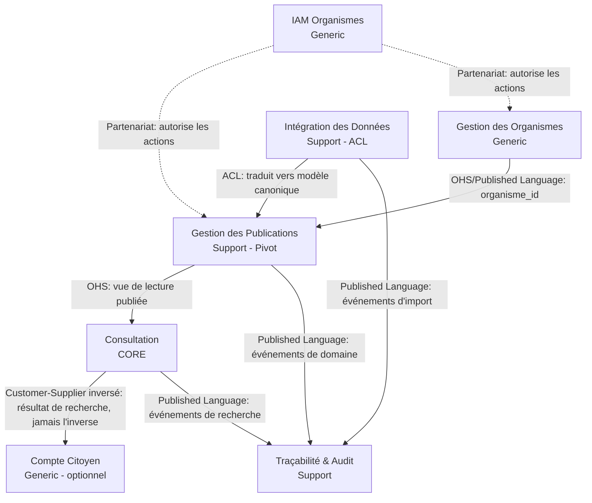

> [!danger] Document sous réexamen intégral — 2026-09-06
> Le porteur a décidé de **reprendre la conception depuis l'intention**. Aucun énoncé de ce document ne vaut engagement, y compris ceux qu'il présente comme tranchés, canonisés ou terminés. Il est conservé comme **état de travail antérieur**, pas comme référence opposable — `DEC-C-016` au [[checkme/90-pilotage/Journal des décisions|Journal des décisions]].

Document 1 — DDD Stratégique

Version : 0.2 (Draft — intègre la décision "compte citoyen facultatif")

Statut : Document de conception — dépend de Document 0 (Vision et Principes Fondateurs)

---

## 0. Cadrage

Ce document applique le Domain-Driven Design stratégique au projet **checkMe**. Il ne modélise pas encore les agrégats, entités ou objets-valeurs (DDD tactique) — cela viendra dans un document ultérieur, une fois les frontières métier stabilisées.

Toute décision ici découle directement de Document 0. En particulier :

- **6.1 Neutralité** → aucun contexte ne doit contenir de logique de décision administrative.
- **6.4 Publication = unité principale** → c'est l'agrégat racine implicite autour duquel tout s'organise.
- **6.5 Consultation contextualisée** → la recherche n'est jamais globale ; elle appartient à un contexte dédié, pas mêlée à la gestion des publications.
- **6.6 / 6.7 Identifiants définis par l'organisme, avec niveau de confiance** → logique de matching à isoler, car elle a ses propres règles et sa propre évolution.
- **6.9 Indépendance du mode d'intégration** → l'ingestion de données doit être un contexte à part, avec une couche anti-corruption vers le modèle canonique.
- **6.10 Multi-organismes, aucune dépendance croisée** → la gestion des organismes doit être isolée et générique.

### 0.1 Décision actée — Compte citoyen facultatif

Cette décision complète Document 0 sans le contredire ; elle précise comment 6.5 et 6.8 s'incarnent au niveau des bounded contexts. Elle est actée avant toute conception tactique car elle détermine des frontières de contexte, pas seulement des écrans.

> **Principe** : la consultation d'une publication officielle ne dépend jamais de la création préalable d'un compte citoyen. L'identité numérique du citoyen est un service complémentaire, jamais une condition d'accès.

Conséquences directes sur le découpage stratégique :

- Les **utilisateurs de l'infrastructure** (organismes : administrateurs nationaux et administrateurs d'organisme) ont toujours un compte, avec une identité forte — c'est un besoin d'authentification classique.
- Les **bénéficiaires** (citoyens) consultent par défaut sans compte. Un compte citoyen est un service optionnel et de nature différente (auto-service, faible enjeu de sécurité au départ, activable à tout moment sans migration de données).
- Ces deux populations n'ont ni le même cycle de vie, ni les mêmes garanties, ni la même volumétrie. Elles ne doivent donc **pas** partager le même bounded context d'identité (voir le point 2.6 et point 2.7).

---

## 1. Sous-domaines (Subdomain Analysis)

### 1.1 Domaine Core — celui qui justifie l'existence de checkMe

**Consultation (Recherche & Restitution)**

C'est la seule chose que le citoyen vit réellement. Toute la valeur du produit tient dans la vitesse et la fiabilité de cette étape. Un concurrent pourrait recopier la gestion de publications ou l'import de fichiers sans effort ; il ne peut pas recopier facilement une recherche fiable, contextualisée, tolérante aux variantes d'identifiants et hiérarchisée par niveau de confiance. C'est ici que l'investissement en ingénierie doit être maximal.

### 1.2 Domaines Support — nécessaires, spécifiques à checkMe, mais pas le cœur de la valeur perçue

**Gestion des Publications**
Modélise le cycle de vie d'une publication (organisme, catégorie, session, modèle, enregistrements). Sert de pivot entre l'ingestion et la consultation.

**Intégration des Données (Ingestion)**
Absorbe la diversité des sources (fichier, API, connecteur, synchronisation) et les traduit vers un modèle canonique d'enregistrement. Complexité technique réelle, mais ne porte aucune règle métier de recherche.

**Traçabilité & Audit**
Garantit que chaque information est rattachée à une publication identifiable, avec historique des modifications. Support indispensable à la confiance, mais suit des patterns d'event-sourcing/logging assez génériques.

### 1.3 Domaines Generic — solutions connues, aucun avantage différenciant à réinventer

**Gestion des Organismes (Tenancy)**
Création d'espaces organismes, isolation des données, paramètres. Multi-tenancy classique.

**IAM Organismes**
Authentification et permissions des administrateurs (national et organisme). Identité forte, obligatoire, classique. Candidat naturel à une brique standard (ex. Keycloak-like) plutôt qu'un développement sur mesure.

**Compte Citoyen** *(optionnel, activable dès le MVP même si peu utilisé au début)*
Auto-service léger permettant à un citoyen de conserver un historique de recherches et, plus tard, de suivre des publications. Volontairement séparé d'IAM Organismes (voir 0.1) : cycle de vie, volumétrie et exigences de sécurité totalement différents.

> Remarque : la **Notification** (email/SMS informant un citoyen qu'une publication le concerne) n'est pas dans le périmètre de Document 0. Elle est identifiée ici comme **contexte futur probable**, dépendant de Compte Citoyen, à ne pas coupler prématurément aux autres contextes.

---

## 2. Bounded Contexts

Pour chaque contexte : responsabilité, ce qu'il **ne fait pas**, et les termes du langage ubiquitaire qui n'ont de sens qu'à l'intérieur de ses frontières.

### 2.1 BC — Consultation *(Core)*

**Responsabilité** : recevoir un identifiant saisi par un citoyen dans le cadre d'une publication précise, appliquer la stratégie de matching selon le niveau de confiance des identifiants disponibles, retourner le statut/situation correspondant.

**Ne fait pas** : ne stocke pas les enregistrements sources (il les lit en lecture seule depuis Gestion des Publications), ne décide rien, ne modifie aucune donnée, **n'exige jamais d'identité citoyenne pour fonctionner** (0.1). Une *Recherche* est valide qu'elle soit anonyme ou rattachée à un Compte Citoyen — le contexte ne connaît de toute façon jamais que le résultat, jamais le compte lui-même (voir 2.7, relation en Customer-Supplier inversée).

**Langage ubiquitaire propre** :
- *Recherche* (une tentative de consultation, avec zéro, un, ou plusieurs résultats)
- *Critère de recherche* (l'identifiant saisi + son type)
- *Résolution* (l'algorithme qui, face à plusieurs identifiants disponibles, choisit lequel utiliser selon la priorité)
- *Situation* (la réponse structurée renvoyée au citoyen : statut, convocation, affectation, résultat…)
- *Ambiguïté* (plusieurs enregistrements correspondent — cas explicite à gérer, notamment pour l'identifiant faible "nom + prénom")

### 2.2 BC — Gestion des Publications *(Support, pivot)*

**Responsabilité** : cycle de vie complet d'une publication — création, association à un organisme/catégorie/session/modèle, réception des enregistrements, publication, mise à jour, archivage.

**Ne fait pas** : n'exécute aucune recherche, ne connaît pas le citoyen, ne gère pas l'authentification des utilisateurs organisme (délègue à IAM).

**Langage ubiquitaire propre** :
- *Publication* (agrégat racine du domaine entier)
- *Catégorie* (ex. concours, recrutement, bourse…)
- *Session* (édition temporelle d'une catégorie, ex. "Concours Fonction Publique 2026")
- *Modèle* (définition des champs attendus + des identifiants utilisables pour cette publication, avec leur priorité)
- *Enregistrement* (une ligne = une personne concernée dans cette publication)
- *État de publication* (brouillon, publiée, mise à jour, archivée)

### 2.3 BC — Intégration des Données *(Support)*

**Responsabilité** : absorber un fichier, un appel API, un connecteur ou une synchronisation, valider la structure contre le *modèle* attendu par la publication, produire des *enregistrements* canoniques.

**Ne fait pas** : ne connaît aucune règle de recherche, ne décide pas de la publication des données (transmet à Gestion des Publications qui décide).

**Langage ubiquitaire propre** :
- *Lot d'import* (batch)
- *Mode d'intégration* (fichier / API / connecteur / synchronisation)
- *Erreur de conformité* (écart entre les données reçues et le modèle attendu)
- *Mapping* (correspondance entre champs source et champs canoniques)

Ce contexte agit comme **couche anti-corruption (ACL)** : quel que soit le mode d'intégration, il ne laisse passer que des enregistrements conformes au modèle canonique de Gestion des Publications.

### 2.4 BC — Traçabilité & Audit *(Support, transversal)*

**Responsabilité** : historiser chaque création/modification touchant une publication ou un enregistrement, garantir qu'une information consultée peut toujours être rattachée à sa source et à sa date.

**Ne fait pas** : n'expose rien directement au citoyen ; sert les administrateurs et, en fond, la fiabilité vue par le citoyen.

**Langage ubiquitaire propre** :
- *Événement d'audit*
- *Origine* (utilisateur/import/API à l'origine d'un changement)
- *Horodatage de vérité* (quand une donnée était valide, distinct de quand elle a été enregistrée)

### 2.5 BC — Gestion des Organismes *(Generic)*

**Responsabilité** : créer et isoler l'espace d'un organisme, gérer ses paramètres, garantir qu'aucun organisme n'accède aux données d'un autre.

**Langage ubiquitaire propre** :
- *Organisme*
- *Espace organisme* (frontière d'isolation logique)
- *Paramètres organisme*

### 2.6 BC — IAM Organismes *(Generic)*

**Responsabilité** : authentification, rôles et permissions des **utilisateurs de l'infrastructure** — administrateur national, administrateur d'organisme (0.1). Identité obligatoire, forte, avec cycle de vie classique (création par invitation, révocation, etc.).

**Ne fait pas** : ne gère aucune identité citoyenne ; ne conditionne jamais l'accès à une consultation.

**Langage ubiquitaire propre** :
- *Compte organisme*
- *Rôle* (administrateur national, administrateur d'organisme)
- *Permission*
- *Session utilisateur* (technique — à ne pas confondre avec *Session* métier du BC Publications)

> Ce conflit de vocabulaire ("Session" métier vs "session" technique d'authentification) est noté ici volontairement : c'est exactement le genre d'ambiguïté que les frontières de contexte doivent absorber. Chaque contexte garde son sens local ; aucun terme partagé global n'est imposé.

### 2.7 BC — Compte Citoyen *(Generic, optionnel)*

**Responsabilité** : permettre à un citoyen, s'il le souhaite, de créer une identité légère pour retrouver son historique de recherches et, à terme, suivre des publications/concours. N'existe qu'en marge de Consultation — jamais en travers de son chemin.

**Ne fait pas** : ne conditionne aucun accès à une publication ou à une recherche (0.1) ; ne porte aucune règle de matching d'identifiant (ça reste dans Consultation) ; ne stocke pas les enregistrements officiels.

**Langage ubiquitaire propre** :
- *Compte citoyen* (distinct du *Compte organisme* de 2.6 — vocabulaire volontairement différencié pour éviter toute confusion de permissions)
- *Historique de consultation* (liste des *Recherches* passées rattachées volontairement par le citoyen)
- *Suivi* (abonnement futur à une catégorie/session pour être notifié — dépend du futur contexte Notification)

**Statut d'implémentation** : contexte à prévoir dans l'architecture dès maintenant (frontières, contrats), mais dont le développement peut être différé après le MVP sans remise en cause du reste — c'est précisément l'intérêt de l'avoir isolé.

---

## 3. Context Map

### 3.1 Relations et patterns retenus

| Relation | Pattern | Justification |
|---|---|---|
| Gestion des Organismes → Gestion des Publications | **Open Host Service** (OHS) | Chaque publication référence un `organisme_id` ; le contexte amont expose une interface stable, sans que Publications n'ait besoin de connaître les détails internes d'un organisme. |
| Intégration des Données → Gestion des Publications | **Anti-Corruption Layer** (ACL) | Quel que soit le mode d'intégration (6.9), aucune structure externe ne doit fuiter dans le modèle canonique des publications. |
| Gestion des Publications → Consultation | **Open Host Service / Customer-Supplier** | Consultation est client : il consomme une vue de lecture stabilisée (publication + enregistrements + modèle d'identifiants), sans écrire dans Publications. Publications a la responsabilité de ne pas casser ce contrat. |
| IAM Organismes → Gestion des Organismes, Gestion des Publications | **Partnership / Shared Kernel restreint** (uniquement le concept d'identité d'un compte + permission) | Les deux équipes/contextes doivent coordonner l'évolution des rôles, mais IAM Organismes reste sinon totalement indépendant. |
| Consultation → Compte Citoyen | **Customer-Supplier inversé** : c'est Compte Citoyen qui est client de Consultation (il consomme un résultat pour l'enregistrer dans l'historique), jamais l'inverse. | Garantit qu'on peut désactiver ou différer entièrement Compte Citoyen (0.1) sans jamais toucher au contrat de Consultation. |
| Tous les contextes métier → Traçabilité & Audit | **Published Language** (événements de domaine) | Audit ne dicte rien aux autres contextes ; il écoute passivement des événements publiés dans un format stable et documenté. |

**Ce qui est volontairement absent** : aucune dépendance directe entre *Intégration des Données* et *Consultation*, ni entre *Gestion des Organismes* et *Consultation*, ni entre *IAM Organismes* et *Compte Citoyen* (deux identités totalement étanches, 0.1). Le citoyen ne doit jamais être exposé, même indirectement, à la complexité d'ingestion ou de multi-tenance — cela découle de 6.5 (consultation contextualisée et volontairement étroite).

---

## 4. Glossaire consolidé (Langage Ubiquitaire global)

Seuls les termes ci-dessous traversent plusieurs contextes avec un sens strictement identique. Tout le reste appartient à son contexte local (voir le point 2).

| Terme | Définition stable, valable partout |
|---|---|
| **Organisme** | Entité juridique/institutionnelle propriétaire de ses publications (6.2). |
| **Publication** | Unité principale de diffusion d'informations nominatives (6.4). |
| **Citoyen** | Personne consultant une information qui la concerne ; n'a pas de compte requis par défaut. |
| **Compte Citoyen** | Identité optionnelle qu'un citoyen peut créer pour bénéficier de services complémentaires (historique, suivi) ; jamais une condition d'accès à une publication (0.1). |
| **Identifiant** | Donnée saisie par le citoyen pour se retrouver dans une publication ; typée et priorisée par l'organisme (6.6, 6.7). |
| **Niveau de confiance** | Rang de fiabilité attribué à un type d'identifiant par l'organisme, utilisé pour arbitrer entre plusieurs identifiants disponibles. |

---

## 5. Invariants métier transversaux

Ces règles s'imposent à **tous** les contextes concernés, indépendamment de leur implémentation :

1. Un enregistrement n'existe jamais sans publication parente (6.4, 6.8).
2. Un organisme ne peut ni lire ni modifier les publications d'un autre organisme (6.10).
3. Aucune recherche n'est possible en dehors du périmètre d'une publication précise (6.5) — pas de recherche "citoyen" transverse à toutes les publications de tous les organismes.
4. Le mode d'intégration d'une publication (fichier, API, connecteur, sync) ne doit jamais être visible ni dans le contrat de Gestion des Publications, ni dans celui de Consultation (6.9).
5. Toute création ou modification de publication/enregistrement produit un événement d'audit (traçabilité — valeur du projet).
6. La consultation d'une publication ne nécessite jamais un compte citoyen préalable (0.1) — Consultation doit rester fonctionnel même si le contexte Compte Citoyen est totalement absent ou désactivé.
7. Un Compte organisme (IAM Organismes) et un Compte citoyen (Compte Citoyen) ne partagent jamais le même espace d'identité, de rôles ou de permissions (0.1).

---

## 6. Prochaines étapes

Ce document fige les frontières métier. Les documents suivants s'y référeront sans les remettre en cause, sauf changement majeur validé explicitement :

- **Document 2 — Vision d'architecture (TOGAF-like)** : positionnement des bounded contexts en couches techniques, choix de style d'architecture (modulaire monolithique vs microservices par contexte), contraintes non-fonctionnelles.
- **Document 3 — DDD Tactique** : agrégats, entités, objets-valeurs, invariants internes pour les contextes Core et Support (Consultation et Gestion des Publications en priorité).
- **Document 4 — API & Contrats** : contrats d'interface entre contextes (notamment l'OHS Publications → Consultation, et l'ACL Intégration → Publications).
