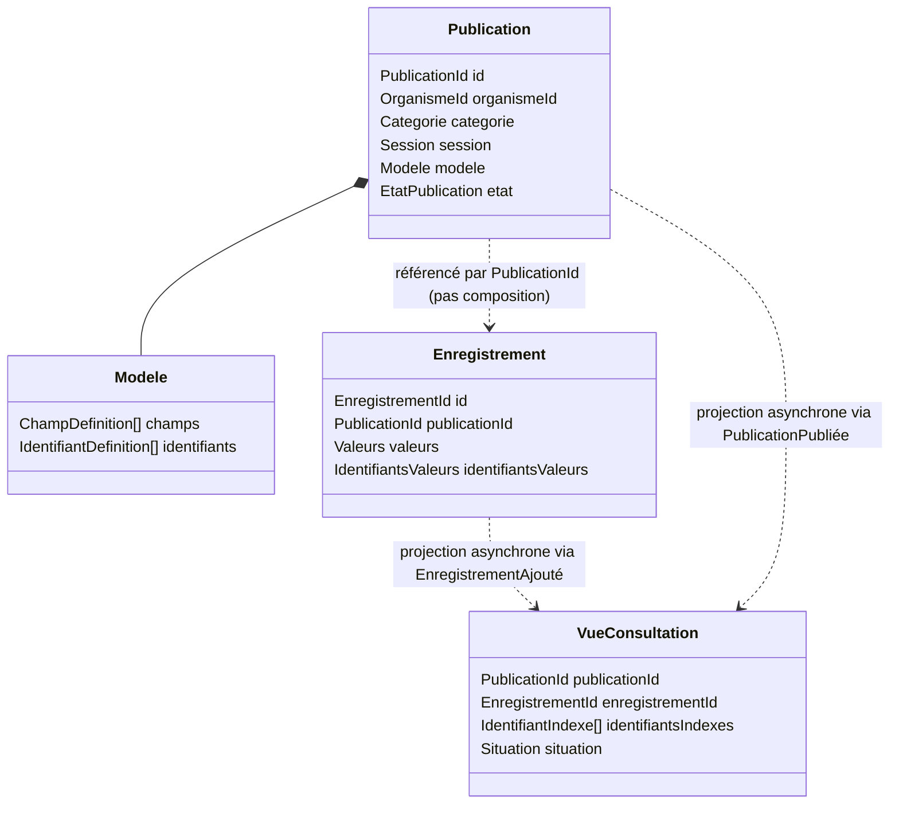
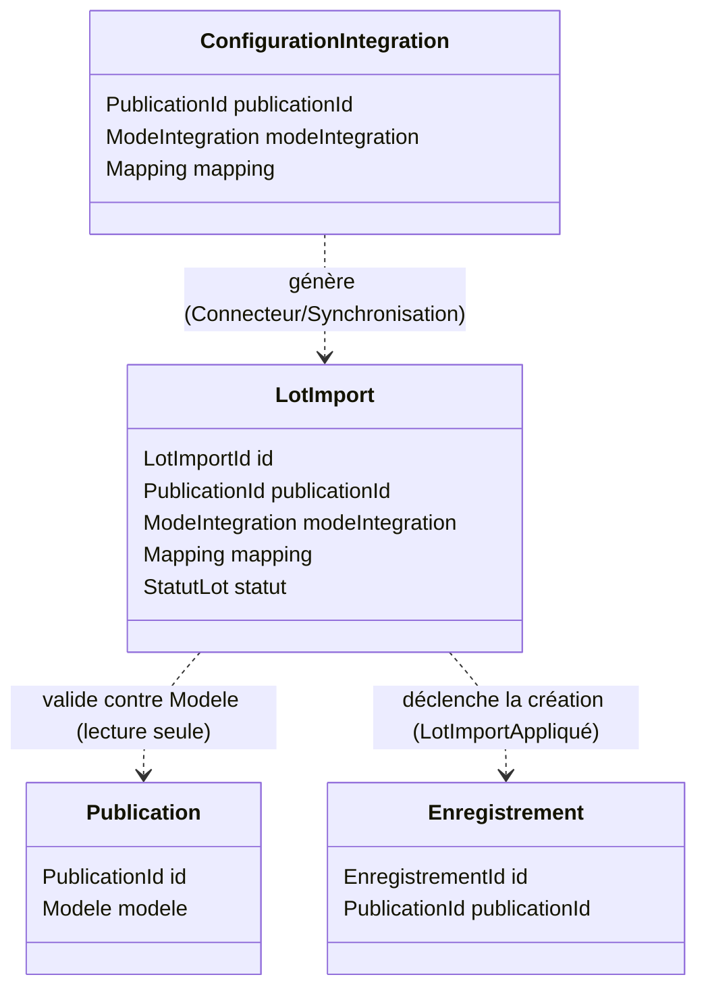

> [!danger] Document sous réexamen intégral — 2026-09-06
> Le porteur a décidé de **reprendre la conception depuis l'intention**. Aucun énoncé de ce document ne vaut engagement, y compris ceux qu'il présente comme tranchés, canonisés ou terminés. Il est conservé comme **état de travail antérieur**, pas comme référence opposable — `DEC-C-016` au [[checkme/90-pilotage/Journal des décisions|Journal des décisions]].

Document 3 — DDD Tactique

Version : 0.2 (Draft — intègre le BC Intégration des Données)

Statut : Document de conception — dépend de Document 0 (Vision), Document 1 (DDD Stratégique), Document 2 (Vision d'Architecture)

---

## 0. Cadrage

Ce document modélise le **DDD tactique** — agrégats, entités, objets-valeurs, invariants — pour trois bounded contexts : **Gestion des Publications**, **Consultation** (les deux priorités initiales), et **Intégration des Données** (ajouté en point 5, une fois les deux premiers stabilisés, comme prévu). Les contextes restants (IAM Organismes, Compte Citoyen, Organismes, Audit) restent hors périmètre — ce sont les contextes génériques, à faible risque de modélisation, traités en dernier.

Ce document respecte strictement la décision d'architecture de Document 2 (AP-3, CQRS léger) : Gestion des Publications est le **modèle d'écriture**, Consultation ne possède qu'un **modèle de lecture** alimenté de façon asynchrone. Il n'y a donc pas d'agrégat "Recherche" au sens transactionnel classique côté Consultation — cette section le justifie en détail.

---

## 1. Décision structurante — Publication et Enregistrement sont deux agrégats séparés

C'est la décision tactique la plus importante de ce document, donc elle est posée avant tout le reste.

**Le problème** : une publication (ex. résultat d'un concours national) peut contenir de quelques dizaines à plusieurs centaines de milliers d'enregistrements. Si `Enregistrement` était modélisé comme une entité enfant à l'intérieur de l'agrégat `Publication` (composition classique), alors :

- charger une `Publication` obligerait, dans le pire cas, à charger des centaines de milliers d'enregistrements en mémoire ;
- toute modification (même d'un seul enregistrement) passerait par le verrou transactionnel de l'agrégat entier ;
- un import de masse (Intégration des Données) deviendrait une opération monstrueuse, contraire à AP-1/AP-3 de Document 2.

**Décision** : `Publication` et `Enregistrement` sont deux agrégats **distincts**, reliés uniquement par référence (`PublicationId`), jamais par composition. `Enregistrement` est écrit indépendamment, par lots, sans jamais charger l'agrégat `Publication` en entier.

**Conséquence assumée** : la cohérence entre une `Publication` et l'ensemble de ses `Enregistrement` est **éventuelle**, pas transactionnelle. C'est cohérent avec AD-03 de Document 2 (cohérence éventuelle déjà actée pour Consultation) — on l'étend ici explicitement à la relation Publication/Enregistrement elle-même.

---

## 2. BC Gestion des Publications — modèle tactique

### 2.1 Agrégat `Publication` (racine)

| Élément | Type | Description |
|---|---|---|
| `id` | Value Object (`PublicationId`) | Identité de l'agrégat. |
| `organismeId` | Value Object (référence externe) | Référence opaque vers le BC Gestion des Organismes — jamais résolue en objet complet ici (respect de la frontière de contexte). |
| `categorie` | Value Object (`Categorie{code, libellé}`) | Ex. "Concours", "Bourse". |
| `session` | Value Object (`Session{code, libellé, période}`) | Ex. "Session 2026". |
| `modele` | Value Object (`Modele`) | Définit la structure attendue des enregistrements et les identifiants exploitables (voir 2.2). |
| `etat` | Value Object / Enum (`EtatPublication`) | `Brouillon` → `Publiée` → `MiseAJour` → `Archivée`. |
| `dateCreation`, `dateDernierePublication` | Value Object (Date) | Horodatages. |

**`Modele` (Value Object composite)** :
- `champs: ChampDefinition[]` — `ChampDefinition{nom, type, affichable}` (le flag `affichable` détermine si ce champ apparaît dans la `Situation` restituée au citoyen — voir le point 3).
- `identifiants: IdentifiantDefinition[]` — `IdentifiantDefinition{type, libellé, niveauConfiance, obligatoire}`.

**Invariants de l'agrégat `Publication`** :

1. Une `Publication` ne peut passer à l'état `Publiée` que si `modele.identifiants` contient au moins un `IdentifiantDefinition`.
2. Les valeurs de `niveauConfiance` au sein d'un même `Modele` doivent être uniques (ordre total strict, pas d'ambiguïté de priorité — respecte 6.7 de Document 0).
3. Une fois l'état `Publiée` atteint, `modele.champs` et `modele.identifiants` ne peuvent plus être **retirés ou retypés** — seulement complétés par de nouveaux champs/identifiants. Casser un champ déjà utilisé casserait silencieusement les `Enregistrement` déjà ingérés (qui vivent dans un agrégat séparé, donc invisibles ici).
4. Une `Publication` à l'état `Archivée` n'accepte plus aucun nouvel `Enregistrement` (appliqué en pratique par le service applicatif d'ingestion, qui vérifie l'état avant d'écrire).

### 2.2 Agrégat `Enregistrement` (racine, séparé — voir le point 1)

| Élément | Type | Description |
|---|---|---|
| `id` | Value Object (`EnregistrementId`) | Identité de l'agrégat. |
| `publicationId` | Value Object (référence) | Référence vers la `Publication` parente — jamais de composition (voir le point 1). |
| `valeurs` | Value Object (`Valeurs`, map champ → valeur) | Doit être conforme à `modele.champs` de la Publication référencée **au moment de l'ingestion** (validé par le service applicatif, pas par l'agrégat lui-même qui ne connaît pas le Modele). |
| `identifiantsValeurs` | Value Object (map type d'identifiant → valeur) | Ce qui permettra la résolution côté Consultation. |
| `origine` | Value Object (`Origine{lotImportId, ligneSource}`) | Traçabilité — consommé par le BC Audit. |

**Invariants de l'agrégat `Enregistrement`** :

1. Un `Enregistrement` ne peut être créé que par référence à une `Publication` existante et non `Archivée` (vérifié par le service applicatif au moment de l'écriture, pas par une contrainte interne à l'agrégat lui-même).
2. `identifiantsValeurs` doit contenir au moins une valeur pour l'un des `IdentifiantDefinition` marqués `obligatoire` dans le `Modele` de la Publication au moment de l'ingestion.
3. Un `Enregistrement` est modifiable (correction après coup) et supprimable, mais chaque modification/suppression doit produire un événement dédié (voir 2.3) — jamais de mutation silencieuse, pour respecter la valeur de Traçabilité (Document 0 point 9).

### 2.3 Événements de domaine — BC Gestion des Publications

| Événement | Émis par | Consommé notamment par |
|---|---|---|
| `PublicationCréée` | `Publication` | Audit |
| `PublicationModèleÉtendu` | `Publication` | Audit, Intégration (met à jour la validation attendue) |
| `PublicationPubliée` | `Publication` | Consultation (déclenche la construction de la Vue de Consultation), Audit |
| `PublicationArchivée` | `Publication` | Consultation (retire/gèle la Vue de Consultation), Audit |
| `EnregistrementAjouté` | `Enregistrement` | Consultation (indexe l'enregistrement dans la Vue de Consultation), Audit |
| `EnregistrementModifié` | `Enregistrement` | Consultation (réindexe), Audit |
| `EnregistrementSupprimé` | `Enregistrement` | Consultation (désindexe), Audit |

### 2.4 Repositories (interfaces conceptuelles)

- `PublicationRepository` : `parId(PublicationId)`, `sauvegarder(Publication)` — jamais de méthode qui charge les enregistrements associés.
- `EnregistrementRepository` : `sauvegarderParLot(Enregistrement[])`, `parPublication(PublicationId, pagination)` — pensé pour l'écriture/lecture en masse, jamais pour charger "tous les enregistrements d'une publication" sans pagination.

---

## 3. BC Consultation — modèle tactique

### 3.1 Nature du modèle côté Consultation

Conformément à AP-3 (Document 2), Consultation ne possède **aucun agrégat d'écriture métier**. Son seul état persistant est une **projection de lecture** (`VueConsultation`), reconstruite à partir des événements du point 2.3. Ce n'est pas un agrégat DDD au sens classique (pas d'invariants transactionnels internes à protéger) — c'est un modèle de lecture optimisé pour un seul usage : répondre vite à une recherche.

**`VueConsultation` (projection, une entrée par Enregistrement)** :

| Élément | Type | Description |
|---|---|---|
| `publicationId`, `enregistrementId` | référence | Origine de la donnée. |
| `identifiantsIndexés` | `IdentifiantIndexé[]` — `{type, valeurNormalisée, niveauConfiance}` | Valeurs normalisées (casse, accents, espaces) pour tolérer les variantes de saisie. |
| `situation` | Value Object (`Situation`) | Vue restituable au citoyen — construite uniquement à partir des champs `affichable` du `Modele` d'origine (respecte 6.1 — neutralité : Consultation ne décide de rien, il restitue ce que l'organisme a désigné comme affichable). |

### 3.2 Objets-valeurs du domaine de recherche

- **`CritereRecherche`** `{type, valeur}` — ce que saisit le citoyen : un type d'identifiant + une valeur brute.
- **`Situation`** `{nature, champsAffichés: Champ[]}` — `nature` reste un simple libellé porté par le `Modele` (ex. "résultat", "convocation"), jamais un type métier codé en dur dans Consultation : cela permettrait d'ajouter de nouveaux types de publication sans toucher ce contexte (Document 0 point 11).
- **`RésultatDeRésolution`** — union de trois cas possibles : `Trouvé(Situation)`, `Ambigu(nombreDeCorrespondances)`, `AucunRésultat`.

### 3.3 Service de domaine — `ServiceDeRésolution`

C'est le cœur métier du contexte Core. Décrit ici en tant que **domain service** (pas d'état propre, opère sur la `VueConsultation`) :

1. Recevoir `PublicationId` + un ou plusieurs `CritereRecherche` saisis par le citoyen.
2. Rejeter immédiatement si la `Publication` référencée n'est pas dans un état public (`Publiée`/`MiseAJour`) — information portée par la projection elle-même (une `VueConsultation` n'existe/n'est visible que pour ces états).
3. Parmi les critères fournis, sélectionner celui dont `niveauConfiance` est le plus élevé (règle héritée de 6.7, Document 0 — c'est ici, et seulement ici, qu'elle s'exécute).
4. Rechercher les `VueConsultation` dont `identifiantsIndexés` contient une valeur normalisée correspondante pour ce type.
5. Retourner `Trouvé` (une correspondance), `Ambigu` (plusieurs), ou `AucunRésultat` (aucune) — jamais de résultat partiel en cas d'ambiguïté, pour ne jamais exposer la donnée d'une autre personne.

### 3.4 Journal de recherche — événement, pas agrégat

Une tentative de consultation est modélisée comme un **événement immuable** `RechercheEffectuée{publicationId, typeCritèreUtilisé, résultat, horodatage, compteCitoyenId?}` plutôt que comme un agrégat avec cycle de vie. Il n'y a rien à faire évoluer après coup — une recherche passée reste un fait historique. Cet événement alimente :
- le BC Audit (traçabilité) ;
- le futur BC Compte Citoyen, s'il est activé, pour construire l'historique de consultation (Document 1, point 2.7).

**Point ouvert de sécurité (à trancher en Document Sécurité)** : `RechercheEffectuée` ne devrait probablement pas stocker la **valeur brute** du critère saisi (ex. un numéro CNIB en clair) dans un journal à conservation longue, pour limiter l'exposition de données personnelles en cas de fuite du journal lui-même — une version hachée ou tronquée est préférable. Décision à figer plus tard, mentionnée ici pour ne pas être oubliée.

### 3.5 Invariants du contexte Consultation

1. Une résolution ne s'exécute jamais sur une `Publication` dont l'état n'est pas public (point 3.3, étape 2).
2. La sélection du critère se fait toujours par le plus haut `niveauConfiance` disponible parmi ceux fournis — jamais par ordre de saisie du citoyen.
3. Un résultat `Ambigu` ne renvoie jamais de détail sur les correspondances trouvées (ni noms, ni aucune `Situation` partielle).

### 3.6 Repository / projection (interface conceptuelle)

- `VueConsultationRepository` : `rechercher(PublicationId, CritereRecherche) → RésultatDeRésolution`, `indexer(Enregistrement, Publication)` (appelé par le projecteur asynchrone), `désindexer(EnregistrementId)`.

---

## 4. Vue d'ensemble

---

## 5. BC Intégration des Données — modèle tactique

### 5.1 Rôle tactique de ce contexte

Ce contexte matérialise l'ACL (Anti-Corruption Layer) défini en Document 1 (point 2.3) : il absorbe la diversité des modes d'intégration (fichier, API, connecteur, synchronisation — 6.9 de Document 0) et ne laisse jamais rien passer vers Gestion des Publications qui ne soit pas déjà conforme au `Modele` canonique. Il **orchestre** la création d'`Enregistrement`, mais ne les possède pas : `Enregistrement` reste un concept de Gestion des Publications (Document 3, point 2.2). La frontière est stricte — Intégration ne fait qu'appeler l'écriture de l'autre contexte, une fois la donnée validée.

### 5.2 Agrégat `LotImport` (racine)

| Élément | Type | Description |
|---|---|---|
| `id` | Value Object (`LotImportId`) | Identité de l'agrégat. |
| `publicationId` | Value Object (référence) | Publication ciblée. |
| `modeIntegration` | Value Object (Enum) | `Fichier` \| `API` \| `Connecteur` \| `Synchronisation`. |
| `source` | Value Object (`Source{origine, dateReception}`) | Métadonnées d'origine (nom de fichier, identifiant de connecteur, etc.). |
| `mapping` | Value Object (`Mapping`) | Correspondance champ source → champ canonique du `Modele` visé, pour ce lot précis. |
| `statut` | Value Object / Enum | `Reçu` → `EnValidation` → `Valide` \| `PartiellementValide` \| `Rejeté` → `Appliqué`. |
| `erreursConformite` | `ErreurConformite[]` (VO) | `{ligne, champ, raison}` — une par écart détecté. |
| `compteurs` | Value Object (`Compteurs{lignesTraitees, lignesEnErreur}`) | Pour le reporting côté back-office organisme. |

**Invariants de l'agrégat `LotImport`** :

1. Un `LotImport` ne peut passer en `EnValidation` que si son `mapping` couvre l'intégralité des champs et identifiants marqués `obligatoire` dans le `Modele` de la Publication ciblée — sinon rejet immédiat, avant même d'examiner une seule ligne.
2. Un `LotImport` ciblant une `Publication` à l'état `Archivée` est rejeté immédiatement (cohérent avec l'invariant 2.2.1 de la section précédente).
3. Le passage à `Appliqué` est **explicite** : un lot `PartiellementValide` ne s'applique jamais silencieusement — il faut une confirmation de l'administrateur d'organisme pour ignorer les lignes en erreur et appliquer le reste. Pas d'application partielle automatique.
4. Le contenu brut du lot (fichier original, payload API tel que reçu) n'est jamais transmis à Gestion des Publications — seule sa traduction canonique (via le `Mapping`) franchit la frontière du contexte.

### 5.3 `ConfigurationIntegration` — agrégat secondaire, pour les modes récurrents

**Motivation** : un import ponctuel de fichier n'a pas besoin de configuration persistante — le `Mapping` vit le temps du `LotImport`. Mais un connecteur ou une synchronisation automatique se répète dans le temps ; il a besoin d'une configuration stable entre deux exécutions.

| Élément | Type | Description |
|---|---|---|
| `id` | Value Object | Identité. |
| `publicationId` | référence | Publication cible (ou modèle de publication, si réutilisée d'une session à l'autre — cf. question ouverte Document 3 point 6). |
| `modeIntegration` | Enum | `Connecteur` \| `Synchronisation` (jamais `Fichier`, qui reste ad hoc). |
| `mapping` | Value Object | Mapping par défaut, réutilisé à chaque exécution. |
| `frequence` | Value Object (optionnel) | Pour `Synchronisation` uniquement. |
| `referenceCredentials` | Value Object (opaque) | Pointeur vers un secret stocké ailleurs (coffre-fort de secrets) — **jamais** le secret lui-même dans cet agrégat. |

Cet agrégat ne fait que **préparer** les `LotImport` suivants ; il ne contient jamais de données personnelles.

### 5.4 Service de domaine — `TraducteurCanonique`

Domain service sans état, appelé lors du passage `Reçu` → `EnValidation` d'un `LotImport` :

1. Pour chaque ligne source, appliquer le `Mapping` pour produire des `Valeurs` et `IdentifiantsValeurs` candidates.
2. Valider chaque valeur contre la définition du champ correspondant dans le `Modele` (type, obligation).
3. Toute ligne non conforme produit une `ErreurConformite` et n'est jamais transmise plus loin — jamais de tentative de "deviner" ou corriger automatiquement une donnée invalide (respecte 6.1, neutralité : l'infrastructure ne décide pas à la place de l'organisme).
4. Les lignes conformes deviennent des candidats à la création d'`Enregistrement`, appliqués uniquement lors du passage à `Appliqué` (point 5.2, invariant 3).

### 5.5 Événements de domaine — BC Intégration des Données

| Événement | Émis par | Consommé notamment par |
|---|---|---|
| `LotImportReçu` | `LotImport` | Audit |
| `LotImportValidé` / `LotImportPartiellementValidé` / `LotImportRejeté` | `LotImport` | Audit, back-office organisme (reporting) |
| `LotImportAppliqué` | `LotImport` | Gestion des Publications (déclenche la création effective des `Enregistrement`), Audit |
| `ErreurDeConformitéDétectée` | `TraducteurCanonique` (par ligne) | Back-office organisme (affichage détaillé des erreurs) |

### 5.6 Repositories (interfaces conceptuelles)

- `LotImportRepository` : `sauvegarder(LotImport)`, `parId(LotImportId)`, `parPublication(PublicationId)`.
- `ConfigurationIntegrationRepository` : `sauvegarder`, `parPublication`, `dueALExecution()` (pour les synchronisations planifiées).

### 5.7 Mise à jour du diagramme d'ensemble

---

## 6. Questions ouvertes (à trancher dans les documents suivants)

- **Catégorie / Session partagées ?** Actuellement modélisées comme Value Objects embarqués dans `Publication`. Si les organismes veulent gérer un catalogue réutilisable ("cette catégorie existe déjà, je choisis juste une nouvelle session"), il faudra les promouvoir en entités propres avec leur propre agrégat — à réévaluer une fois le back-office organisme conçu (UX).
- **Anonymisation du journal de recherche** (point 3.4) — à trancher formellement dans le futur document Sécurité.
- **Règles de correspondance floue** pour l'identifiant faible "nom + prénom" (accents, ordre des mots, variantes orthographiques) — nécessite probablement un algorithme dédié (distance de Levenshtein ou équivalent), non détaillé ici, à approfondir avant l'implémentation du `ServiceDeRésolution`.
- **Stockage des secrets de connexion** pour `ConfigurationIntegration` (point 5.3) — un coffre-fort de secrets (Vault, ou équivalent plus simple pour un MVP) doit être choisi ; hors périmètre DDD, à trancher en Architecture Logicielle.

---

## 7. Prochaines étapes

- **Document 4 — Architecture Logicielle** : traduire l'ensemble des agrégats de ce document (Publications, Consultation, Intégration) en structure de code concrète du monolithe modulaire — packages, mécanisme de bus d'événements interne, organisation des repositories, choix de framework/stack.
- **Document API & Contrats** : contrat exposé par `ServiceDeRésolution` pour l'interface citoyen, contrat d'écriture pour le back-office organisme, et contrat d'entrée pour chaque `ModeIntegration` (upload fichier, endpoint API, webhook connecteur).
- **DDD Tactique des contextes génériques** (IAM Organismes, Compte Citoyen, Gestion des Organismes, Audit) — à faire en dernier, une fois le cœur métier stable.
