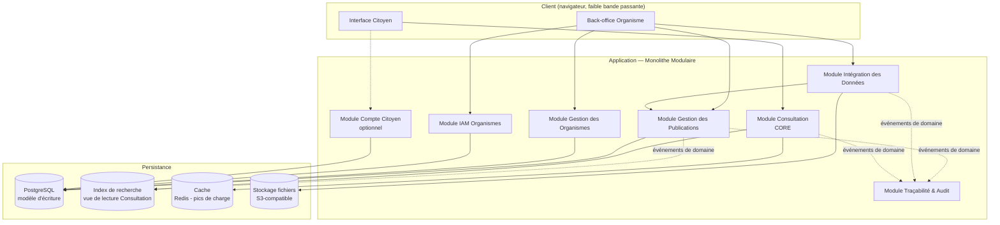

> [!danger] Document sous réexamen intégral — 2026-09-06
> Le porteur a décidé de **reprendre la conception depuis l'intention**. Aucun énoncé de ce document ne vaut engagement, y compris ceux qu'il présente comme tranchés, canonisés ou terminés. Il est conservé comme **état de travail antérieur**, pas comme référence opposable — `DEC-C-016` au [[checkme/90-pilotage/Journal des décisions|Journal des décisions]].

Document 2 — Vision d'Architecture (TOGAF Phase A — adapté)

Version : 0.1 (Draft)

Statut : Document de conception — dépend de Document 0 (Vision) et Document 1 (DDD Stratégique)

---

## 0. Cadrage

Ce document correspond à une **Phase A (Architecture Vision)** allégée, inspirée de TOGAF ADM. Il ne détaille pas encore la stack technique précise, les schémas de base de données ou les contrats d'API — cela viendra dans le futur document "Architecture Logicielle" et dans le DDD Tactique. Son rôle : positionner les bounded contexts de Document 1 dans une architecture cible cohérente, et acter le style architectural.

---

## 1. Parties prenantes et préoccupations

| Partie prenante | Préoccupation principale |
|---|---|
| **Citoyen** | Rapidité, disponibilité même sur connexion faible/instable, aucune barrière d'accès (0.1 de Document 1). |
| **Administrateur d'organisme** | Publier fiablement, corriger vite en cas d'erreur, ne pas dépendre d'une équipe technique externe pour chaque campagne. |
| **Administrateur national** | Vue d'ensemble, garantie que les organismes restent isolés entre eux, maîtrise des coûts d'infrastructure. |
| **Équipe technique (toi, seul architecte/développeur au démarrage)** | Une architecture qu'une seule personne peut construire, déployer et maintenir sans over-engineering, mais qui n'interdit pas une évolution vers plus d'échelle plus tard. |
| **État / régulateur (acteur latent)** | Souveraineté des données, hébergement potentiellement local, absence de dépendance à un fournisseur cloud unique. |

---

## 2. Facteurs et contraintes

- **Contexte réseau** : connectivité mobile en Afrique de l'Ouest souvent en 3G/4G limitée, coûteuse en data. L'expérience côté citoyen doit rester légère (poids de page, nombre de requêtes).
- **Pics de charge prévisibles mais ponctuels** : la publication d'un résultat de concours très attendu peut générer un pic massif et soudain de consultations sur une fenêtre de quelques heures, suivi d'un trafic très faible le reste du temps. C'est un facteur de conception majeur pour le contexte Consultation.
- **Équipe réduite** : conception, développement et exploitation reposent sur une seule personne au démarrage. Une architecture en microservices avec orchestration complexe (Kubernetes multi-services, service mesh) serait un risque opérationnel disproportionné à ce stade.
- **Souveraineté numérique** : cohérent avec ton intérêt déjà exprimé pour l'infrastructure numérique souveraine ouest-africaine — l'architecture ne doit pas verrouiller le projet à un fournisseur cloud propriétaire unique.
- **Évolutivité déjà actée** : Document 0 point 10/point 11 exige d'ajouter de nouveaux organismes et types de publications sans changer l'architecture fondamentale — donc les frontières de Document 1 doivent rester visibles au niveau physique, même si le déploiement initial est simple.

---

## 3. Principes d'architecture

Chaque principe suit le format TOGAF (Énoncé / Justification / Implications).

### AP-1 — Monolithe modulaire avant microservices

**Énoncé** : Le système est construit comme un monolithe modulaire, où chaque module correspond exactement à un bounded context de Document 1. Aucun découpage en microservices n'est fait par défaut.

**Justification** : Une seule personne conçoit, développe et exploite le système. Les microservices ajoutent un coût d'orchestration, de observabilité et de déploiement qui dépasse la valeur apportée à ce stade — sans bénéfice réel puisque la charge globale reste modeste hors pics.

**Implications** : Les frontières de module doivent être aussi strictes en code (packages/dossiers séparés, pas d'appel direct entre modules internes hors interface publique) qu'elles le seraient entre services réseau. Cela garantit qu'un module pourra être extrait en service indépendant plus tard **sans réécriture**, seulement en changeant le mode de communication (appel direct → appel réseau).

### AP-2 — Consultation est le seul contexte candidat à une extraction anticipée

**Énoncé** : Le contexte Consultation (Core) est conçu dès le départ pour pouvoir être déployé et mis à l'échelle indépendamment du reste, même s'il démarre dans le même déploiement.

**Justification** : C'est le seul contexte directement exposé au pic de charge citoyen (cf. point 2). Les autres contextes (Publications, Ingestion, IAM, Organismes) ont un trafic porté par des utilisateurs internes aux organismes, très inférieur en volume et en imprévisibilité.

**Implications** : Consultation lit exclusivement des vues déjà matérialisées (voir AP-3) ; il n'écrit jamais dans le modèle de Gestion des Publications. Cette absence d'écriture croisée est ce qui rend l'extraction future triviale.

### AP-3 — Séparation lecture/écriture au niveau du contexte Consultation (CQRS léger)

**Énoncé** : Gestion des Publications reste le modèle d'écriture (source de vérité). Consultation s'appuie sur une **vue de lecture dédiée**, optimisée pour la recherche par identifiant, reconstruite de façon asynchrone à chaque publication/mise à jour.

**Justification** : Les besoins de lecture (recherche quasi-instantanée par identifiant, tolérance aux variantes) et d'écriture (structure normalisée, validation, historisation) sont fondamentally différents. Les confondre dans un seul modèle nuirait soit à la vitesse de recherche, soit à la rigueur de gestion des publications.

**Implications** : Introduction d'un magasin de lecture spécialisé (ex. moteur de recherche/index ou table dénormalisée) alimenté par des événements émis par Gestion des Publications. Cohérence **éventuelle** (eventual consistency) acceptée entre écriture et lecture — à documenter clairement pour ne pas surprendre les organismes ("votre publication peut prendre quelques secondes à devenir cherchable").

### AP-4 — Aucune dépendance propriétaire bloquante

**Énoncé** : Les briques d'infrastructure (base de données, cache, stockage de fichiers, index de recherche) doivent avoir une alternative auto-hébergeable réaliste, même si un service managé est utilisé en premier lieu pour aller vite.

**Justification** : Cohérence avec la préoccupation de souveraineté (point 1) et avec l'intérêt du projet pour l'infrastructure numérique souveraine ouest-africaine.

**Implications** : Préférence pour des technologies open-source largement supportées (PostgreSQL, Redis, MinIO/S3-compatible, Meilisearch/OpenSearch) plutôt que des services propriétaires non portables.

### AP-5 — Frugalité de bande passante côté citoyen

**Énoncé** : Toute interface ou API exposée au citoyen est conçue pour fonctionner correctement sur une connexion lente et instable.

**Justification** : Contrainte réseau structurelle (point 2), directement liée à la mission (Document 0 — rapidité d'accès).

**Implications** : Pages de consultation légères, réponses API minimales, pas de dépendance à un chargement lourd de bibliothèques front-end pour le seul acte de recherche.

---

## 4. Vision cible — style architectural retenu

**Monolithe modulaire, découpé strictement selon les bounded contexts de Document 1, avec un seul contexte (Consultation) conçu en CQRS léger pour absorber les pics de charge indépendamment du reste.**

### 4.1 Lecture du schéma

- **Un seul déploiement au démarrage** (une application, une base d'écriture) — cohérent avec AP-1 et la contrainte d'équipe réduite.
- **Le module Consultation ne touche jamais PostgreSQL directement** : il lit exclusivement l'index de recherche, alimenté de façon asynchrone. C'est la matérialisation d'AP-2/AP-3 — le jour où il faut l'extraire en service séparé (ou juste le scaler horizontalement pour un pic), il n'y a aucune dépendance à couper.
- **Le cache (Redis)** absorbe les pics de charge répétés sur les mêmes publications très consultées (résultats d'un concours donné dans les premières heures) sans re-solliciter l'index à chaque requête identique.
- **Le module Intégration des Données** ne parle qu'au module Gestion des Publications — jamais directement à la base d'écriture des autres modules, conformément à l'ACL défini en Document 1.

---

## 5. Exigences non-fonctionnelles (NFR)

| Catégorie | Exigence | Origine |
|---|---|---|
| **Performance** | Une recherche de consultation doit répondre en quelques centaines de millisecondes même sous charge, grâce à l'index dédié + cache. | Mission "accès rapide" (Document 0 point 3, point 8) |
| **Disponibilité** | Le module Consultation doit rester disponible même si Intégration/Publications sont temporairement indisponibles (ils ne se touchent qu'en asynchrone). | Découplage lecture/écriture (AP-3) |
| **Scalabilité** | Le module Consultation doit pouvoir être répliqué horizontalement indépendamment des autres modules dès qu'un pic est anticipé (ex. jour de publication d'un grand concours). | Facteur de charge (point 2) |
| **Sécurité** | Les données nominatives ne transitent jamais en clair au repos ; les imports de fichiers sont validés strictement avant tout passage en publication. | Nature des données (Document 0 — informations nominatives) |
| **Portabilité** | Aucune brique bloquante propriétaire (AP-4). | Souveraineté (point 2) |
| **Frugalité réseau** | Poids de page et de réponse API minimisés côté citoyen (AP-5). | Contexte réseau (point 2) |
| **Interopérabilité** | Le module Intégration expose des contrats d'import stables (fichier, API) indépendants du mode technique utilisé par l'organisme. | Document 0 point 6.9, point 9 |

---

## 6. Décisions d'architecture actées (résumé ADR)

| ID | Décision | Alternative écartée | Raison de l'écart |
|---|---|---|---|
| AD-01 | Monolithe modulaire au démarrage | Microservices dès le départ | Coût opérationnel disproportionné pour une équipe d'une personne |
| AD-02 | CQRS léger uniquement pour Consultation | Un seul modèle de données partagé pour écriture et lecture | Confondrait rigueur de gestion et vitesse de recherche |
| AD-03 | Cohérence éventuelle entre publication et disponibilité en recherche | Cohérence forte immédiate | Coût technique élevé pour un bénéfice marginal ; délai de quelques secondes acceptable et à documenter côté organisme |
| AD-04 | Technologies open-source auto-hébergeables en priorité | Services managés propriétaires exclusifs | Cohérence avec la souveraineté numérique visée par le projet |
| AD-05 | IAM Organismes et Compte Citoyen restent deux modules séparés (hérité de Document 1) | Un seul module d'identité générique | Cycles de vie et exigences de sécurité incompatibles (Document 1, 0.1) |

---

## 7. Risques architecturaux identifiés

| Risque | Impact | Mitigation |
|---|---|---|
| Sous-estimer un pic de charge (ex. résultat national très attendu) | Indisponibilité de Consultation au moment critique | Cache + index dédié + capacité de scaling horizontal isolée du reste (AP-2/AP-3) |
| Dérive des frontières de modules dans le code au fil du temps (un développeur seul, pression du temps) | Le monolithe modulaire devient un "monolithe tout court", perte de la possibilité d'extraction future | Discipline de dossier/package stricte dès le départ (interfaces publiques explicites par module), à documenter dans le futur document "Architecture Logicielle" |
| Latence de la cohérence éventuelle mal comprise par les organismes | Support/confusion ("j'ai publié mais ça n'apparaît pas") | Statut de publication explicite visible côté back-office organisme (ex. "publiée — indexation en cours" vs "publiée — disponible") |
| Dépendance à un unique développeur pour l'exploitation | Continuité de service en cas d'indisponibilité | Hors périmètre architecture pure, mais à garder en tête pour les choix d'outillage (favoriser la simplicité d'exploitation, l'automatisation, la documentation) |

---

## 8. Prochaines étapes

- **Document 3 — DDD Tactique** : agrégats, entités, objets-valeurs pour Consultation et Gestion des Publications en priorité — maintenant que les frontières physiques (modules) sont posées, le détail interne peut être modélisé sans risque de devoir tout redécouper.
- **Document "Architecture Logicielle"** (futur) : structure de dossiers/packages concrète du monolithe modulaire, choix de framework, conventions de communication inter-module (appel direct + bus d'événements interne), stratégie de migration vers un service extrait si besoin.
- **Document API & Contrats** : contrat stable entre Gestion des Publications et l'index de lecture de Consultation (événements de domaine), et contrat d'import pour Intégration des Données.
