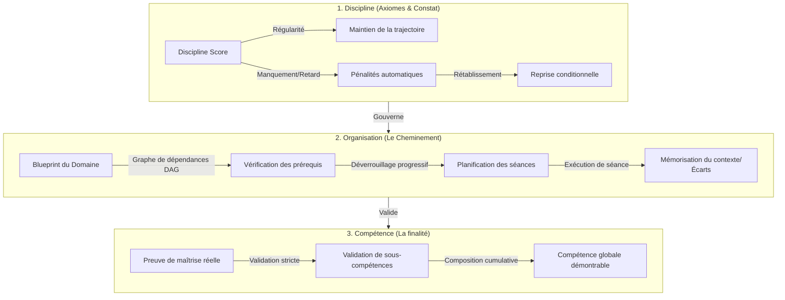

# Analyse de Conception & Architecture de l'Infrastructure — LevelUP

Ce document synthétise les réflexions de conception issues du dossier `ingenerie_conception` et les tentatives de développement documentées dans `bundler` afin de poser les bases de la documentation d'ingénierie finale pour le développement de l'infrastructure de **LevelUP**.

---

## 1. Synthèse de la Vision & Alignement Stratégique

LevelUP répond à un constat critique du monde contemporain : **l'abondance d'informations ne se traduit pas par une abondance de compétences réelles**. 

Dans un contexte où les ressources (formations, IA, roadmaps) sont omniprésentes mais superficielles, LevelUP se positionne comme une **infrastructure de contrainte intelligente** conçue pour structurer la progression d'un apprenant vers la maîtrise réelle.

### 1.1 Le Coeur du Système : L'Orchestrateur de Progression
Selon le dernier état des réflexions (`back_office_6.md`), LevelUP n'est ni un gestionnaire de tâches ni un catalogue de formations. C'est un **moteur d'organisation** articulé autour de trois piliers fondamentaux :
* **Le Domaine (Universel)** : La structure de connaissance d'une discipline (ex. Administration Système, Flutter) modélisée de manière agnostique et technique.
* **L'Organisation (Personnelle)** : L'adaptation de ce domaine aux contraintes, au rythme et à la situation d'un individu.
* **Le Blueprint (Patrimoine Métier)** : Le modèle d'ingénierie d'une compétence regroupant fondations, sous-compétences, prérequis (DAG), critères de validation, ressources et plans de révision.

---

## 2. Déconstruction du Modèle Pédagogique & Discipline

Le modèle d'apprentissage repose sur une progression rigoureuse sous contraintes :



### 2.1 Les trois dimensions du modèle
1. **La Discipline (Régularité)** : Mesurée par un score de discipline. Toute déviation ou retard déclenche un job de pénalité qui ajuste le planning. La reprise n'est pas passive ; elle nécessite de suivre un protocole strict pour retrouver son rythme.
2. **L'Organisation (Le Parcours)** : Repose sur un graphe dirigé acyclique (DAG) de prérequis. Un sujet est verrouillé (`locked`) tant que ses prérequis ne sont pas validés.
3. **La Compétence (L'Objectif)** : Une distinction claire est faite entre l'activité (consommer une ressource) et la compétence (produire une preuve observable évaluée par des critères de maîtrise).

---

## 3. Analyse Comparée des Approches Techniques

Le dossier `bundler` contient deux approches distinctes pour implémenter cette vision :

| Dimension | Approche FastAPI (`implement-docs`) | Essai de développement (`levelUP_essaie_developpement`) |
| :--- | :--- | :--- |
| **Langage & Framework** | Python / FastAPI | TypeScript / NestJS (Strict Mode) & Next.js |
| **Persistance** | SQL Alchemy + Alembic (PostgreSQL/SQLite) | Prisma ORM (PostgreSQL) |
| **Gestion d'état / Cache** | Redis optionnel | Redis intégré pour le cache et les files d'attente |
| **Frontières d'isolement** | Conceptuellement propre mais non implémenté | Monorepo structuré avec `/apps/backend` et `/apps/frontend` |
| **Niveau de maturité** | Spécifications textuelles et pseudo-code | MVP V1 fonctionnel avec seed de démonstration et Docker Dev Container |

> [!IMPORTANT]
> **Le diagnostic d'audit (`levelup_audit.md`) reste valide pour les deux approches** : Le risque principal est la dispersion des règles métier (progression, score, pénalités) dans les couches d'exposition API. Il est impératif de consolider un **Core Engine déterministe** (State Machine pure sans dépendance framework).

---

## 4. Cadre d'Ingénierie pour le Développement de l'Infrastructure

Pour développer l'infrastructure à long terme, nous proposons de structurer la documentation d'ingénierie selon les standards **TOGAF (Phase A-D)** et le **Systems Engineering (INCOSE)**. 

### Structure recommandée pour le dossier d'ingénierie (`levelup_architecture/`)

```text
levelup_architecture/
├── 01_business_architecture/
│   ├── business_capabilities.md   # Modèle de capacités (04-Business-Capability-model.md)
│   ├── progression_state_machine.md # États (locked, available, validated) & transitions
│   └── discipline_rules.md        # Calcul des pénalités, score de discipline, protocole de reprise
├── 02_application_architecture/
│   ├── core_engine_specification.md # Spécification du noyau computationnel déterministe
│   ├── api_contracts.md           # Contrats REST (JSON Schema / OpenAPI)
│   └── component_isolation.md     # Règle d'isolation (Clean Architecture / Hexagonale)
├── 03_data_architecture/
│   ├── conceptual_model.md        # Entités (User, Blueprint, Topic, Session, Penalty)
│   ├── physical_schema.md         # Schéma PostgreSQL (DDL ou schema.prisma)
│   └── audit_and_traceability.md  # Modélisation des logs d'activité et snapshots d'interruptions
└── 04_technical_infrastructure/
    ├── devcontainer_spec.md       # Environnement de développement standardisé Docker
    ├── deployment_and_runtime.md  # Topologie cible (Backend NestJS, Cache Redis, DB PostgreSQL)
    └── cron_jobs_specification.md  # Planification et robustesse des tâches de nuit (pénalités)
```

---

## 5. Feuille de Route Immédiate pour la Documentation d'Infrastructure

Pour passer de la réflexion à une implémentation robuste et applicable immédiatement, les étapes documentaires suivantes doivent être réalisées :

### 1. Spécification Formelle du Core Engine (Noyau Déterministe)
* Rédiger la logique du graphe (DAG) de progression sous forme de fonctions pures (calcul de l'état d'un sujet en fonction de ses prérequis et des validations).
* Documenter la State Machine des sessions (`planned` -> `active` -> `done`/`interrupted`/`missed`).

### 2. Standardisation de la Stack Technique
* Trancher entre NestJS (TypeScript) et FastAPI (Python). 
  > [!TIP]
  > L'essai NestJS (`levelUP_essaie_developpement`) est très avancé, structuré et dispose déjà d'un environnement de conteneurisation complet (Docker Dev Container). Il est recommandé d'adopter ce socle TypeScript pour garantir un déploiement immédiat.

### 3. Modélisation de la Robustesse (Discipline & Reprise)
* Écrire la spécification technique des scripts de pénalité (nightly crons).
* Définir le schéma d'audit (snapshots) pour garantir qu'aucune donnée de progression n'est perdue en cas d'interruption.

---

> [!NOTE]
> Ce rapport d'analyse pose le cadre de transition vers l'architecture technique. Si ces orientations sont validées, nous pourrons commencer la rédaction des fiches d'architecture de l'infrastructure.
