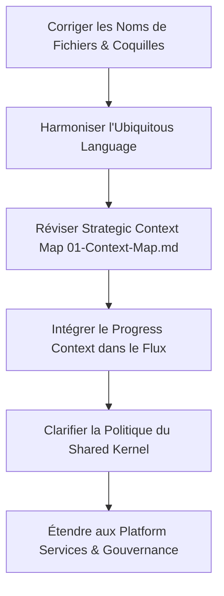

# Rapport d'Audit Approfondi — Architecture LevelUP

**Version :** 1.0  
**Statut :** Livré  
**Catégorie :** Audit d'Architecture & Alignement Stratégique  
**Date de l'audit :** 4 Juillet 2026  

---

## 1. Introduction et Objectif de l'Audit

Cet audit a pour but d'analyser en profondeur le dépôt d'architecture de **LevelUP**, qui combine l'architecture d'entreprise (**TOGAF**) et la conception logicielle stratégique (**Domain-Driven Design - DDD**). 

L'objectif est d'évaluer la cohérence, la structure, la rigueur terminologique et l'alignement entre les différents livrables documentaires du projet (de la fondation aux spécifications d'intégration).

---

## 2. Synthèse Documentaire et Organisation du Dépôt

Le dépôt d'architecture de LevelUP est structuré de manière rigoureuse autour de 6 répertoires et de documents racine :

*   **Racine :** Contient les réflexions de transition d'architecture ([01.md](file:///home/oswiser9/Incubo/levelup/levelUP_architecture/01.md)) et le framework d'ingénierie des modèles de référence ([LevelUP Reference Model Engineering Framework (RMEF).md](file:///home/oswiser9/Incubo/levelup/levelUP_architecture/LevelUP%20Reference%20Model%20Engineering%20Framework%20%28RMEF%29.md)).
*   **[Foundation/](file:///home/oswiser9/Incubo/levelup/levelUP_architecture/Foundation) :** Définit l'identité, la vision et la philosophie de progression.
*   **[Business Architecture/](file:///home/oswiser9/Incubo/levelup/levelUP_architecture/Business%20Architecture) :** Regroupe la modélisation métier sous l'angle de TOGAF (Value Stream, Capabilities, Domain Model, Object Model, Behavior Model).
*   **[Strategic Domain Design (DDD)/](file:///home/oswiser9/Incubo/levelup/levelUP_architecture/Strategic%20Domain%20Design%20%28DDD%29) :** Définit les Bounded Contexts et le Context Map stratégique.
*   **[Shared Kernel/](file:///home/oswiser9/Incubo/levelup/levelUP_architecture/Shared%20Kernel) :** Gère les concepts transversaux partagés.
*   **[integration architecture/](file:///home/oswiser9/Incubo/levelup/levelUP_architecture/integration%20architecture) :** Définit les protocoles de communication inter-contextes (ACL, commandes, requêtes, événements).
*   **[platform-Context-Landscape/](file:///home/oswiser9/Incubo/levelup/levelUP_architecture/platform-Context-Landscape) :** Cartographie globale de l'écosystème étendu (Services transverses et Gouvernance).

---

## 3. Incohérences Majeures et Gaps Logiques (Résultats de l'Audit)

L'audit a révélé des écarts structurels importants entre la cartographie stratégique ([01-Context-Map.md](file:///home/oswiser9/Incubo/levelup/levelUP_architecture/Strategic%20Domain%20Design%20%28DDD%29/01-Context-Map.md)) et les spécifications individuelles des contextes.

### 3.1 Divergence de Nommage des Bounded Contexts
Il existe un décalage sémantique direct entre les noms utilisés dans le document du Context Map stratégique et les fichiers de spécification correspondants :
1.  **Program Context vs Organization Context :** 
    *   Le fichier [05-Program-Context-Specification.md](file:///home/oswiser9/Incubo/levelup/levelUP_architecture/Strategic%20Domain%20Design%20%28DDD%29/05-Program-Context-Specification.md) définit le **Program Context**.
    *   Cependant, le Context Map ([01-Context-Map.md](file:///home/oswiser9/Incubo/levelup/levelUP_architecture/Strategic%20Domain%20Design%20%28DDD%29/01-Context-Map.md)) l'appelle **Organization Context** (notamment dans la section 4 *Vue d'ensemble*, section 5 *Classification*, section 6.3 *Description*, et section 7 *Relations*).
2.  **Activity Context vs Execution Context :**
    *   Le fichier [06-Activity-Context-Specification.md](file:///home/oswiser9/Incubo/levelup/levelUP_architecture/Strategic%20Domain%20Design%20%28DDD%29/06-Activity-Context-Specification.md) définit le **Activity Context**.
    *   Le Context Map ([01-Context-Map.md](file:///home/oswiser9/Incubo/levelup/levelUP_architecture/Strategic%20Domain%20Design%20%28DDD%29/01-Context-Map.md)) le nomme **Execution Context** dans toutes ses diagrammes, descriptions et tableaux.

> [!WARNING]  
> Ces divergences de nommage violent le principe de l'**Ubiquitous Language** (Langage Commun) du DDD. Elles peuvent induire les développeurs en erreur lors de l'implémentation.

### 3.2 Omission Totale du "Progress Context" dans le Context Map
*   Un fichier de spécification entier est dédié au suivi de progression : [07-progress-Context-Specification.md](file:///home/oswiser9/Incubo/levelup/levelUP_architecture/Strategic%20Domain%20Design%20%28DDD%29/07-progress-Context-Specification.md).
*   Pourtant, le **Progress Context** est **complètement absent** du document [01-Context-Map.md](file:///home/oswiser9/Incubo/levelup/levelUP_architecture/Strategic%20Domain%20Design%20%28DDD%29/01-Context-Map.md). Il n'est pas classé dans les domaines (Core/Supporting/Generic), n'apparaît pas dans le diagramme de flux, ni dans le tableau des relations inter-contextes.
*   C'est une faille majeure car la progression est au cœur du modèle de valeur de LevelUP.

### 3.3 Exclusion des Contextes de la Couche "Platform Services"
*   Le répertoire [platform-Context-Landscape/](file:///home/oswiser9/Incubo/levelup/levelUP_architecture/platform-Context-Landscape) contient les spécifications pour **Portfolio**, **Recommendation**, **Resource Catalog** et **Search**.
*   Le document de référence globale [LevelUP-Context-Landscape.md](file:///home/oswiser9/Incubo/levelup/levelUP_architecture/platform-Context-Landscape/LevelUP-Context-Landscape.md) classifie ces domaines comme des **Supporting Domains** clés.
*   Pourtant, le Context Map ([01-Context-Map.md](file:///home/oswiser9/Incubo/levelup/levelUP_architecture/Strategic%20Domain%20Design%20%28DDD%29/01-Context-Map.md)) ignore entièrement ces contextes dans son schéma de relations et ses descriptions.

### 3.4 Contradiction Conceptuelle sur le Shared Kernel
*   Le document [01-Context-Map.md](file:///home/oswiser9/Incubo/levelup/levelUP_architecture/Strategic%20Domain%20Design%20%28DDD%29/01-Context-Map.md) affirme à la section 10 :  
    > *"Aucun objet métier complet n'est partagé."*
*   Cependant, le fichier [Evidence-Shared-Kernel-Specifica.md](file:///home/oswiser9/Incubo/levelup/levelUP_architecture/Shared%20Kernel/Evidence-Shared-Kernel-Specifica.md) (Evidence Shared Kernel Specification) formalise la structure complète et normalisée de l'objet **Evidence** (identifiant, type, producteur, niveau de confiance, métadonnées de vérification, etc.) partagé à travers tout l'écosystème.
*   L'objet `Evidence` est un objet métier transverse fondamental, ce qui contredit directement la règle d'exclusion de partage d'objets métier complets.

### 3.5 Écarts Sémantiques dans l'Ubiquitous Language
Certains termes déclarés dans les objets principaux du Context Map ne correspondent pas à la structure interne des spécifications :
*   Dans le Context Map ([01-Context-Map.md](file:///home/oswiser9/Incubo/levelup/levelUP_architecture/Strategic%20Domain%20Design%20%28DDD%29/01-Context-Map.md)), le **Learning Context** manipule des `Learning Path`, `Stage`, `Milestone`, `Objective`.
*   Dans sa spécification ([04-Learning-Context-Specification.md](file:///home/oswiser9/Incubo/levelup/levelUP_architecture/Strategic%20Domain%20Design%20%28DDD%29/04-Learning-Context-Specification.md)), il manipule des `Learning Blueprint`, `Learning Stage`, `Learning Module`, `Learning Unit`, `Milestone`, `Consolidation`, `Review Session`. 
*   Le terme `Learning Path` a été remplacé par `Learning Blueprint`, et de nouveaux objets fondamentaux (`Learning Module`, `Learning Unit`) sont apparus sans être reportés sur la cartographie stratégique.

---

## 4. Anomalies de Nommage et Qualité des Fichiers

Plusieurs anomalies de syntaxe, coquilles ou troncatures de noms de fichiers nuisent à la cohérence professionnelle du dépôt :

### 4.1 Fichiers Tronqués (Problème de Longueur de Nom sous OS)
Certains fichiers semblent avoir été renommés ou enregistrés avec des extensions tronquées :
1.  `Shared Kernel/Shared-Kernel-Architecture-Speci.md`  
    *(Manque: `fication.md`)*
2.  `Shared Kernel/Evidence-Shared-Kernel-Specifica.md`  
    *(Manque: `tion.md`)*
3.  `platform-Context-Landscape/Resource-Catalog-Context-Specifi.md`  
    *(Manque: `cation.md`)*

### 4.2 Coquilles et Orthographe
1.  **Dossier d'intégration :** Le fichier `integration architecture/Integration-Architecture-Specifion.md` contient une faute d'orthographe évidente dans son nom : **Specifion** au lieu de **Specification**.
2.  **Dossier Foundation :** Le fichier `Foundation/03'-Pfrogression-Philosophy.md` contient :
    *   Un caractère parasite apostrophe (`'`) dans le nom du fichier.
    *   Une faute de frappe : **Pfrogression** au lieu de **Progression**.
3.  **Incohérence de casse :** Le fichier `Strategic Domain Design (DDD)/07-progress-Context-Specification.md` utilise une minuscule (`progress`) contrairement à tous ses fichiers pairs (`02-Competency-Context-Specification.md`, `04-Learning-...`).
4.  **Casse dans Business Architecture :** Le fichier `Business Architecture/10-Business-Behavior-model.md` utilise une minuscule pour `model` (au lieu de `Model` pour s'aligner sur `08-Business-Domain-Model.md`).

---

## 5. Recommandations Stratégiques de Rectification

Pour assurer l'intégrité de l'architecture logicielle avant la phase de codage, nous recommandons d'exécuter le plan d'action suivant :

### Étape 1 : Renommer et Nettoyer les Fichiers
*   Corriger les fichiers tronqués et contenant des fautes de frappe :
    *   `Foundation/03'-Pfrogression-Philosophy.md` ➔ `Foundation/03-Progression-Philosophy.md`
    *   `integration architecture/Integration-Architecture-Specifion.md` ➔ `integration architecture/Integration-Architecture-Specification.md`
    *   `Shared Kernel/Shared-Kernel-Architecture-Speci.md` ➔ `Shared Kernel/Shared-Kernel-Architecture-Specification.md`
    *   `Shared Kernel/Evidence-Shared-Kernel-Specifica.md` ➔ `Shared Kernel/Evidence-Shared-Kernel-Specification.md`
    *   `platform-Context-Landscape/Resource-Catalog-Context-Specifi.md` ➔ `platform-Context-Landscape/Resource-Catalog-Context-Specification.md`
    *   `Strategic Domain Design (DDD)/07-progress-Context-Specification.md` ➔ `Strategic Domain Design (DDD)/07-Progress-Context-Specification.md`
    *   `Business Architecture/10-Business-Behavior-model.md` ➔ `Business Architecture/10-Business-Behavior-Model.md`

### Étape 2 : Harmoniser le Context Map ([01-Context-Map.md](file:///home/oswiser9/Incubo/levelup/levelUP_architecture/Strategic%20Domain%20Design%20%28DDD%29/01-Context-Map.md))
*   **Mise à jour des noms :** Remplacer systématiquement `Organization Context` par `Program Context` et `Execution Context` par `Activity Context`.
*   **Ubiquitous Language :** Mettre à jour les objets principaux du **Learning Context** pour inclure `Learning Blueprint`, `Learning Module`, et `Learning Unit` en remplacement de `Learning Path` et `Stage`.
*   **Ajout du Progress Context :** Intégrer le **Progress Context** dans la section 5 (Core Domains), 6 (Descriptions) et 7 (Relations). Il doit s'insérer entre le `Activity Context` (qu'il observe) et le `Assessment Context` (auquel il fournit une vision de progression continue avant la validation).
*   **Clarification du Shared Kernel :** Modifier la phrase *"Aucun objet métier complet n'est partagé"* pour expliquer que le Shared Kernel définit des structures contractuelles universelles (Value Objects complexes) comme l'objet **Evidence**, essentielles à l'interopérabilité des couches de progression et d'évaluation.

### Étape 3 : Cartographier la Couche Plateforme (Platform Services Layer)
*   Ajouter une sous-section ou un schéma dans le Context Map montrant comment les contextes secondaires comme le **Portfolio Context** ou le **Resource Catalog Context** consomment les événements ou services exposés par les Core Contexts (notamment la publication de l'objet `Evidence` par l'Assessment ou le Progress Context vers le Portfolio).

---

## 6. Conclusion de l'Audit

Le dépôt d'architecture de LevelUP démontre une conception métier et une structuration DDD d'une excellente qualité de fond. Cependant, la présence d'incohérences de nommage majeures (`Program` vs `Organization`, `Activity` vs `Execution`), l'omission du `Progress Context` et les coquilles de fichiers affaiblissent la rigueur globale du référentiel.

L'application des corrections proposées permettra de stabiliser définitivement cette "constitution logicielle" et de débuter les phases d'implémentation technique sur des bases saines et alignées.
