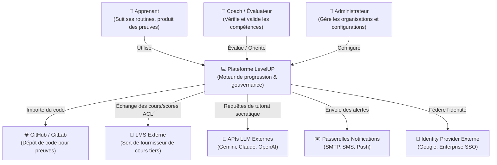
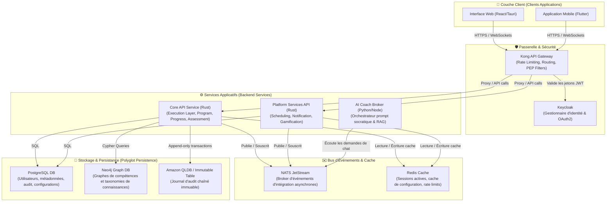
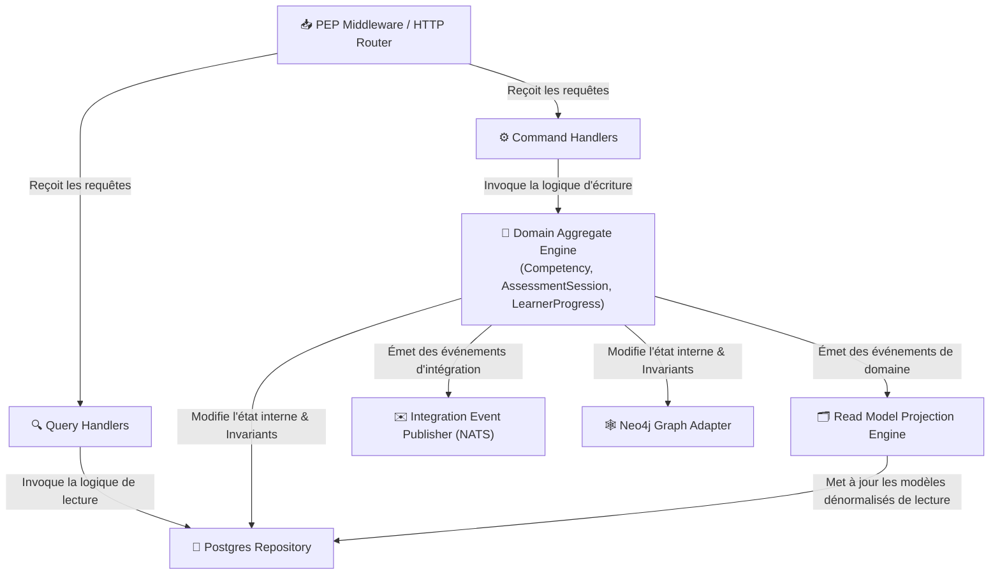
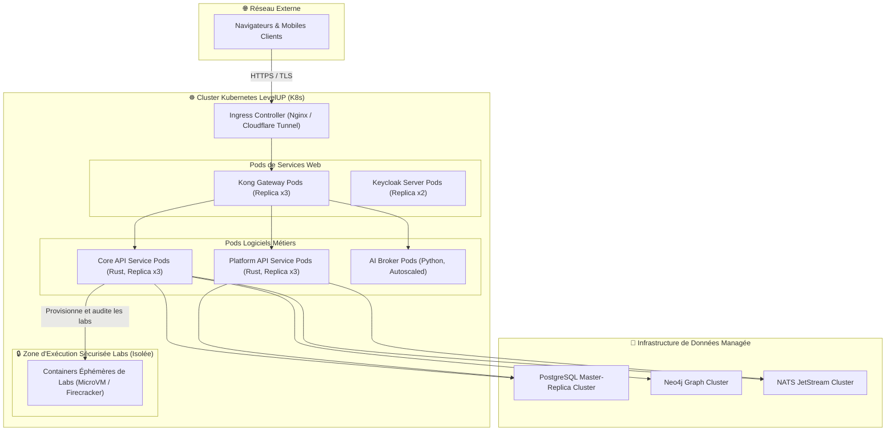

# LevelUP — Solution Architecture (C4 Model)

**Version :** 1.1  
**Statut :** Core Standard  
**Catégorie :** Solution Layer  
**Code :** LEVELUP-SOL-C4-001  

---

# 1. Niveau 1 : Diagramme de Contexte Système (System Context Diagram)

Le diagramme de contexte montre comment la plateforme LevelUP s'intègre avec les acteurs externes et les services tiers.

---

# 2. Niveau 2 : Diagramme de Conteneurs (Container Diagram)

Le diagramme de conteneurs détaille la répartition logicielle des différents services, des bases de données et du bus d'événements.

---

# 3. Niveau 3 : Diagramme de Composants (Component Diagram)

Détail interne des composants logiciels du **Core API Service (Rust)**.

---

# 4. Niveau 4 : Diagramme de Déploiement (Deployment Diagram)

Schéma d'infrastructure montrant le déploiement de LevelUP sur un cluster Kubernetes cloud ou on-premise.

