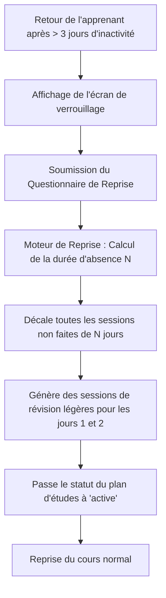

# LevelUP — Contrats d'API & Moteurs Métier

Ce document spécifie l'architecture des interfaces programmatiques (API REST) et la logique algorithmique des moteurs internes de **LevelUP**.

---

## 1. Contrats d'API REST

Tous les échanges se font au format JSON. Les endpoints d'administration requièrent un rôle `admin` (vérifié par JWT / RBAC).

### 1.1 Authentification
* `POST /api/v1/auth/login` : Authentification utilisateur.
  * *Request Body* : `{"email": "...", "password": "..."}`
  * *Response* : `{"token": "JWT_STRING", "user": {"id": "...", "role": "learner", "discipline_score": 100}}`

### 1.2 Programmes & Plans
* `GET /api/v1/programs` : Liste des programmes d'étude actifs.
* `POST /api/v1/admin/programs` (Admin) : Création d'un programme.
* `POST /api/v1/admin/plans` (Admin) : Création d'un plan d'étude associé à un programme.
  * *Request Body* :
    ```json
    {
      "program_id": "c0eebc99-9c0b-4ef8-bb6d-6bb9bd380a33",
      "title": "Cursus Fondamentaux Cloud",
      "objective": "Devenir autonome sur l'administration système et Docker",
      "estimated_duration_days": 90
    }
    ```

### 1.3 Progression & Sujets
* `GET /api/v1/topics/unlocked` : Récupère la liste des sujets accessibles (tous les prérequis sont validés).
* `POST /api/v1/topics/:id/validate` : Force la validation d'un sujet (réservé aux exercices pratiques ou validation automatique).
  * *Response* : `{"success": true, "unlocked_topics": ["UUID_TOPIC_B"]}`

### 1.4 Séances (Sessions)
* `POST /api/v1/sessions/start` : Démarre la séance du jour.
  * *Request Body* : `{"topic_id": "UUID_TOPIC"}`
  * *Response* : `{"session_id": "UUID_SESSION", "status": "active", "started_at": "..."}`
* `POST /api/v1/sessions/:id/end` : Clôture une séance.
  * *Request Body* : `{"outcome": "done|interrupted", "notes": "..."}`
  * *Response* : `{"session_id": "...", "status": "done|interrupted"}`

### 1.5 Discipline & Pénalités
* `GET /api/v1/penalties/history` : Historique des pénalités de l'utilisateur.
* `POST /api/v1/admin/penalties/waive` (Admin) : Accorde une dispense pour une pénalité (ex : maladie).
  * *Request Body* : `{"penalty_id": "...", "reason": "Justificatif médical fourni"}`

---

## 2. Logique des Moteurs Métier (Algorithmes)

### 2.1 Moteur de Planification (Scheduling Engine)
Ce moteur détermine quel sujet doit être étudié chaque jour.

**Algorithme de sélection de la séance :**
1. **Recherche de session active** : Si l'apprenant a une session à l'état `interrupted` ou `postponed`, elle est prioritaire pour aujourd'hui.
2. **Analyse du Graphe** : Le moteur effectue un parcours des sujets du plan d'étude actif :
   * Il identifie tous les sujets du plan dont le statut est `locked`.
   * Pour chaque sujet, il vérifie dans la table `prerequisites` si tous les sujets requis sont dans l'état `validated` ou `mastered`.
   * Si oui, le statut du sujet passe de `locked` à `available`.
3. **Sélection par Ordre Pédagogique** : Parmi les sujets `available` ou `in_progress`, il sélectionne celui appartenant au module ayant le plus petit `sequence_order` et génère une entrée `Session` planifiée pour la date du jour.

```text
Entrée : User_ID, Plan_ID
Sortie : Session planifiée pour aujourd'hui

1. Rechercher une session non finalisée (status = 'interrupted') -> Si trouvée, retourner.
2. Pour chaque topic T du plan :
     Si tous les P de prerequisites(T) ont status IN ('validated', 'mastered') :
       T.status <- 'available'
3. Sélectionner le topic T ('available') ayant le sequence_order le plus bas.
4. Créer Session(topic_id = T.id, user_id = User_ID, status = 'planned', planned_date = CURRENT_DATE).
```

---

### 2.2 Moteur Disciplinaire (Discipline Engine)
Ce moteur s'exécute chaque nuit via un job planifié pour détecter les manquements.

**Algorithme de détection des absences :**
1. Rechercher toutes les sessions planifiées à une date antérieure ou égale à aujourd'hui et dont le statut est toujours `planned`.
2. Pour chaque session trouvée :
   * Mettre à jour le statut de la session à `missed`.
   * Créer une entrée dans la table `penalties` :
     * Calculer les points à retirer (ex: 10 points par défaut).
     * Mettre à jour le `discipline_score` de l'utilisateur en soustrayant ces points (sans descendre en dessous de 0).
   * Insérer un log dans `activity_logs` pour documenter l'application automatique de la pénalité.
3. Si le nombre de sessions manquées consécutives atteint le seuil (ex: 3 jours), changer le statut du plan d'étude de l'utilisateur à `paused` et générer un verrou de reprise.

---

### 2.3 Moteur de Reprise (Recovery Engine)
Lorsqu'un apprenant revient d'une période d'inactivité prolongée (plan à l'état `paused`), il ne doit pas être submergé de travail accumulé.

**Algorithme de réajustement du calendrier :**
1. **Évaluation** : L'apprenant répond au questionnaire de reprise (évaluation de la charge cognitive, motivation, temps disponible).
2. **Décalage temporel** : Le moteur identifie toutes les sessions planifiées dans le futur qui n'ont pas encore été effectuées.
3. **Répartition de la charge** :
   * Le moteur décale le calendrier futur de $N$ jours (où $N$ correspond à la durée de l'inactivité).
   * Il insère des séances spécifiques de **révision** (état `planned` avec un statut de révision) sur les premiers jours de reprise pour réactiver la mémoire de travail de l'apprenant.
   * Le score de discipline remonte progressivement de 5 points par jour de séance validée avec succès.
4. Le statut du plan repasse à `active`.


