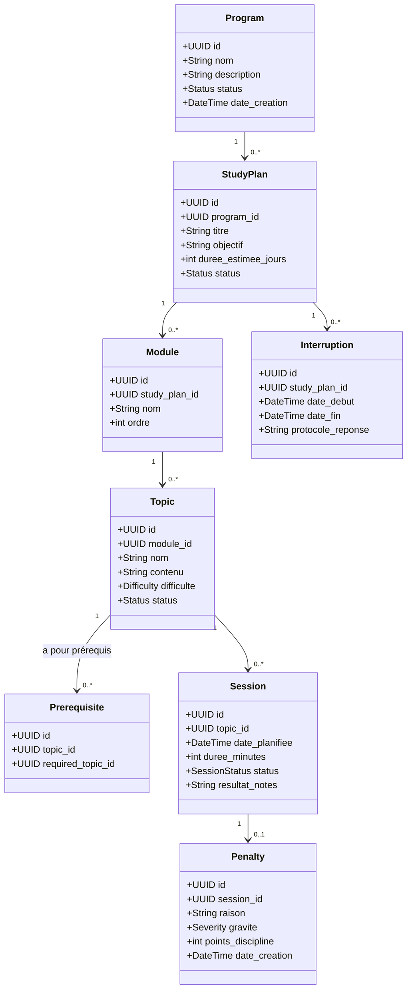
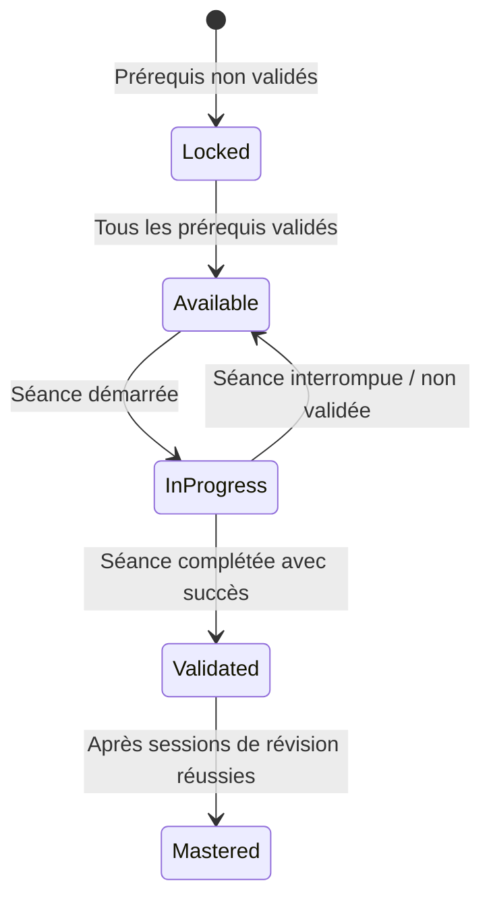
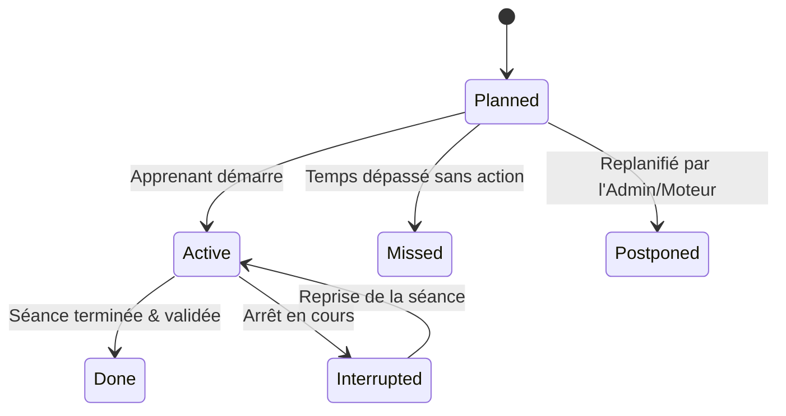
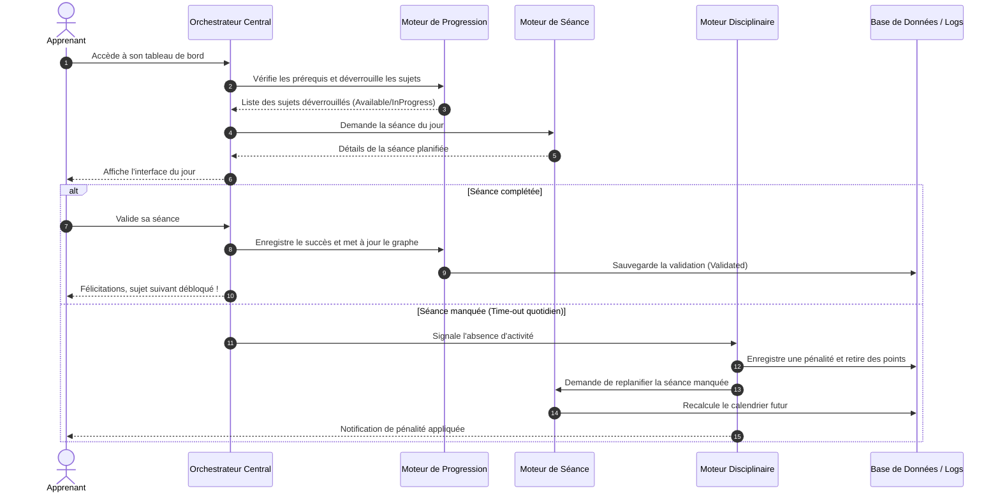

# LevelUP — Dossier de Conception Produit (No-Code)

> [!IMPORTANT]
> **LevelUP** n'est pas un simple agenda ou un outil de suivi d'études passif. C'est un **système de contraintes intelligentes** conçu pour imposer la discipline, structurer la progression pédagogique, gérer la résilience (reprise après interruption) et tracer rigoureusement chaque écart par un mécanisme de pénalités.

---

## 1. Vision & Philosophie du Produit

### 1.1 Le Problème
L'auto-apprentissage (notamment en ingénierie système, administration réseau, DevOps ou développement bas niveau) souffre d'un taux d'abandon extrêmement élevé. Les causes principales sont :
1. **La dispersion** : L'apprenant saute de sujet en sujet sans maîtriser les bases.
2. **Le manque de discipline** : Pas de contrainte temporelle ou d'engagement réel.
3. **La mauvaise gestion des interruptions** : Après un arrêt de quelques jours, l'apprenant perd le fil, se décourage et abandonne.
4. **L'illusion de maîtrise** : Valider des modules sans réelle vérification des prérequis logiques.

### 1.2 La Solution : Le Système de Contrainte Intelligente
LevelUP répond à cela en automatisant le rôle d'un tuteur rigoureux :
* **Un chemin, pas de raccourcis** : Le système verrouille les sujets tant que leurs prérequis ne sont pas maîtrisés.
* **Engagement temporel** : Des séances d'apprentissage quotidiennes sont générées et planifiées. Tout manquement entraîne une pénalité.
* **Résilience intégrée** : En cas d'interruption (maladie, imprévu), le système ne se contente pas de décaler les dates ; il applique un protocole de reprise (évaluation, recalage automatique, séance de rattrapage) pour réengager l'apprenant de manière cohérente.
* **Traçabilité totale** : Toutes les actions, validations, sanctions et modifications d'administration sont journalisées.

---

## 2. Objectifs Globaux & Public Cible

### 2.1 Objectifs Clés
* **Taux de complétion accru** : Maintenir l'apprenant dans un rythme régulier grâce à des rappels et un calendrier dynamique.
* **Maîtrise réelle** : Garantir l'acquisition des compétences clés (sécurité, système, DevOps) en validant rigoureusement les prérequis via un graphe orienté de dépendances.
* **Autonomie de création** : Permettre à un administrateur de créer, modifier, suspendre et structurer des programmes éducatifs complets de manière modulaire sans toucher au code.

### 2.2 Public Cible
1. **L'Apprenant (Learner)** : Professionnel ou étudiant en informatique cherchant à acquérir des compétences techniques dures (C, DevOps, Administration Linux) avec rigueur et structure.
2. **L'Administrateur (Admin)** : Tuteur, formateur ou ingénieur pédagogique qui conçoit les programmes d'études, définit les dépendances, gère les règles de pénalité et supervise la progression globale.

---

## 3. Analyse Détaillée des Besoins (Besoins Fonctionnels)

### 3.1 Gestion de la Structure Pédagogique (No-Code)
L'administrateur doit pouvoir configurer la formation à l'aide d'une hiérarchie claire :
* **Programme** : Niveau macro (ex. : *DevOps & Infrastructure Cloud*).
* **Plan d'Étude** : Déclinaison temporelle et pédagogique du programme (ex. : *Cursus intensif 3 mois*).
* **Module** : Regroupement thématique au sein d'un plan (ex. : *Conteneurisation et Docker*).
* **Sujet (Topic)** : Unité d'apprentissage atomique (ex. : *Gestion des volumes Docker*).
* **Ressources** : Liens vers des cours, vidéos, livres, classés comme *Primaire* (obligatoire) ou *Secondaire* (complémentaire).

### 3.2 Le Graphe de Dépendances (Prérequis)
* Un sujet $B$ peut dépendre d'un ou plusieurs sujets prérequis $A_1, A_2$.
* Le système doit empêcher l'accès au sujet $B$ tant que $A_1$ et $A_2$ ne sont pas dans l'état `validated` ou `mastered`.
* L'interface de l'apprenant doit afficher explicitement le graphe de dépendance ou la liste des prérequis manquants pour déverrouiller un sujet.

### 3.3 Exécution et Suivi Quotidien (Séances)
* Chaque jour, le système propose une **Séance** de travail basée sur le plan actif.
* L'apprenant démarre la séance, qui suit une durée estimée.
* À la fin de la séance, l'apprenant clôture le travail en déclarant un résultat : `done` (complété), `interrupted` (interrompu), ou si la journée se termine sans action, le système marque la séance comme `missed` (manquée).

### 3.4 Système Disciplinaire et Pénalités
* **Détection automatique des écarts** : Si une séance planifiée passe en `missed`, le moteur disciplinaire se déclenche.
* **Application des pénalités** : Une pénalité est générée, associant une gravité (faible, moyenne, forte), un retrait de points fictifs de discipline, et un impact sur le planning (ex. : obligation d'effectuer une séance supplémentaire de révision).
* **Historique non modifiable** : L'apprenant ne peut pas supprimer ou falsifier son historique de pénalités. Seul l'administrateur peut accorder des dispenses justifiées (maladie, etc.), ce qui génère un log d'audit.

### 3.5 Protocole de Reprise après Interruption
Lorsqu'un apprenant s'arrête pendant une période prolongée (plusieurs séances manquées d'affilée) :
1. **Verrouillage temporaire** : L'accès au cours normal est suspendu.
2. **Questionnaire/Évaluation de reprise** : L'apprenant doit répondre à un court questionnaire pour évaluer ce qu'il a retenu et valider son contexte (temps disponible, motivation).
3. **Recalage du planning** : Le moteur de planification recalcule les dates futures et insère des sessions de révision ou de rattrapage avant de réactiver le cours normal.

---

## 4. Modèle Métier & États du Système

### 4.1 Entités du Domaine (Données logiques)

### 4.2 Machine à États (Cycles de Vie)

#### État d'un Sujet (Topic)

#### État d'une Séance (Session)

---

## 5. Architecture Fonctionnelle (Flux d'Orchestration)

Voici comment interagissent les différents moteurs lors de l'utilisation de la plateforme :

---

## 6. Conditions pour un Produit Final Efficace

Pour que LevelUP ne soit pas seulement une ébauche mais un produit performant et engageant, l'implémentation doit respecter plusieurs piliers clés :

### 6.1 Une Expérience Utilisateur (UI/UX) Immersive & Premiums
L'application doit susciter un sentiment de sérieux et de focus. Les principes visuels doivent inclure :
* **Un Mode Sombre par défaut** : Interface épurée avec des couleurs type "terminal de commande moderne" (Gris foncés, accents néons discrets : vert pour validation, orange/rouge pour pénalités, bleu pour les révisions).
* **Des Micro-Animations** : Effets subtils de transition lors du déverrouillage d'un sujet ou de l'application d'une pénalité (effet visuel de "verrou" qui s'ouvre, barre de progression dynamique).
* **Une Visualisation du Graphe** : Utilisation d'un arbre de dépendances interactif (type node graph léger) pour que l'apprenant voie physiquement sa progression.

### 6.2 Fiabilité des Moteurs Métier
Le produit final repose entièrement sur la robustesse de ses algorithmes :
* **Détection des chevauchements** : Le moteur de planification ne doit jamais planifier deux séances complexes en même temps.
* **Immutabilité des Logs d'Audit** : Chaque action (changement de statut, application de pénalité, validation manuelle par l'admin) doit être inscrite dans une table d'audit `activity_logs` dont les entrées ne peuvent être ni modifiées ni supprimées (principe d'append-only).

### 6.3 Protocole de Résilience (Gestion des Pannes de Discipline)
La réussite d'un outil de formation autonome repose sur la gestion de l'échec de l'utilisateur. 
* Si l'utilisateur a 3 jours d'inactivité, la plateforme **ne doit pas** accumuler 3 séances sur le même jour lors de son retour.
* Le système doit geler le parcours, lui présenter une page dédiée "Protocole de reprise" (analyse de l'interruption, recalibrage de la charge quotidienne), puis étaler les séances manquées dans le calendrier futur en y insérant des révisions légères des notions précédentes.

### 6.4 Tableau de Bord d'Administration Complet
Pour que la conception soit réellement "sans code" à long terme, l'administrateur doit disposer d'un outil visuel complet pour :
* **Glisser-Déposer** des modules pour changer leur ordre.
* **Lier graphiquement** des sujets entre eux pour créer des prérequis.
* **Ajuster les barèmes de pénalités** (nombre de points retirés, déclencheur de replanification).

---

## 7. Plan de Validation & Critères d'Acceptation (MVP)

Pour valider le succès du produit final, les scénarios de test suivants doivent impérativement passer :

| Scénario de Test | Action | Résultat Attendu |
| :--- | :--- | :--- |
| **T1. Verrouillage prérequis** | Tenter d'accéder au Sujet B qui a pour prérequis le Sujet A (non validé). | Accès refusé, affichage d'un message explicatif listant le Sujet A comme prérequis. |
| **T2. Déverrouillage automatique** | Marquer le Sujet A comme `Validated`. | Le Sujet B passe automatiquement de l'état `Locked` à `Available`. |
| **T3. Génération de pénalité** | Laisser passer 24h sans démarrer ni valider la séance planifiée. | La séance passe au statut `Missed`. Une entité `Penalty` est créée, 10 points de discipline sont retirés. |
| **T4. Protocole de reprise** | Simuler 4 jours d'inactivité, puis se connecter. | Le système affiche l'écran de reprise, bloque l'accès aux cours, recalcule le calendrier et étale la charge de rattrapage. |
| **T5. Traçabilité d'administration** | L'administrateur modifie la durée estimée d'un plan. | Un log d'audit est inséré avec le timestamp, l'identité de l'admin et l'ancienne/nouvelle valeur. |
