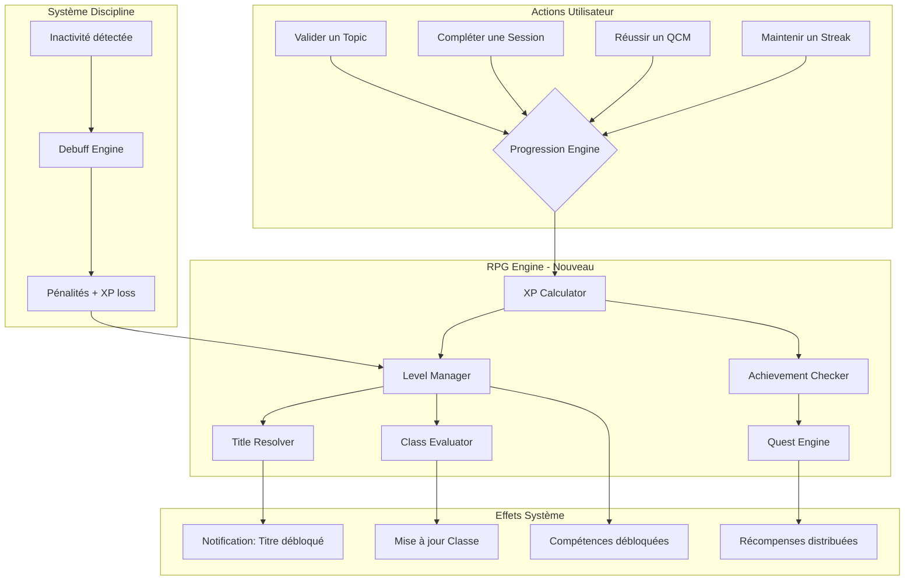
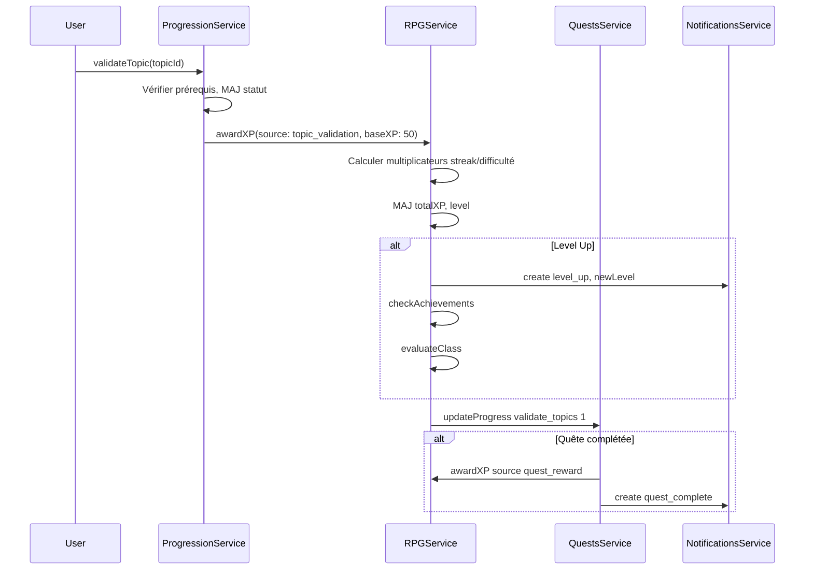
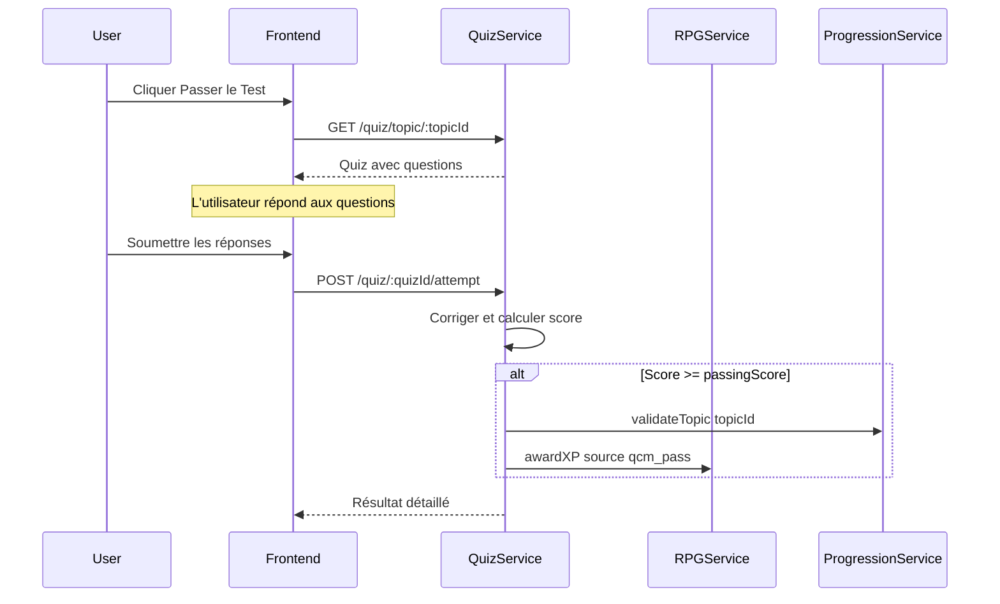

# 🎮 LevelUP — Spécification du Système RPG / Science-Fiction

> **Version** : 1.0.0  
> **Date** : 2026-06-19  
> **Statut** : Architecture & Design — En attente de validation  

---

## Table des Matières

1. [Vision & Philosophie](#1-vision--philosophie)
2. [Analyse de l'Existant](#2-analyse-de-lexistant)
3. [Architecture du Système RPG](#3-architecture-du-système-rpg)
4. [Modèle de Données (Évolution Prisma)](#4-modèle-de-données-évolution-prisma)
5. [Backend — Services & API](#5-backend--services--api)
6. [Frontend — Composants & Pages](#6-frontend--composants--pages)
7. [Système de Quêtes & Achievements](#7-système-de-quêtes--achievements)
8. [Arbre de Compétences (Skill Tree)](#8-arbre-de-compétences-skill-tree)
9. [Système de Titres & Rangs](#9-système-de-titres--rangs)
10. [Notifications & Journal de Système](#10-notifications--journal-de-système)
11. [IA Tutor & Génération de Contenu](#11-ia-tutor--génération-de-contenu)
12. [Moteur de Tests / QCM](#12-moteur-de-tests--qcm)
13. [Plan d'Implémentation Phasé](#13-plan-dimplémentation-phasé)
14. [Annexes](#14-annexes)

---

## 1. Vision & Philosophie

### 1.1 Principe Fondateur

> **"Apprendre en s'amusant, avec discipline et rigueur."**

LevelUP n'est pas un simple LMS. C'est un **système de progression personnelle** inspiré des jeux RPG (Solo Leveling, Sword Art Online, Tower of God) et des interfaces de science-fiction (Minority Report, Iron Man HUD, Ghost in the Shell).

L'utilisateur ne "suit un cours" — il **éveille son Système**, monte en puissance, débloque des capacités, et affronte des défis de plus en plus complexes.

### 1.2 Piliers de Conception

| Pilier | Description | Inspiration |
|:---|:---|:---|
| **Progression Tangible** | Chaque action (validation, session, streak) donne des récompenses visibles et mesurables | XP, niveaux, barres de progression RPG |
| **Contraintes Intelligentes** | L'accès est conditionné par la maîtrise des prérequis (graphe DAG). Pas de raccourci possible. | Système de verrouillage de compétences (Skill Lock) |
| **Identité & Classe** | L'utilisateur forge son identité technique à travers ses choix de parcours | Classes de personnage (Mage, Guerrier → SysAdmin, NetEngineer) |
| **Responsabilité & Conséquences** | L'inactivité a un coût réel (pénalités, debuffs, perte de rang) | Système de malédictions / status effects |
| **Immersion Narrative** | L'interface raconte une histoire — l'utilisateur est un opérateur dans un monde technique | UI de type terminal HUD / sci-fi |

### 1.3 Ce que ça change pour l'utilisateur

```
AVANT (LMS classique)           →    APRÈS (LevelUP RPG System)
──────────────────────────────        ──────────────────────────────
"Cours 3/12 complété"           →    "Niveau 7 — Adepte du Kernel"
"Test réussi"                   →    "Compétence 'Gestion Mémoire' débloquée ⚡"
"Inactif depuis 3 jours"       →    "⚠️ DEBUFF: Malédiction du Paresseux (-30% XP)"  
"Badge de complétion"           →    "Titre obtenu: Architecte des Ombres 🏆"
"Voir mes cours"                →    "Arbre de Compétences — 4 branches à explorer"
```

---

## 2. Analyse de l'Existant

### 2.1 Ce qui existe déjà (et qu'on conserve)

| Composant | Fichier clé | Statut |
|:---|:---|:---|
| Schéma de données complet | `prisma/schema.prisma` | ✅ Production-ready |
| Progression Engine (DAG) | `progression.service.ts` | ✅ Fonctionnel |
| Session Lifecycle | `sessions.service.ts` | ✅ Fonctionnel |
| Discipline & Streaks | `discipline.service.ts` | ✅ Fonctionnel |
| Accountability Cron | `accountability-cron.service.ts` | ✅ Fonctionnel |
| Recommendation Engine | `recommendations.service.ts` | ✅ Fonctionnel |
| Profil RPG (v1) | `profile/page.tsx` | 🔄 Base existante |
| Système de Notifications | `dashboard/page.tsx` | 🔄 Dropdown basique |
| 4 Parcours par défaut | `seed.ts` + `docs/ref/content/` | ✅ D1, D2, D3, D4 |
| Import JSON/MD | `roadmap-parser.ts` | ✅ Fonctionnel |
| Agent CLI (Rust/X11) | `agent-cli/src/main.rs` | ✅ Fonctionnel |

### 2.2 Ce qui manque / doit évoluer

| Fonctionnalité | Priorité | Complexité |
|:---|:---|:---|
| Système XP & Niveaux calculé (backend) | 🔴 Critique | Moyenne |
| Arbre de Compétences visuel (Skill Tree) | 🔴 Critique | Haute |
| Système de Titres & Rangs dynamiques | 🟠 Haute | Moyenne |
| Quêtes & Achievements | 🟠 Haute | Haute |
| Moteur de Tests / QCM | 🟠 Haute | Haute |
| IA Tutor (génération de cours) | 🟡 Moyenne | Très Haute |
| Notifications temps réel (WebSocket) | 🟡 Moyenne | Moyenne |
| Page Profil RPG v2 (refonte complète) | 🔴 Critique | Haute |
| Inventaire (badges, récompenses) | 🟡 Moyenne | Basse |
| Système de Classes spécialisées | 🟠 Haute | Moyenne |

---

## 3. Architecture du Système RPG

### 3.1 Vue d'ensemble — Flux de données



### 3.2 Formules de Calcul

#### XP par Action

| Action | XP de base | Multiplicateurs |
|:---|:---|:---|
| Valider un Topic (`validated`) | +50 XP | × difficulté (1.0/1.5/2.0) |
| Maîtriser un Topic (`mastered`) | +25 XP (bonus) | × 1.0 |
| Compléter une Session (>= durée prévue) | +20 XP | × streak_multiplier |
| Réussir un QCM (>= 80%) | +30 XP | × (score / 100) |
| Streak journalier (3+ jours) | +10 XP/jour | × floor(streak / 7) |
| Première validation d'un Module | +100 XP (bonus Module) | × 1.0 |

#### Multiplicateur de Streak

```
streak_multiplier = 1.0 + min(currentStreak * 0.05, 0.5)
```
- Streak 0-2 : x1.0
- Streak 3 : x1.15
- Streak 7 : x1.35
- Streak 10+ : x1.50 (cap)

#### Niveau (Level)

```
level = floor(sqrt(totalXP / 100)) + 1
xp_for_next_level = (level)^2 × 100
xp_current_in_level = totalXP - (level - 1)^2 × 100
progress_percentage = xp_current_in_level / ((level)^2 × 100 - (level - 1)^2 × 100) × 100
```

| Niveau | XP Total Requis | Titre automatique |
|:---|:---|:---|
| 1 | 0 | Recrue du Système |
| 5 | 1 600 | Opérateur Initié |
| 10 | 8 100 | Technicien Confirmé |
| 15 | 19 600 | Ingénieur du Noyau |
| 20 | 36 100 | Architecte Système |
| 25 | 57 600 | Maître des Protocoles |
| 30 | 84 100 | Légende de l'Infrastructure |

#### Pénalités XP

| Événement | Perte XP |
|:---|:---|
| Session manquée (non justifiée) | -20 XP |
| Score discipline < 50 | -5 XP/jour |
| Streak cassé | -10 XP |

---

## 4. Modèle de Données (Évolution Prisma)

### 4.1 Nouvelles Tables

```prisma
// ===== SYSTÈME RPG =====

model UserProfile {
  id              String   @id @default(uuid()) @db.Uuid
  userId          String   @unique @map("user_id") @db.Uuid
  user            User     @relation(fields: [userId], references: [id], onDelete: Cascade)
  
  // XP & Niveaux
  totalXP         Int      @default(0) @map("total_xp")
  level           Int      @default(1)
  
  // Classe & Spécialisation  
  className       String   @default("Recrue du Système") @map("class_name")
  classIcon       String   @default("🔰") @map("class_icon")
  primaryPath     String?  @map("primary_path") // "system_dev", "admin_linux", "network", "devops"
  
  // Statistiques de Combat (Attributs)
  statMemory      Int      @default(10) @map("stat_memory")    // C/Rust — Mémoire & CPU
  statKernel      Int      @default(10) @map("stat_kernel")    // Linux Admin — Persistance Kernel
  statNetwork     Int      @default(10) @map("stat_network")   // Réseau/Télécom — Résolution
  statOrchestra   Int      @default(10) @map("stat_orchestra") // DevOps — Orchestration
  statDiscipline  Int      @default(10) @map("stat_discipline")// Discipline — Volonté
  
  // Métadonnées
  bio             String?
  avatarUrl       String?  @map("avatar_url")
  createdAt       DateTime @default(now()) @map("created_at") @db.Timestamptz
  updatedAt       DateTime @default(now()) @updatedAt @map("updated_at") @db.Timestamptz
  
  // Relations
  achievements    UserAchievement[]
  titles          UserTitle[]
  activeTitle     String?  @map("active_title")
  quests          UserQuest[]
  xpLogs          XPLog[]
  
  @@map("user_profiles")
}

model Achievement {
  id          String   @id @default(uuid()) @db.Uuid
  code        String   @unique
  name        String
  description String
  icon        String   @default("🏆")
  category    String   // "progression", "discipline", "social", "exploration"
  xpReward    Int      @default(0) @map("xp_reward")
  rarity      String   @default("common") // "common", "rare", "epic", "legendary"
  
  // Condition de déclenchement
  triggerType String   @map("trigger_type")
  triggerValue Int     @map("trigger_value")
  triggerMeta  Json?   @map("trigger_meta")
  
  users       UserAchievement[]
  
  @@map("achievements")
}

model UserAchievement {
  id            String      @id @default(uuid()) @db.Uuid
  userId        String      @map("user_id") @db.Uuid
  userProfile   UserProfile @relation(fields: [userId], references: [userId], onDelete: Cascade)
  achievementId String      @map("achievement_id") @db.Uuid
  achievement   Achievement @relation(fields: [achievementId], references: [id], onDelete: Cascade)
  unlockedAt    DateTime    @default(now()) @map("unlocked_at") @db.Timestamptz
  
  @@unique([userId, achievementId])
  @@map("user_achievements")
}

model Title {
  id          String   @id @default(uuid()) @db.Uuid
  code        String   @unique
  name        String
  description String
  category    String   // "level", "achievement", "special", "seasonal"
  rarity      String   @default("common")
  
  requireLevel    Int?     @map("require_level")
  requireAchievement String? @map("require_achievement")
  
  users       UserTitle[]
  
  @@map("titles")
}

model UserTitle {
  id          String      @id @default(uuid()) @db.Uuid
  userId      String      @map("user_id") @db.Uuid
  userProfile UserProfile @relation(fields: [userId], references: [userId], onDelete: Cascade)
  titleId     String      @map("title_id") @db.Uuid
  title       Title       @relation(fields: [titleId], references: [id], onDelete: Cascade)
  earnedAt    DateTime    @default(now()) @map("earned_at") @db.Timestamptz
  
  @@unique([userId, titleId])
  @@map("user_titles")
}

model Quest {
  id          String   @id @default(uuid()) @db.Uuid
  code        String   @unique
  name        String
  description String
  type        String   // "daily", "weekly", "story", "challenge"
  xpReward    Int      @map("xp_reward")
  
  objectiveType  String @map("objective_type")
  objectiveCount Int    @map("objective_count")
  objectiveMeta  Json?  @map("objective_meta")
  
  timeLimit      Int?   @map("time_limit")
  repeatInterval String? @map("repeat_interval")
  
  users          UserQuest[]
  
  @@map("quests")
}

model UserQuest {
  id          String      @id @default(uuid()) @db.Uuid
  userId      String      @map("user_id") @db.Uuid
  userProfile UserProfile @relation(fields: [userId], references: [userId], onDelete: Cascade)
  questId     String      @map("quest_id") @db.Uuid
  quest       Quest       @relation(fields: [questId], references: [id], onDelete: Cascade)
  progress    Int         @default(0)
  status      String      @default("active") // "active", "completed", "failed", "expired"
  startedAt   DateTime    @default(now()) @map("started_at") @db.Timestamptz
  completedAt DateTime?   @map("completed_at") @db.Timestamptz
  
  @@unique([userId, questId])
  @@map("user_quests")
}

model XPLog {
  id          BigInt      @id @default(autoincrement())
  userId      String      @map("user_id") @db.Uuid
  userProfile UserProfile @relation(fields: [userId], references: [userId], onDelete: Cascade)
  amount      Int
  source      String
  sourceId    String?     @map("source_id") @db.Uuid
  description String
  createdAt   DateTime    @default(now()) @map("created_at") @db.Timestamptz
  
  @@index([userId])
  @@map("xp_logs")
}

// ===== MOTEUR QCM / TESTS =====

model Quiz {
  id          String   @id @default(uuid()) @db.Uuid
  topicId     String   @map("topic_id") @db.Uuid
  topic       Topic    @relation(fields: [topicId], references: [id], onDelete: Cascade)
  title       String
  description String?
  passingScore Int     @default(80) @map("passing_score")
  timeLimit    Int?    @map("time_limit")
  questions   QuizQuestion[]
  attempts    QuizAttempt[]
  
  @@index([topicId])
  @@map("quizzes")
}

model QuizQuestion {
  id          String   @id @default(uuid()) @db.Uuid
  quizId      String   @map("quiz_id") @db.Uuid
  quiz        Quiz     @relation(fields: [quizId], references: [id], onDelete: Cascade)
  questionText String  @map("question_text")
  questionType String  @default("multiple_choice") @map("question_type")
  options     Json
  explanation String?
  points      Int      @default(1)
  order       Int
  
  @@index([quizId])
  @@map("quiz_questions")
}

model QuizAttempt {
  id          String   @id @default(uuid()) @db.Uuid
  quizId      String   @map("quiz_id") @db.Uuid
  quiz        Quiz     @relation(fields: [quizId], references: [id], onDelete: Cascade)
  userId      String   @map("user_id") @db.Uuid
  user        User     @relation(fields: [userId], references: [id], onDelete: Cascade)
  score       Int
  passed      Boolean
  answers     Json
  startedAt   DateTime @default(now()) @map("started_at") @db.Timestamptz
  completedAt DateTime? @map("completed_at") @db.Timestamptz
  
  @@index([quizId, userId])
  @@map("quiz_attempts")
}

// ===== NOTIFICATIONS SYSTÈME =====

model Notification {
  id          String   @id @default(uuid()) @db.Uuid
  userId      String   @map("user_id") @db.Uuid
  user        User     @relation(fields: [userId], references: [id], onDelete: Cascade)
  type        String
  title       String
  message     String
  icon        String   @default("📢")
  metadata    Json?
  read        Boolean  @default(false)
  createdAt   DateTime @default(now()) @map("created_at") @db.Timestamptz
  
  @@index([userId, read])
  @@map("notifications")
}
```

### 4.2 Modifications au Schéma Existant

Les modèles `User` et `Topic` existants recevront de nouvelles relations :

```diff
 model User {
   // ... champs existants ...
+  profile        UserProfile?
+  quizAttempts   QuizAttempt[]
+  notifications  Notification[]
 }

 model Topic {
   // ... champs existants ...
+  quizzes        Quiz[]
 }
```

---

## 5. Backend — Services & API

### 5.1 Nouveau Module : `rpg` (RPG Engine)

#### `rpg.service.ts` — Service Principal

```typescript
// Responsabilités :
// 1. Calcul et attribution d'XP
// 2. Gestion des niveaux et level-up
// 3. Évaluation des attributs (stats) basée sur la progression
// 4. Déclenchement d'événements (achievements, titres)

interface XPEvent {
  userId: string;
  source: 'topic_validation' | 'session_complete' | 'qcm_pass' | 'streak_bonus' | 'penalty' | 'quest_reward';
  sourceId?: string;
  baseXP: number;
  multiplier?: number;
  description: string;
}

class RPGService {
  // Appelé par ProgressionService quand un topic est validé
  async awardXP(event: XPEvent): Promise<{ totalXP: number; newLevel: number; leveledUp: boolean }>;
  
  // Recalcule les stats basé sur UserTopicProgress
  async recalculateStats(userId: string): Promise<UserProfile>;
  
  // Vérifie et attribue les achievements débloqués
  async checkAchievements(userId: string): Promise<Achievement[]>;
  
  // Évalue la classe/spécialisation
  async evaluateClass(userId: string): Promise<{ className: string; classIcon: string }>;
  
  // Retourne le profil RPG complet
  async getFullProfile(userId: string): Promise<RPGProfile>;
}
```

#### `rpg.controller.ts` — Endpoints API

| Méthode | Route | Description |
|:---|:---|:---|
| `GET` | `/rpg/profile` | Profil RPG complet (XP, level, stats, classe, titres, achievements) |
| `GET` | `/rpg/xp-history` | Historique des gains/pertes d'XP |
| `GET` | `/rpg/achievements` | Liste de tous les achievements + statut débloqué/verrouillé |
| `GET` | `/rpg/titles` | Titres obtenus + titre actif |
| `PUT` | `/rpg/title` | Changer le titre actif affiché |
| `GET` | `/rpg/leaderboard` | Classement des utilisateurs par niveau/XP |
| `GET` | `/rpg/skill-tree` | Arbre de compétences de l'utilisateur |

### 5.2 Nouveau Module : `quests`

```typescript
class QuestsService {
  async assignDailyQuests(userId: string): Promise<UserQuest[]>;
  async updateQuestProgress(userId: string, objectiveType: string, count: number): Promise<void>;
  async checkCompletion(userId: string): Promise<UserQuest[]>;
}
```

### 5.3 Nouveau Module : `quiz`

```typescript
class QuizService {
  async getQuizForTopic(topicId: string): Promise<Quiz>;
  async submitAttempt(userId: string, quizId: string, answers: Record<string, number>): Promise<QuizResult>;
  async generateQuiz(topicId: string, questionCount: number): Promise<Quiz>;
}
```

### 5.4 Nouveau Module : `notifications`

```typescript
class NotificationsService {
  async create(userId: string, data: CreateNotificationDto): Promise<Notification>;
  async getUnread(userId: string): Promise<Notification[]>;
  async markAsRead(userId: string, notificationId?: string): Promise<void>;
  async countUnread(userId: string): Promise<number>;
}
```

### 5.5 Points d'Intégration avec l'Existant

Le RPG Engine s'intègre **en aval** des services existants. Il ne modifie pas leur logique interne, il **réagit** à leurs événements.



---

## 6. Frontend — Composants & Pages

### 6.1 Refonte de la Navigation Sidebar

La sidebar actuelle est fonctionnelle mais ne reflète pas l'identité RPG. Nouvelle structure :

```
+-----------------------------+
|  LevelUP                    |
|  SYSTEM v3.0.0              |
+-----------------------------+
|  [AVATAR]  Username         |
|   Lvl 12   Classe: ...     |
|  ░░░░░░░░░░ 72% -> Lvl 13  |
+-----------------------------+
|  📊 Hub Central             |  <- /dashboard
|  🌳 Arbre de Compétences   |  <- /skill-tree (NEW)
|  📚 Catalogue des Parcours |  <- /curriculum
|  📅 Centre de Missions     |  <- /sessions/schedule
|  🛡 Discipline & Statut    |  <- /discipline
|  🏆 Quêtes & Achievements  |  <- /quests (NEW)
|  📝 Centre d'Évaluation    |  <- /tests (NEW)
|  💻 Terminaux Connectés    |  <- /devices
|  👤 Profil Système          |  <- /profile
|  ⚙ Administration          |  <- /admin (admin only)
+-----------------------------+
|  🚪 Déconnexion             |
+-----------------------------+
```

### 6.2 Nouvelles Pages

#### `/skill-tree` — Arbre de Compétences

Interface visuelle interactive montrant les 4 branches d'apprentissage sous forme d'arbre. Chaque noeud représente un Module ou un Topic.

**Design** : 
- Fond sombre avec des lignes de connexion lumineuses (style circuit imprimé)
- Noeuds colorés par branche (Orange = Système, Cyan = Linux, Violet = Réseau, Vert = DevOps)
- Noeuds verrouillés = grisés avec icône de cadenas
- Noeuds validés = brillants avec animation pulse
- Noeuds maîtrisés = effet néon + étoile

#### `/quests` — Centre de Quêtes

Liste des quêtes actives, complétées et disponibles.

**Sections** :
- **Quêtes Quotidiennes** (se renouvellent toutes les 24h)
  - "Compléter 1 session d'étude" (+20 XP)
  - "Valider 1 topic" (+30 XP)
  - "Maintenir la streak" (+10 XP)
- **Quêtes Hebdomadaires** 
  - "Valider 5 topics cette semaine" (+150 XP)
  - "Compléter 3 sessions de >=45min" (+100 XP)
- **Quêtes d'Histoire** (liées au parcours)
  - "Compléter le Module 1 du Parcours Système" (+200 XP)
- **Défis** (optionnels, haute récompense)
  - "Obtenir 100% à un QCM sans aide" (+300 XP)

#### `/tests` — Centre d'Évaluation

Interface de passage de QCM/Tests pour valider la maîtrise d'un topic ou module.

**Fonctionnalités** :
- Mode examen (timer, pas de retour en arrière)
- Mode entraînement (pas de timer, explications après chaque question)
- Résultats détaillés avec graphique radar par compétence
- Historique des tentatives

### 6.3 Refonte des Pages Existantes

#### Dashboard (`/dashboard`) — Évolutions

Le dashboard sera enrichi avec :
1. **Quête du Jour** : Carte latérale montrant la quête quotidienne active et sa progression
2. **Statistiques rapides** : 4 KPI cards (XP Total, Niveau, Streak, DP) au lieu d'un profil statique
3. **Derniers Achievements** : Les 3 derniers achievements débloqués
4. **Graphique dynamique** : Basé sur les vraies données de sessions (pas des données statiques)

#### Profil (`/profile`) — Refonte RPG v2

La page profil actuelle est déjà en style sci-fi. La v2 l'enrichit avec :

1. **Carte de Personnage** : Avatar, Niveau, XP bar, Classe, Titre actif
2. **Panneau de Stats** : Radar chart SVG des 5 attributs
3. **Inventaire d'Achievements** : Grille visuelle avec raretés (Commun → Légendaire)
4. **Collection de Titres** : Liste des titres débloqués, sélection du titre actif
5. **Journal d'Activité** : Timeline des événements récents (XP gains, level-ups, etc.)
6. **Équipement / Appareils** : Appareils connectés avec statut temps réel

---

## 7. Système de Quêtes & Achievements

### 7.1 Achievements par Catégorie

#### Progression
| Code | Nom | Condition | Rareté | XP |
|:---|:---|:---|:---|:---|
| `FIRST_BLOOD` | Première Validation | Valider 1 topic | Common | +25 |
| `APPRENTICE` | Apprenti du Système | Valider 10 topics | Common | +50 |
| `JOURNEYMAN` | Compagnon Technique | Valider 25 topics | Rare | +100 |
| `EXPERT` | Expert Confirmé | Valider 50 topics | Epic | +200 |
| `MASTER` | Maître Absolu | Valider 100 topics | Legendary | +500 |
| `MODULE_CLEAR` | Module Achevé | Compléter un module entier | Rare | +150 |
| `PATH_COMPLETE` | Voie Accomplie | Compléter un parcours entier | Legendary | +1000 |

#### Discipline
| Code | Nom | Condition | Rareté | XP |
|:---|:---|:---|:---|:---|
| `STREAK_3` | Flamme Naissante | Streak de 3 jours | Common | +20 |
| `STREAK_7` | Semaine de Fer | Streak de 7 jours | Rare | +50 |
| `STREAK_30` | Mois d'Acier | Streak de 30 jours | Epic | +200 |
| `STREAK_100` | Centurion | Streak de 100 jours | Legendary | +500 |
| `PERFECT_DP` | Discipline Parfaite | Maintenir 100 DP pendant 7 jours | Epic | +150 |
| `COMEBACK` | Retour en Force | Remonter de <50 à 100 DP | Rare | +75 |

#### Sessions
| Code | Nom | Condition | Rareté | XP |
|:---|:---|:---|:---|:---|
| `FIRST_SESSION` | Première Séance | Compléter 1 session | Common | +15 |
| `DEEP_WORKER` | Travailleur Profond | Compléter une session de >=60min | Rare | +50 |
| `NIGHT_OWL` | Hibou Nocturne | Session entre 22h et 5h | Rare | +30 |
| `EARLY_BIRD` | Lève-Tôt | Session avant 7h | Rare | +30 |
| `MARATHON` | Marathonien | 5 sessions dans une journée | Epic | +100 |

#### QCM / Tests
| Code | Nom | Condition | Rareté | XP |
|:---|:---|:---|:---|:---|
| `FIRST_PASS` | Premier Examen | Réussir 1 QCM | Common | +20 |
| `PERFECT_SCORE` | Score Parfait | 100% à un QCM | Epic | +100 |
| `EXAMINER` | Examinateur | Réussir 10 QCM | Rare | +75 |

### 7.2 Quêtes par Défaut

#### Quêtes Quotidiennes (Pool)

| Code | Nom | Objectif | XP |
|:---|:---|:---|:---|
| `DAILY_SESSION` | Entraînement Quotidien | Compléter 1 session | +20 |
| `DAILY_VALIDATE` | Progression du Jour | Valider 1 topic | +30 |
| `DAILY_STREAK` | Feu Sacré | Maintenir la streak | +10 |
| `DAILY_FOCUS_30` | Concentration Minimum | 30 min de focus | +15 |
| `DAILY_QCM` | Test Rapide | Réussir 1 QCM | +25 |

#### Quêtes Hebdomadaires (Pool)

| Code | Nom | Objectif | XP |
|:---|:---|:---|:---|
| `WEEKLY_5_TOPICS` | Semaine Productive | Valider 5 topics | +150 |
| `WEEKLY_3_LONG` | Sessions Profondes | 3 sessions de >= 45min | +100 |
| `WEEKLY_FULL_STREAK` | Flamme Hebdomadaire | Streak de 7 jours | +75 |

---

## 8. Arbre de Compétences (Skill Tree)

### 8.1 Structure

L'arbre de compétences est une **représentation visuelle** du graphe de progression existant. Il ne crée pas de nouvelle logique — il **visualise** les données de `UserTopicProgress`, `Module`, et `Prerequisite`.

```
                    SYSTÈME CENTRAL
                   /    |    \    \
                  /     |     \    \
           DEV        ADMIN     RÉSEAU    DEVOPS
          SYSTÈME     LINUX    TÉLÉCOM     OPS
            🔶          🔷        🟣        🟢
            |           |         |         |
        [Module 1]  [Module 1] [Module 1] [Module 1]
            |           |         |         |
        [Module 2]  [Module 2] [Module 2] [Module 2]
            |           |         |         |
           ...         ...       ...       ...
```

### 8.2 Implémentation Frontend

L'arbre sera rendu en **SVG interactif** dans un composant React dédié. Chaque noeud est cliquable et affiche un popover avec les détails du module/topic.

**Interactions** :
- **Hover** : Affiche un tooltip avec le nom, statut et prérequis
- **Click** : Ouvre un panneau latéral avec les détails du module + topics
- **Zoom/Pan** : Navigation fluide dans l'arbre (pour les grands parcours)

---

## 9. Système de Titres & Rangs

### 9.1 Rangs par Niveau

| Rang | Niveaux | Couleur | Icône |
|:---|:---|:---|:---|
| Fer | 1 – 4 | `#8B8B8B` | ⬜ |
| Bronze | 5 – 9 | `#CD7F32` | 🟫 |
| Argent | 10 – 14 | `#C0C0C0` | ⬜ |
| Or | 15 – 19 | `#FFD700` | 🟡 |
| Platine | 20 – 24 | `#00CED1` | 🔵 |
| Diamant | 25 – 29 | `#B9F2FF` | 💎 |
| Légende | 30+ | `#FF6B6B` | 🔥 |

### 9.2 Classes par Spécialisation

La classe est déterminée automatiquement par la branche où l'utilisateur a le plus de topics validés.

| Branche Dominante | Classe | Icône |
|:---|:---|:---|
| Développement Système | Forgeur de Code | ⚒️ |
| Administration Linux | Gardien du Kernel | 🛡️ |
| Réseau & Télécom | Tisserand de Flux | 🌐 |
| DevOps / DevSecOps | Orchestrateur | ⚡ |
| Équilibré (pas de dominante) | Polymathe | 🔮 |

---

## 10. Notifications & Journal de Système

### 10.1 Types de Notifications

| Type | Icône | Couleur | Exemple |
|:---|:---|:---|:---|
| `xp_gain` | ⚡ | Cyan | "+50 XP — Topic 'Gestion Mémoire' validé" |
| `level_up` | 🎉 | Or | "Niveau 12 atteint ! Nouveau rang : Argent" |
| `achievement` | 🏆 | Variable | "Achievement débloqué : Semaine de Fer" |
| `title` | 👑 | Violet | "Titre obtenu : Gardien du Kernel" |
| `quest` | 📜 | Vert | "Quête complétée : Entraînement Quotidien (+20 XP)" |
| `penalty` | ⚠️ | Rouge | "Pénalité appliquée : Session manquée (-20 XP)" |
| `system` | 🔧 | Gris | "Agent démon synchronisé. 45min de focus détectées." |

### 10.2 Composant Dropdown Amélioré

Le dropdown de notifications existant sera remplacé par un panneau glassmorphisme avec :
- **Groupement par date** (Aujourd'hui, Hier, Cette semaine)
- **Indicateur de lecture** (point bleu pour non-lu)
- **Actions rapides** (Marquer tout comme lu, Filtrer par type)
- **Animation d'entrée** (slide-down + fade-in)
- **Compteur badge** basé sur les vraies notifications non lues en BDD

### 10.3 Page `/notifications` Dédiée

Page complète avec :
- Liste paginée de toutes les notifications
- Filtres par type (XP, Level, Achievement, etc.)
- Recherche textuelle
- Export CSV de l'historique

---

## 11. IA Tutor & Génération de Contenu

> **Statut** : Phase 4 (Future). Nécessite une intégration API externe.

### 11.1 Vision

Un assistant IA capable de :
1. **Générer des cours** adaptés au niveau de l'utilisateur
2. **Générer des QCM** basés sur le contenu d'un topic
3. **Expliquer les erreurs** de l'utilisateur (basé sur `Mistake`)
4. **Suggérer des exercices** personnalisés

### 11.2 Architecture Prévue

```
Frontend (Chat UI) -> Backend (AI Proxy) -> LLM API (OpenAI / Ollama)
                                          -> Contexte: Topic content + User progress + Mistakes
```

### 11.3 Implémentation Minimale (Phase 3)

Pour la Phase 3, on peut commencer par :
- **Génération de QCM** : Template-based (pas d'IA), avec des banques de questions pré-remplies dans le seed
- **Intégration roadmap.sh** : Import des cours générés par AI Tutor de roadmap.sh via le parser existant

---

## 12. Moteur de Tests / QCM

### 12.1 Workflow



### 12.2 Types de Questions

1. **QCM Classique** : 4 options, 1 correcte
2. **Vrai/Faux** : Affirmation à valider
3. **Complétion de Code** : Trou dans un snippet à remplir (future)
4. **Ordonnancement** : Remettre des étapes dans le bon ordre (future)

---

## 13. Plan d'Implémentation Phasé

### Phase 1 — Fondations RPG (Semaine 1-2)

> **Objectif** : Le système de niveaux, XP et attributs est fonctionnel en backend et visible en frontend.

| Tâche | Fichier(s) | Priorité |
|:---|:---|:---|
| Migration Prisma (nouvelles tables) | `schema.prisma` | 🔴 |
| Seed des Achievements & Titres par défaut | `seed.ts` | 🔴 |
| Service `RPGService` (XP, levels, stats) | `rpg/rpg.service.ts` | 🔴 |
| Controller `RPGController` | `rpg/rpg.controller.ts` | 🔴 |
| Intégration avec `ProgressionService` | `progression.service.ts` | 🔴 |
| Intégration avec `SessionsService` | `sessions.service.ts` | 🔴 |
| Service `NotificationsService` | `notifications/notifications.service.ts` | 🟠 |
| Refonte Profil RPG v2 | `profile/page.tsx` | 🟠 |
| Refonte Sidebar (XP bar, niveau) | `layout.tsx` | 🟠 |

### Phase 2 — Quêtes & Achievements (Semaine 3-4)

> **Objectif** : L'utilisateur a des objectifs quotidiens/hebdomadaires et débloque des achievements.

| Tâche | Fichier(s) | Priorité |
|:---|:---|:---|
| Service `QuestsService` | `quests/quests.service.ts` | 🔴 |
| CRON quotidien d'assignation de quêtes | `quests/quests-cron.service.ts` | 🔴 |
| Page `/quests` | `quests/page.tsx` | 🔴 |
| Dropdown Notifications v2 | `layout.tsx` | 🟠 |
| Page `/notifications` | `notifications/page.tsx` | 🟠 |
| Refonte Dashboard (intégration quêtes) | `dashboard/page.tsx` | 🟠 |

### Phase 3 — Tests & Skill Tree (Semaine 5-6)

> **Objectif** : L'utilisateur peut passer des QCM et visualiser son arbre de compétences.

| Tâche | Fichier(s) | Priorité |
|:---|:---|:---|
| Service `QuizService` | `quiz/quiz.service.ts` | 🔴 |
| Controller `QuizController` | `quiz/quiz.controller.ts` | 🔴 |
| Page `/tests` (UI de passage de QCM) | `tests/page.tsx` | 🔴 |
| Page `/skill-tree` (SVG interactif) | `skill-tree/page.tsx` | 🟠 |
| Seed de QCM par défaut | `seed.ts` | 🟠 |
| Intégration QCM -> RPG (XP rewards) | `quiz.service.ts` -> `rpg.service.ts` | 🔴 |

### Phase 4 — IA & Polish (Semaine 7+)

> **Objectif** : Génération de contenu assistée par IA, polish UX final.

| Tâche | Fichier(s) | Priorité |
|:---|:---|:---|
| Module IA Proxy (LLM integration) | `ai/ai.service.ts` | 🟡 |
| Génération automatique de QCM | `quiz/quiz-generator.service.ts` | 🟡 |
| Chat IA Tutor | `ai/page.tsx` | 🟡 |
| WebSocket pour notifications temps réel | `notifications/notifications.gateway.ts` | 🟡 |
| Animations & micro-interactions | `globals.css` | 🟡 |
| Responsive mobile | Tous les composants | 🟡 |

---

## 14. Annexes

### A. Glossaire RPG vers LevelUP

| Terme RPG | Équivalent LevelUP | Description |
|:---|:---|:---|
| XP (Experience Points) | Points de Synchronisation | Gagnés en validant des topics, sessions, QCM |
| Level | Niveau de l'Opérateur | Déterminé par le total d'XP |
| Class | Spécialisation Technique | Basée sur le parcours dominant |
| Skill Tree | Arbre de Compétences | Visualisation du graphe de progression |
| Quest | Mission | Objectif quotidien/hebdomadaire/histoire |
| Achievement | Distinction | Accomplissement permanent débloqué |
| Title | Titre d'Unité | Préfixe affiché sous le nom |
| Buff | Amélioration Système | Bonus actif (ex: streak) |
| Debuff | Altération Système | Malus actif (ex: discipline basse) |
| Inventory | Registre de l'Unité | Collection d'achievements et titres |
| HP (Health Points) | Énergie de Discipline (DP) | Score de discipline existant |
| Stats | Attributs Système | Les 5 attributs techniques |

### B. Palette de Couleurs par Rareté

| Rareté | Couleur | Code Hex |
|:---|:---|:---|
| Common | Gris clair | `#9CA3AF` |
| Rare | Bleu | `#3B82F6` |
| Epic | Violet | `#8B5CF6` |
| Legendary | Or | `#F59E0B` |

### C. Thème Sonore (Futur)

Pour une immersion maximale, des effets sonores subtils pourront être ajoutés :
- Level Up : son de "ding" cristallin
- Achievement : fanfare courte
- Debuff : son grave d'avertissement
- Quest Complete : mélodie de victoire
