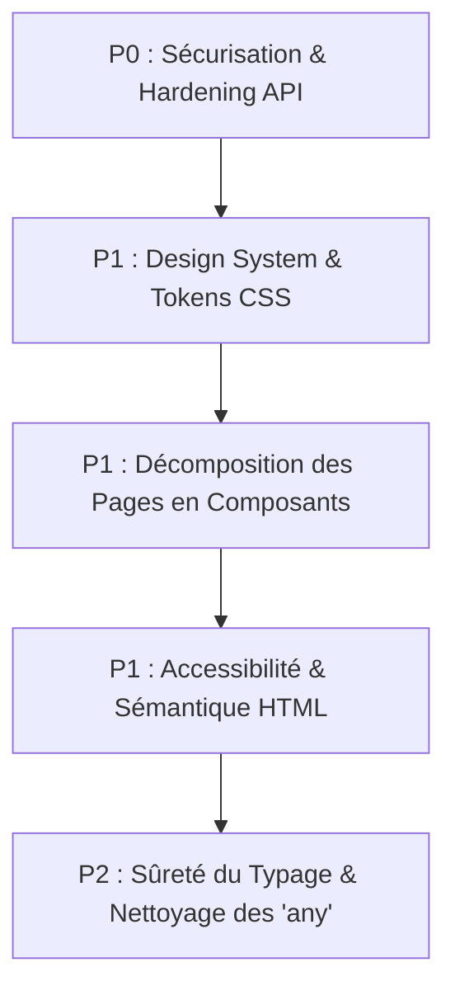

# 🚀 LevelUP — Plan de Refonte UI/UX & Sécurité du Projet

Ce document définit le **plan d'action d'implémentation** détaillé pour répondre aux failles de sécurité, à la dette technique de l'interface utilisateur, aux manques d'accessibilité et au manque de typage identifiés lors de l'audit de spécification technique [levelup_audit_specification_technique.md](file:///home/oswiser9/Out-Labs/www/levelUP/workflow/levelup_audit_specification_technique.md).

---

## 🗺️ Synthèse Globale & Objectifs de Refonte
L'implémentation suivra une approche incrémentale et sécurisée, découpée en **5 grandes étapes clés** (de P0 à P2).



---

## 🔒 Étape 1 — P0 : Sécurisation & Durcissement de l'API

### 1.1 Nettoyage des Fuites d'Informations Critiques dans les Logs
*   **Problème** : NestJS écrit en clair le secret et les identifiants de connexion PostgreSQL (`DATABASE_URL`) dans la console au démarrage.
*   **Cible** : Supprimer la ligne `console.log('DATABASE_URL inside NestJS:', ...)` dans [main.ts](file:///home/oswiser9/Out-Labs/www/levelUP/apps/backend/src/main.ts#L10) et s'assurer qu'aucun autre mot de passe ou clé n'est affiché.

### 1.2 Restriction du CORS
*   **Problème** : `app.enableCors()` est configuré sans restriction d'origine, autorisant n'importe quel domaine à interroger l'API.
*   **Cible** : Restreindre CORS dans [main.ts](file:///home/oswiser9/Out-Labs/www/levelUP/apps/backend/src/main.ts#L12) en limitant les requêtes uniquement à l'origine du frontend Next.js (`http://localhost:3000` ou la variable d'environnement `FRONTEND_URL`).
*   **Code Cible** :
    ```typescript
    app.enableCors({
      origin: process.env.FRONTEND_URL || 'http://localhost:3000',
      credentials: true,
    });
    ```

### 1.3 Passage de l'Authentification sous Cookies HttpOnly
*   **Problème** : Le jeton JWT est actuellement stocké dans le `localStorage` du navigateur du client, le rendant vulnérable aux attaques de type XSS (Cross-Site Scripting).
*   **Cibles d'implémentation** :
    1.  **Backend** : Modifier [auth.controller.ts](file:///home/oswiser9/Out-Labs/www/levelUP/apps/backend/src/auth/auth.controller.ts) pour injecter le token JWT dans un cookie HTTP-only, sécurisé, SameSite:
        ```typescript
        response.cookie('token', token, {
          httpOnly: true,
          secure: process.env.NODE_ENV === 'production',
          sameSite: 'lax',
          maxAge: 7 * 24 * 60 * 60 * 1000 // 7 jours
        });
        ```
    2.  **Backend** : Modifier la stratégie d'extraction JWT dans [jwt.strategy.ts](file:///home/oswiser9/Out-Labs/www/levelUP/apps/backend/src/auth/jwt.strategy.ts#L10-L15) pour parser les cookies de la requête.
    3.  **Frontend** : Adapter l'utilitaire d'appel API dans `apps/frontend/src/utils/api.ts` pour inclure automatiquement les cookies (`credentials: 'include'`). Supprimer la dépendance à `localStorage.getItem('token')` pour l'auth de base.

---

## 🎨 Étape 2 — P1 : Extraction du Design System & Refactoring CSS

### 2.1 Centralisation des CSS Tokens dans globals.css
*   **Problème** : Beaucoup d'éléments d'interface ont des tailles, des bordures et des marges codées en dur, entraînant des décalages visuels.
*   **Cible** : Structurer la racine de [globals.css](file:///home/oswiser9/Out-Labs/www/levelUP/apps/frontend/src/app/globals.css) avec des variables de tokens CSS formelles :
    *   *Couleurs de Sémantique RPG* :
        *   `--primary` / `--primary-hover` / `--primary-glow` (Violet)
        *   `--accent-cyan` / `--accent-cyan-glow` (Apprenant / Progression)
        *   `--accent-emerald` (Succès / Validation)
        *   `--accent-orange` (Admin / Notifications)
        *   `--danger` (Erreurs / Pénalités)
    *   *Espacements Rigoureux* : `--space-xs: 4px`, `--space-sm: 8px`, `--space-md: 16px`, `--space-lg: 24px`, `--space-xl: 32px`
    *   *Rayons de courbure* : `--radius-sm: 6px`, `--radius-md: 10px`, `--radius-lg: 16px`

### 2.2 Création de Composants Fondamentaux Communs (Atomic Design)
*   **Cible** : Définir des composants graphiques de base sous `apps/frontend/src/app/components/ui/` :
    *   `Card.tsx` / `CardHeader.tsx` / `CardContent.tsx` : Cartes sci-fi translucides standardisées.
    *   `Button.tsx` : Variantes standardisées (primary, secondary, danger, icon) avec micro-animations d'hover.
    *   `Badge.tsx` : Badges colorés de statuts (en cours, validé, révision).
    *   `Dialog.tsx` : Fenêtre modale avec animation de fondu et overlay flouté.

---

## 🧩 Étape 3 — P1 : Découpe Modulaire des Pages Monolithes

### 3.1 Découpe du Dashboard (`dashboard/page.tsx`)
*   **Problème** : Le fichier principal du tableau de bord contient toute la logique de récupération, l'état d'affichage de la session de focus active, les recommandations, le graphe de discipline et le daemon diagnostic.
*   **Cible** : Découper ce fichier de 900+ lignes en sous-composants dédiés :
    1.  `ActiveSessionBanner.tsx` : Affiche l'état de la session courante ou suggère le plan.
    2.  `KpiGrid.tsx` : Regroupe les cartes de statistiques (XP, Streak, Score de discipline, focus minutes).
    3.  `RecommendationsCard.tsx` : Propose le prochain nœud logique d'étude.
    4.  `DaemonMonitorCard.tsx` : Diagnostique en direct le status de l'agent Rust et des processus système autorisés.

### 3.2 Découpe du Panel d'Administration (`admin/page.tsx`)
*   **Cible** : Diviser l'écran d'administration (1400+ lignes) par domaine fonctionnel :
    1.  `ProgramTreeBuilder.tsx` : Sidebar de navigation hiérarchique (Ajout/Édition/Suppression de programmes et modules).
    2.  `DependencyCanvas.tsx` : Zone interactive SVG affichant le graphe orienté acyclique (DAG).
    3.  `SupervisionTable.tsx` : Liste des cohortes d'apprenants et diagnostics de blocages.
    4.  `CalibrationPanel.tsx` : Contrôles de réglage des constantes système et interrupteurs de règles.

---

## ♿ Étape 4 — P1 : Accessibilité (A11y) & Sémantique HTML

### 4.1 Restructuration Sémantique
*   **Cible** : Remplacer l'usage abusif de `div` par des balises sémantiques HTML5 :
    *   `header` : Barre de navigation supérieure et profils.
    *   `aside` : Barre latérale (sidebar) de navigation gauche.
    *   `main` : Zone de contenu principal.
    *   `section` : Blocs KPI et widgets autonomes.
    *   Un seul titre `h1` par page comme point d'ancrage principal.

### 4.2 Attributs d'Accessibilité (ARIA)
*   **Cible** : Équiper tous les contrôles interactifs d'attributs d'assistance :
    *   `aria-label` sur tous les boutons contenant uniquement des icônes ou emojis (ex: les boutons de modification/suppression `✏️`, `❌` dans le builder).
    *   `aria-expanded` pour les dropdowns de notifications.
    *   `aria-live="polite"` pour les alerts ou le timer de session active.
    *   Assurer un contour visible au focus (`outline: 2px solid var(--accent-cyan)`) pour la navigation au clavier.

---

## 🏷️ Étape 5 — P2 : Durcissement du Typage & Nettoyage des `any`

### 5.1 Déclaration des Interfaces de Données Communes
*   **Cible** : Créer un fichier de typage unifié sous `apps/frontend/src/types/index.ts` qui réplique fidèlement le schéma Prisma :
    *   `UserProfile` : XP, niveau, classe, statistiques.
    *   `TopicProgress` : validatedAt, masteredAt, retentionScore, needsRevision.
    *   `Quest` / `UserQuest` : status, progress, deadlines.
    *   `Quiz` / `QuizAttempt` / `QuizQuestion`.

### 5.2 Remplacement de `any`
*   **Cible** : Supprimer l'ensemble des déclarations `any` dans les states du frontend (`useState<any[]>()`) et les remplacer par les types formels définis ci-dessus, éliminant les risques d'erreurs d'attributs inexistants au runtime.

---

## 🚀 Calendrier d'Implémentation Recommandé

| Phase | Description | Durée Estimée | Statut |
| :--- | :--- | :--- | :--- |
| **Phase 1** | **P0 : Sécurisation & Cookies HttpOnly** | 1 à 2 jours | 📅 Prévu |
| **Phase 2** | **P1 : Tokens CSS & Composants de Base** | 2 jours | 📅 Prévu |
| **Phase 3** | **P1 : Découpe du Dashboard & de l'Admin** | 3 jours | 📅 Prévu |
| **Phase 4** | **P1 : Sémantique HTML & Accessibilité** | 1 jour | 📅 Prévu |
| **Phase 5** | **P2 : Typage strict & suppression des `any`** | 2 jours | 📅 Prévu |
