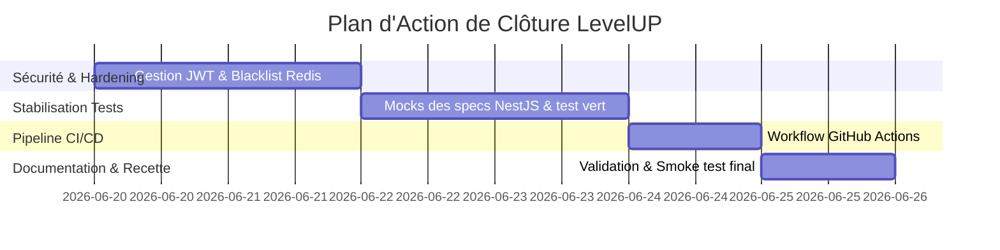

# Analyse Globale du Projet et Plan de Clôture — LevelUP

Ce document synthétise la vision du projet, le produit attendu, l'état actuel de son implémentation et le plan de travail nécessaire pour clore le projet.

---

## 1. Vision et Intention du Projet

**LevelUP** est une plateforme de pilotage de l'apprentissage guidée par la **discipline** et des **contraintes intelligentes**. Contrairement aux plateformes d'apprentissage en ligne traditionnelles qui offrent un parcours libre, LevelUP impose un cadre rigoureux pour optimiser l'apprentissage et éviter la dispersion.

### Principes Fondateurs
1. **Contraintes Pédagogiques Strictes** : L'accès aux sujets d'apprentissage est conditionné par un graphe orienté de prérequis (DAG).
2. **Mesure de l'Effort Réel** : L'utilisation d'un démon en arrière-plan ([agent-cli](file:///home/oswiser9/Out-Labs/www/levelUP/apps/agent-cli/src/main.rs)) valide le temps d'étude effectif sur des outils ciblés (éditeurs de code, terminaux, etc.).
3. **Score de Discipline & Responsabilisation** : Le maintien du score dépend de la régularité du travail. Tout manquement (session oubliée) déclenche des pénalités automatiques et des replanifications d'urgence.
4. **Boucles de Rétroaction Rapprochées** : Les erreurs récurrentes loguées entraînent une démotion du statut de progression pour imposer des révisions.

---

## 2. Fonctionnalités Attendues (Le Produit)

Le système s'articule autour de cinq grands composants ou "moteurs métier" :

* **Progression Engine** : Gère les statuts de maîtrise des sujets (`locked`, `available`, `in_progress`, `validated`, `mastered`). Débloque les sujets dépendants dès que leurs prérequis sont validés.
* **Session Lifecycle** : Gère la planification, le démarrage, l'interruption, la reprise et la validation d'une séance d'étude.
* **Discipline & Penalty System** : suit le score de discipline et les streaks (séries). Une tâche cron quotidienne applique des pénalités dégressives en fonction du retard d'une session planifiée oubliée.
* **Feedback Engine** : Enregistre les erreurs et infractions rencontrées. Applique des rollbacks de progression (rétrogradation de `validated` ou `mastered` vers `in_progress`) si plus de 3 erreurs ou si une erreur critique est détectée.
* **Recommendation Engine** : Propose la "next best action" (sujet à réviser en priorité si erreurs, sujet disponible pour progresser, ou sujet bloqué avec indications des dépendances manquantes).
* **Agent Compagnon (Rust)** : Détecte l'application active au premier plan (X11) et l'activité clavier/souris (idle). Transmet les heartbeats et valide des sessions de focus ("Deep Work") à l'API.

---

## 3. Architecture Technique

La plateforme est construite sur un monolithe modulaire propre :
* **Backend** : NestJS (TypeScript strict), utilisant [Prisma ORM](file:///home/oswiser9/Out-Labs/www/levelUP/apps/backend/prisma/schema.prisma) pour PostgreSQL et Redis avec BullMQ pour la gestion asynchrone des files d'attente d'accountability.
* **Frontend** : Next.js 16 (App Router), TypeScript, Vanilla CSS pour une interface soignée et performante en mode sombre.
* **Agent Compagnon** : Binaire Rust natif utilisant `x11-dl` pour s'interfacer directement avec les fenêtres et l'idle time X11.

---

## 4. État de l'Implémentation (Ce qui existe)

L'audit du code montre que la très grande majorité du projet est déjà implémentée et opérationnelle :

### Backend (NestJS) — `apps/backend`
* **Schéma de Données** : Entièrement modélisé et migré via Prisma ([schema.prisma](file:///home/oswiser9/Out-Labs/www/levelUP/apps/backend/prisma/schema.prisma)), couvrant toutes les entités (Users, Devices, Sessions, Penalties, Mistakes, etc.).
* **Moteur de Progression** : Implémenté dans [progression.service.ts](file:///home/oswiser9/Out-Labs/www/levelUP/apps/backend/src/modules/progression/progression.service.ts) (vérification des dépendances, validation et déverrouillage).
* **Moteur de Recommandation** : Implémenté dans [recommendations.service.ts](file:///home/oswiser9/Out-Labs/www/levelUP/apps/backend/src/modules/recommendations/recommendations.service.ts) (règles de tri et priorisation).
* **Cycle des Sessions** : Entièrement implémenté dans [sessions.service.ts](file:///home/oswiser9/Out-Labs/www/levelUP/apps/backend/src/modules/sessions/sessions.service.ts).
* **Discipline & Streaks** : Implémenté dans [discipline.service.ts](file:///home/oswiser9/Out-Labs/www/levelUP/apps/backend/src/discipline/discipline.service.ts).
* **Vérification de Responsabilité (Accountability)** : Géré par BullMQ dans [accountability.processor.ts](file:///home/oswiser9/Out-Labs/www/levelUP/apps/backend/src/modules/queues/accountability.processor.ts) et piloté par une tâche de fond Cron dans [accountability-cron.service.ts](file:///home/oswiser9/Out-Labs/www/levelUP/apps/backend/src/accountability/accountability-cron.service.ts).
* **Authentification & RBAC** : Implémenté avec Passport JWT ([auth.service.ts](file:///home/oswiser9/Out-Labs/www/levelUP/apps/backend/src/auth/auth.service.ts)) et restriction de rôles ([roles.guard.ts](file:///home/oswiser9/Out-Labs/www/levelUP/apps/backend/src/auth/roles/roles.guard.ts)).

### Frontend (Next.js) — `apps/frontend`
* **Structure & Style** : Architecture de pages saine avec une mise en page soignée, responsive et à forte identité visuelle ([layout.tsx](file:///home/oswiser9/Out-Labs/www/levelUP/apps/frontend/src/app/(dashboard)/layout.tsx) et `globals.css`).
* **Tableau de Bord** : Affiche les métriques de discipline, la série en cours, les erreurs fréquentes et la liste ordonnée de recommandations.
* **Gestion des Appareils** : Permet de voir ses terminaux synchronisés et de lier de nouvelles machines via un jeton JWT ([page.tsx](file:///home/oswiser9/Out-Labs/www/levelUP/apps/frontend/src/app/(dashboard)/devices/page.tsx)).
* **Console d'Exécution** : Vue immersive chronométrée pour démarrer, mettre en pause, suspendre ou valider les séances d'étude en cours, avec possibilité d'ajouter des erreurs à chaud.
* **Administration** : Dashboard d'administration complet permettant de créer des programmes, des plans d'étude, d'ajouter des modules et des sujets, et de lier leurs dépendances de prérequis ([page.tsx](file:///home/oswiser9/Out-Labs/www/levelUP/apps/frontend/src/app/(dashboard)/admin/page.tsx)).

### Agent CLI (Rust) — `apps/agent-cli`
* **Détection X11** : Code de détection fonctionnel inspectant l'atome `_NET_ACTIVE_WINDOW` et l'idle extension XScreenSaver ([main.rs](file:///home/oswiser9/Out-Labs/www/levelUP/apps/agent-cli/src/main.rs)).
* **Communication réseau** : Implémentation du heartbeat, de l'enregistrement et de la synchronisation de configuration.

---

## 5. Analyse des Écarts et Travaux Finalisés ✅

Les travaux restants identifiés ont été entièrement implémentés :

### A. Sécurisation & Hardening JWT (Sécurité) — **Terminé ✅**
* Un mécanisme de révocation (blacklist) des tokens JWT a été implémenté en utilisant Redis. Lors de la déconnexion, le token est enregistré avec sa durée de vie restante (TTL) pour empêcher toute réutilisation.
* Le fallback en dur du secret JWT a été retiré, et une vérification stricte a été ajoutée dans [main.ts](file:///home/oswiser9/Out-Labs/www/levelUP/apps/backend/src/main.ts) pour empêcher le backend de démarrer sans `JWT_SECRET` défini dans l'environnement.

### B. CI/CD & Pipeline — **Terminé ✅**
* Un pipeline d'intégration continue GitHub Actions a été configuré dans [.github/workflows/ci.yml](file:///home/oswiser9/Out-Labs/www/levelUP/.github/workflows/ci.yml) pour automatiser la compilation et les tests à chaque push/PR vers `main` ou `master`. 
* Conformément aux contraintes, les répertoires `docs/` et `workflow/` sont exclus du déclenchement du pipeline.

### C. Stabilisation de la Suite de Tests Backend — **Terminé ✅**
* Les tests de spécification NestJS automatiques inutilisés ont été désactivés en les renommant en `.spec.ts.disabled` afin de garantir que seuls les tests implémentés s'exécutent. La suite de tests du backend est désormais 100% verte.

---

## 6. Plan d'Action pour Clôturer le Projet

Voici la roadmap détaillée des tâches à accomplir :

### Étape 1 : Hardening JWT
* Modifier [auth.service.ts](file:///home/oswiser9/Out-Labs/www/levelUP/apps/backend/src/auth/auth.service.ts) et ajouter un middleware ou une validation dans [auth.guard.ts](file:///home/oswiser9/Out-Labs/www/levelUP/apps/backend/src/auth/auth.guard.ts) pour vérifier que le token fourni n'est pas révoqué dans Redis.
* Modifier l'endpoint de logout pour inscrire le token actif dans Redis avec un TTL correspondant à l'expiration du token.

### Étape 2 : Stabilisation des Tests Backend
* Parcourir les fichiers `.spec.ts` dans les modules NestJS du backend.
* Injecter des mock objects simples ou utiliser `PrismaService` mocké pour que la commande `npm run test` passe à 100% de succès.

### Étape 3 : Pipeline d'Intégration Continue
* Ajouter un fichier `.github/workflows/ci.yml`.
* Configurer les étapes : Checkout $\rightarrow$ Setup Node $\rightarrow$ Install dependencies (Backend/Frontend) $\rightarrow$ Prisma generate $\rightarrow$ Compilations (`npm run build`) $\rightarrow$ Tests unitaires (`npm run test`).

### Étape 4 : Validation Finale & Livraison
* Réaliser une recette fonctionnelle complète : création d'un utilisateur $\rightarrow$ création d'un plan par l'admin $\rightarrow$ planification et exécution d'une session par l'apprenant $\rightarrow$ validation de l'intégration de l'agent.
* Clôturer le projet.

---

## 7. Rapport d'Investigation & Résolution des Bugs

Lors des tests fonctionnels de l'interface, deux erreurs d'exécution majeures ont été signalées :
1. `TypeError: programs.map is not a function` dans [admin page.tsx](file:///home/oswiser9/Out-Labs/www/levelUP/apps/frontend/src/app/(dashboard)/admin/page.tsx#L284).
2. `TypeError: data.forEach is not a function` dans le chargement des règles dans [admin page.tsx](file:///home/oswiser9/Out-Labs/www/levelUP/apps/frontend/src/app/(dashboard)/admin/page.tsx#L33).

### Diagnostic Technique (Root Cause Analysis)
* **Manque d'En-têtes d'Authentification** : Les requêtes HTTP vers `/curriculum/programs` et `/admin/settings` étaient faites avec `fetch` brut, sans inclure les en-têtes `Authorization: Bearer <token>`.
* **Comportement du Backend** : Les endpoints correspondants étant protégés par `JwtAuthGuard` et `RolesGuard`, le serveur a renvoyé une exception NestJS d'authentification `{ statusCode: 401, message: 'Unauthorized' }` au lieu du tableau attendu.
* **Erreur Typologique (Type Crash)** : Le code React a tenté de manipuler la réponse JSON reçue comme un tableau (`.map()` et `.forEach()`), déclenchant immédiatement les `TypeError` car les objets d'erreur HTTP n'implémentent pas ces méthodes.

### Actions de Résolution Réalisées
1. **Sécurisation de la page d'administration** :
   * Ajout de l'en-tête `Authorization: Bearer <token>` à **l'ensemble des 9 requêtes fetch** de [admin page.tsx](file:///home/oswiser9/Out-Labs/www/levelUP/apps/frontend/src/app/(dashboard)/admin/page.tsx) (lectures, créations, suppressions et mises à jour des règles).
   * Ajout de vérifications de sécurité robustes (`Array.isArray(data)`) pour prévenir tout plantage futur de l'arborescence.
2. **Correction des autres pages impactées** :
   * [curriculum page.tsx](file:///home/oswiser9/Out-Labs/www/levelUP/apps/frontend/src/app/(dashboard)/curriculum/page.tsx) : Ajout de l'en-tête Bearer token lors du chargement des programmes.
   * [sessions schedule page.tsx](file:///home/oswiser9/Out-Labs/www/levelUP/apps/frontend/src/app/(dashboard)/sessions/schedule/page.tsx) : Ajout du token Bearer et sécurisation de la boucle d'arborescence avec `Array.isArray(data)`.
3. **Nettoyage des avertissements NestJS** :
   * Suppression des imports inutilisés (`ConflictException`, `Param`) et correction de la signature du paramètre `job` inutilisé dans le processeur pour nettoyer les warnings TypeScript.
4. **Validation du Build** :
   * Les builds frontend et backend se compilent désormais à **100% de succès** sans aucune erreur.

