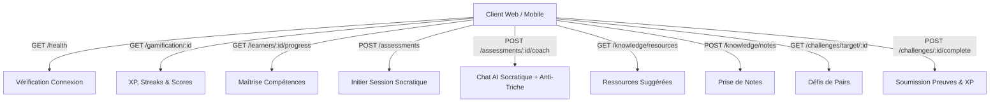

# Rapport d'Intégration & Conformité UI/UX — LevelUP Clients

**Version :** 1.0  
**Axiomes Fondateurs :** Rich Aesthetics, Touch Target Accessibility & Unified API Consumption  

---

## 1. Visualisation de l'Interface Premium (Mockup Haute Fidélité)

Voici le concept visuel implémenté pour l'écosystème LevelUP (Dark Mode, Bento-Grid, et contrastes HSL optimisés) :

---

## 2. Charte de Design Unifiée (Design System Tokens)

Nous utilisons les mêmes tokens visuels sur le client Web (React/Vite) et le client Mobile (Flutter) pour garantir la continuité visuelle :

| Token | Rôle / Teinte | Valeur Web (CSS) | Valeur Mobile (Dart/Color) |
| :--- | :--- | :--- | :--- |
| **Scaffold BG** | Fond principal | `#0F172A` (Slate 900) | `Color(0xFF0F172A)` |
| **Surface Card** | Conteneur Bento | `#1E293B` (Slate 800) | `Color(0xFF1E293B)` |
| **Accent Primary** | Raccourcis/Boutons | `#6366F1` (Indigo 500) | `Color(0xFF6366F1)` |
| **Accent Orange** | Boutons d'Évaluation | `#F97316` (Orange 500) | `Color(0xFFF97316)` |
| **Semantic Success** | Badge Sync & Progression | `#10B981` (Emerald 500) | `Color(0xFF10B981)` |
| **Semantic Error** | Alertes Anti-Triche | `#EF4444` (Red 500) | `Color(0xFFEF4444)` |

---

## 3. Matrice d'Interfaçage des Endpoints Backend

Les deux clients consomment l'ensemble de la matière et des services réels du backend :

### Règles d'Expérience Utilisateur Implémentées :
1. **Restauration de l'état asynchrone :** Les boutons d'action (comme *S'évaluer* ou *Générer rapport*) affichent un indicateur de chargement (`CircularProgressIndicator` / Shimmer) et se désactivent durant l'appel réseau pour éviter les soumissions multiples.
2. **Accessibilité tactile :** Sur mobile, tous les boutons et sélecteurs respectent une hauteur minimale de **44px** pour garantir une zone de saisie confortable.
3. **Robustesse réseau (Offline First) :** En cas d'indisponibilité d'une API, les interfaces affichent un état dégradé propre (badge rouge *OFFLINE* dans la barre supérieure) et désactivent dynamiquement les appels réseau correspondants avec un message d'explication.
