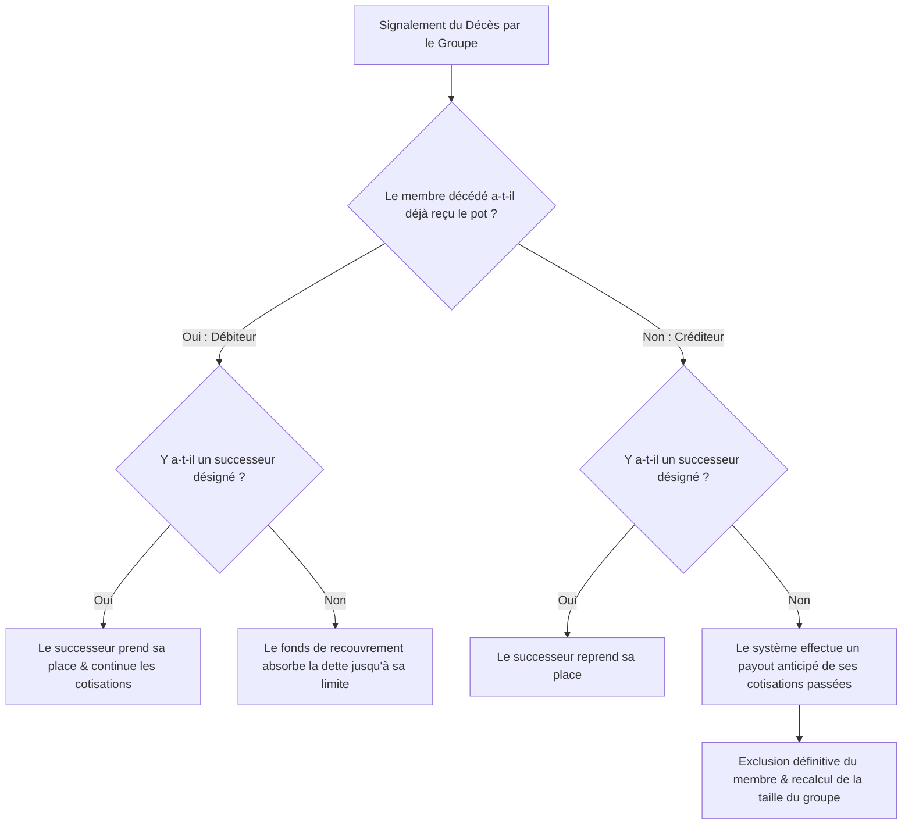

# Analyse de Conception - Vol. 1 : Exigences Métier & Modèles Fonctionnels (Mis à jour)
**Projet :** MaSecure — Infrastructure de Règlement Social Automatisé
**Auteur :** Antigravity AI
**Date :** Juin 2026

---

## 1. Introduction et Objectifs de l'Analyse
Ce document détaille les exigences fonctionnelles et les règles métier de **MaSecure**, révisées d'après les conclusions de notre séance de conception conjointe. Ces règles forment la base absolue sur laquelle reposeront les implémentations logiques et les contraintes logicielles de la plateforme.

---

## 2. Analyse Structurée des Modèles de Groupes

MaSecure prend en charge quatre modèles de groupes de cotisation (Tontine Rotative, Cotisation Sociale, Cotisation en Nature, Hybride). La règle de non-confusion s'applique strictement : les composants de calcul de la tontine (`Tontine Engine`) sont isolés des flux logistiques des fournisseurs (`Partner Engine`).

### 2.1. Fonctionnement et Financement du Fonds de Recouvrement
Le fonds de recouvrement (ou de couverture) sert de filet de sécurité pour combler les retards de paiement et éviter de pénaliser le bénéficiaire du tour.
* **Optionnalité :** L'activation du fonds est décidée par le groupe à sa création.
* **Calcul du montant cible :** Le système calcule automatiquement le montant cible requis du fonds en fonction du nombre de participants et du montant des cotisations individuelles, pour couvrir un défaut de **2 ou 3 membres** simultanément.
* **Modalités de financement :** 
  * **Option A :** Paiement intégral et immédiat (d'un coup) à la création.
  * **Option B :** Paiement progressif (en tranches).
  * *Garde-fou système :* Si le paiement progressif est choisi, le groupe peut démarrer les cycles de cotisations immédiatement, mais le système exige que le fonds soit **totalement approvisionné avant la fin du premier cycle** (c'est-à-dire avant que le premier versement/payout ne soit effectué au bénéficiaire n°1). La durée d'un cycle et l'intervalle entre les contributions sont monitorés par le système pour envoyer des alertes de complétion du fonds.

---

## 3. Gestion Métier des Sinistres : Décès et Incapacité Définitive

En cas de décès ou d'incapacité définitive d'un membre à poursuivre le cycle, le système applique les règles transactionnelles suivantes :



### 3.1. Cas du membre débiteur (a déjà reçu le pot)
1. **Priorité de succession :** Si un membre de la famille ou un tiers désigné accepte de reprendre les obligations, il remplace le défunt et continue les cotisations normalement.
2. **Absence de repreneur :** Le fonds de recouvrement absorbe le manque à gagner pour préserver le cycle, dans la limite de sa capacité (ex : 1 à 3 contributions selon le niveau de couverture du fonds). Si la perte dépasse la limite du fonds, le déficit est signalé aux membres pour décision.
3. **Absence de signalement immédiat :** Si le décès n'est pas immédiatement signalé et qu'un versement manque, le système constate le déficit et préélève sur le fonds. Si le décès est validé a posteriori et qu'il n'y a pas de successeur, les fonds restants non dus ou les contributions en trop sont reversés dans le fonds de recouvrement.

### 3.2. Cas du membre créditeur (n'a pas encore reçu le pot)
1. **Si un successeur reprend sa place :** Le cycle continue sans changement d'ordre.
2. **Si aucun successeur n'est disponible :** 
  * Le système effectue un **versement automatique anticipé** du cumul de ses cotisations passées vers son compte (pour aider la famille).
  * Le membre est immédiatement **exclu définitivement du groupe**.
  * Le groupe continue avec une taille réduite (recalage automatique de l'ordre) ou intègre un nouveau membre pour le cycle suivant.

---

## 4. Le Cycle de Vie des Membres (Statuts & Transitions)

Le cycle de vie d'un membre comprend 4 statuts bien distincts :

```
[ACTIF] ──(Défaut de paiement)──> [QUARANTINE] ──(Non-régularisation)──> [SUSPENDU] ──(3 cycles de défaut)──> [EXCLU]
```

1. **ACTIF :** Participation normale (cotise, vote, reçoit son tour).
2. **QUARANTINE :** Statut temporaire activé dès le début du cycle suivant si le membre a subi un défaut de contribution comblé par le fonds de recouvrement. Un délai de grâce inférieur à l'intervalle de contribution (ex: moins d'une semaine pour un cycle hebdomadaire) lui est accordé pour rembourser le fonds.
3. **SUSPENDU :** Si le délai de grâce expire, le membre est suspendu. Pour redevenir actif, il doit payer :
   * La dette du fonds de recouvrement ;
   * Une pénalité de retard sur le fonds de recouvrement (définie à la création du groupe) ;
   * Les cotisations des cycles manqués.
4. **EXCLU :** Si le membre accumule **3 contributions manquées consécutives**, le système déclenche un événement d'arbitrage pour son exclusion définitive du groupe.

---

## 5. Droit de Vote et Sabotage
* **Règle absolue :** Les membres ayant le statut **SUSPENDU** ou **QUARANTINE** sont **privés de leur droit de vote** sur toute décision susceptible d'influencer les versements ou la configuration financière.
* **Transparence :** Cette règle d'exclusion de vote est affichée et notifiée de manière explicite à chaque membre lors de la création du groupe pour éviter toute contestation.
