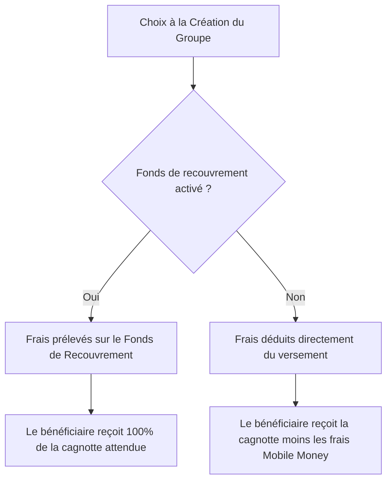

# Analyse de Conception - Vol. 2 : Sécurité Financière & Intégrité du Ledger (Mis à jour)
**Projet :** MaSecure — Infrastructure de Règlement Social Automatisé
**Auteur :** Antigravity AI
**Date :** Juin 2026

---

## 1. Introduction
Ce volume détaille la modélisation de la sécurité des transactions financières, la répartition des frais et l'automate d'état appliquant les sanctions de manière déterministe pour le projet **MaSecure**.

---

## 2. Prise en Charge Sécurisée des Frais de Transaction Mobile Money

Les opérations Mobile Money (Orange Money, Moov, Wave) engendrent des frais de transfert sortant lors des versements (payouts). Le système propose deux modèles configurables à la création du groupe pour gérer ces frais sans déséquilibrer la trésorerie :



### 2.1. Modèle avec Fonds de Recouvrement (Recommandé)
* **Logique :** Les frais de transfert sortant (payout) sont prélevés sur la réserve du fonds de recouvrement du groupe.
* **Bénéfice :** Le membre bénéficiaire du tour reçoit l'intégralité ($100\%$) du montant nominal de la cagnotte. C'est le fonds commun qui amortit le coût technique du réseau.

### 2.2. Modèle sans Fonds de Recouvrement
* **Logique :** Les frais de transfert sortant sont déduits du montant du virement.
* **Conséquence :** Le bénéficiaire reçoit la somme nette de sa cagnotte (montant nominal moins les frais appliqués par l'opérateur Mobile Money). Les membres assument collectivement la responsabilité de ne pas avoir souscrit au fonds.

---

## 3. Automate d'État des Retards : De l'Impayé à l'Exclusion

La gestion des défauts de paiement est entièrement automatisée, évitant ainsi les arrangements manuels arbitraires.

```
[Échéance du Cycle]
        │
        ▼
   (Un impayé) ─────────> Le fonds de recouvrement comble le manque et verse au bénéficiaire
        │
        ▼
[Début du Cycle Suivant]
        │
        ▼
   (Non remboursé) ─────> Statut du membre = QUARANTINE
        │                 Délai de grâce accordé (ex : < 1 semaine pour cycle hebdo)
        ├───────────────────────────┐
        ▼ (Remboursé)               ▼ (Non remboursé après le délai)
    [ACTIF]                     Statut du membre = SUSPENDU
                                Exigences de réintégration :
                                1. Rembourser l'avance du fonds
                                2. Payer la pénalité de retard
                                3. Payer les cotisations cumulées (N et N+1)
                                │
                                ▼
                        (3 cycles consécutifs sans régularisation)
                                │
                                ▼
                        [EXCLUSION DÉFINITIVE]
```

### 3.1. Phase 1 : Utilisation du Fonds et Versement
À l'échéance du cycle, si un membre n'a pas versé sa contribution, le système utilise automatiquement la réserve du **fonds de recouvrement** pour compléter la cagnotte et l'envoyer à temps au bénéficiaire du tour.

### 3.2. Phase 2 : Passage en Quarantaine
Au démarrage du cycle suivant, le système vérifie si le membre défaillant a remboursé sa dette au fonds.
* Si le remboursement n'est pas effectué, le membre passe au statut `QUARANTINE`.
* Un délai de grâce inférieur à la durée de l'intervalle de cotisation (ex: 3 à 5 jours pour un cycle d'une semaine) est ouvert pour lui permettre de régulariser sa situation.

### 3.3. Phase 3 : Suspension
Si le délai de grâce expire sans remboursement, le système bascule automatiquement le membre au statut `SUSPENDU`.
* **Privation de droits :** Le membre suspendu ne peut plus voter.
* **Régularisation cumulative :** Pour redevenir `ACTIF`, le membre doit s'acquitter de :
  1. La somme due au fonds de recouvrement ;
  2. La pénalité financière paramétrée (ex: 50% de la cotisation normale) ;
  3. L'intégralité des cotisations des cycles cumulés.

### 3.4. Phase 4 : Alerte et Exclusion
Si la suspension perdure sur **3 cycles consécutifs de cotisations**, le système bloque définitivement le compte, déclenche une alerte de sortie et procède à l'**exclusion définitive** du membre.

---

## 4. Garanties de Cohérence Logique du Code

Ces transitions d'état sont appliquées par le `Kernel Financier` en Rust via des validations strictes :
* **Idempotence :** L'activation du statut `QUARANTINE` ou `SUSPENDU` produit un événement unique (`MemberQuarantined`, `MemberSuspended`) inscrit dans le ledger.
* **Anti-Corruption :** Aucun recalcul d'ordre de passage n'est toléré pour un cycle déjà engagé (`committed`). Les recalculs liés aux exclusions ou départs n'impactent que les cycles futurs non démarrés.
