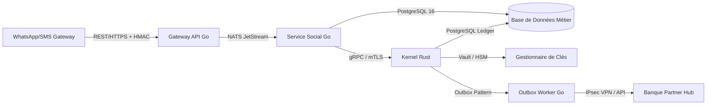

# Analyse de Conception - Vol. 3 : Bonnes Pratiques & Recommandations Technologiques
**Projet :** MaSecure — Infrastructure de Règlement Social Automatisé
**Auteur :** Antigravity AI
**Date :** Juin 2026

---

## 1. Contexte et Enjeux de Modernisation
Pour accompagner la croissance de la plateforme **MaSecure** et étendre son périmètre fonctionnel tout en maintenant un niveau de sécurité optimal, nous avons mené des recherches sur les bonnes pratiques actuelles dans le développement et la conception d'applications financières sécurisées sur le web. 

Ce rapport présente des préconisations concrètes d'évolution technologique, d'architecture de données et de conformité réglementaire.

---

## 2. Recommandations Architecturales : CQRS & Event-Sourcing

Bien que la base de données actuelle soit relationnelle et centralisée sur PostgreSQL, l'adoption d'un modèle **Event-Sourcing** pur pour le grand livre (ledger) est recommandée pour garantir l'historisation totale.

```
                  ┌───────────────── COMMAND SIDE ─────────────────┐
                  │                                                │
[ Requête Client ] ──> [ API Gateway ] ──> [ Command Controller ] ─┘
                                                  │
                                            (Applique Règles)
                                                  ▼
                                            [ Write DB ] (Append-only Event Store)
                                                  │
                                          (Génère Événements)
                                                  ▼
                                            [ Message Bus ] (NATS JetStream)
                                                  │
                                          (Projecteur d'état)
                                                  ▼
                                            [ Read DB ] (Vues SQL optimisées)
                                                  │
                  ┌────────────────── QUERY SIDE ──────────────────┘
                  │                                                │
[ Consultation ] <─── [ API Gateway ] <─── [ Query Controller ] ───┘
```

### 2.1. Séparation Command/Query (CQRS)
* **Pourquoi ?** Actuellement, le recalcul des soldes se fait à chaque cycle en parcourant le ledger, ce qui peut ralentir le système si le groupe a un historique de plusieurs années (impact sur le temps d'export d'audit).
* **Comment ?**
  * **Côté Écriture (Command) :** Le Kernel Rust écrit de façon append-only les événements bruts (`ContributionReceived`, `PayoutExecuted`).
  * **Côté Lecture (Query) :** Un projecteur d'état lit ces événements et met à jour en temps réel une table de synthèse (`group_balances` ou `member_balances`). Les requêtes de consultation et d'export d'audit lisent cette table de synthèse en $O(1)$ sans recalculer toute l'histoire.

### 2.2. Activation et exploitation de NATS JetStream
NATS JetStream est configuré dans le `docker-compose.yml` du projet mais reste sous-utilisé dans les phases 1 et 2.
* **Préconisation :** Utiliser NATS pour propager les événements métiers de façon asynchrone et découpler le système. Par exemple, lorsqu'une contribution est validée, l'événement `ContributionReceived` est publié sur NATS. Le service de notification et le service d'analytics consomment cet événement en tâche de fond sans ralentir la transaction financière principale.

---

## 3. Stockage des Données et Sécurité de l'Information

### 3.1. Problématique de la vie privée vs Immutabilité (RGPD et BCEAO)
Le droit à l'effacement (droit à l'oubli) s'oppose de front au concept de ledger cryptographique immuable. Si un membre demande la suppression de ses données personnelles, modifier le ledger briserait la chaîne de hachage.
* **La Solution Industrielle : Le Crypto-Shredding**
  * Au lieu de stocker en clair les données personnelles (MSISDN, nom) dans le payload de l'événement du ledger, le système les chiffre avec une clé d'encodage unique par utilisateur (`user_encryption_key`).
  * Ces clés individuelles sont stockées dans un coffre-fort sécurisé (Key Vault).
  * Si un utilisateur demande la suppression de ses données, le système détruit définitivement sa clé de chiffrement. Le payload du ledger devient alors indéchiffrable (du bruit aléatoire), ce qui rend les données illisibles (anonymisation parfaite) tout en préservant le hash cryptographique et la continuité de la chaîne.

### 3.2. Partitionnement de la base de données
Pour supporter l'objectif de 500 groupes actifs en phase MVP et évoluer vers des milliers de groupes :
* **Préconisation :** Mettre en œuvre un partitionnement PostgreSQL par `group_id` sur les tables volumineuses (`ledger_entries`, `contributions`, `outbox_events`). Cela garantit que les opérations d'un groupe n'impactent pas les performances d'un autre groupe.

---

## 4. Conformité Réglementaire et Sécurité Financière

### 4.1. Conformité BCEAO et UEMOA
Les plateformes de tontines numériques entrent désormais dans le cadre de la directive BCEAO sur les **Services Financiers Numériques Communautaires** (Directives 2024-2026).
* **Règle de Cantonnement des Fonds :** Les fonds collectés dans le "Central Bank Hub" doivent être logés dans un compte de cantonnement (ring-fenced account) auprès d'une banque partenaire. Ce compte doit être juridiquement distinct des comptes d'exploitation de l'entreprise pour protéger l'argent des tontines en cas de faillite de la plateforme.
* **Vérification KYC & Sanctions :** Intégrer une brique automatique de filtrage des identités lors de l'enrôlement par rapport aux listes de sanctions nationales (Burkina Faso / UEMOA) et internationales, pour satisfaire aux exigences de lutte contre le blanchiment de capitaux et le financement du terrorisme (LBC/FT).

### 4.2. Standardisation des Intégrations API
* **Signature de payload de bout en bout :** Toutes les interactions avec les APIs de Mobile Money ou de la banque partenaire doivent transiter par des tunnels sécurisés (VPN IPsec ou mTLS) avec signature HMAC obligatoire sur chaque corps de requête (`X-Payload-Signature`) utilisant l'algorithme SHA-256.
* **Réconciliation Journalière stricte (Hard Sync) :** Mettre en œuvre un job automatique nocturne qui récupère les fichiers de relevés bancaires (MT940 ou flux d'API) et les confronte au centime près avec le total des événements enregistrés dans le ledger local. Toute divergence doit déclencher un verrouillage immédiat du groupe concerné.

---

## 5. Synthèse de la Stack Cible Recommandée



* **Backend Transactionnel :** Rust pour le Kernel Financier (choix excellent pour la sécurité mémoire et le déterminisme) et Go pour les API Gateways et orchestrateurs (idéal pour la concurrence).
* **Persistance :** PostgreSQL 16 (modèle relationnel et trigger) + Redis (caches de session, verrous distribués pour éviter les conditions de concurrence lors des validations de paiements).
* **Sécurité & Secrets :** HashiCorp Vault pour la rotation et le stockage sécurisé des clés d'API opérateurs et des clés de crypto-shredding.

Dans le volume final, nous listerons les questions clés et les ambiguïtés à lever avec le porteur de projet pour valider formellement la conception avant l'implémentation de la Phase 3.
