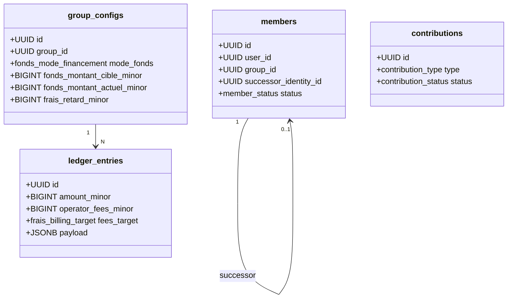

# Analyse de Conception - Vol. 5 : Architecture Technique & Spécifications SQL / Événements
**Projet :** MaSecure — Infrastructure de Règlement Social Automatisé
**Auteur :** Antigravity AI
**Date :** Juin 2026

---

## 1. Contexte d'Architecture
Ce volume décrit l'intégration technique des règles de conception validées lors de notre alignement. Nous définissons ici les extensions du schéma relationnel PostgreSQL, ainsi que la structure des événements de domaine publiés sur NATS JetStream.

---

## 2. Extensions du Schéma Relationnel PostgreSQL

Pour supporter les décisions de conception, nous proposons d'étendre les tables opérationnelles de la manière suivante.



### 2.1. Nouveaux Énumérés (Types ENUM)
```sql
CREATE TYPE fonds_mode_financement AS ENUM ('integral', 'progressif');
CREATE TYPE contribution_type AS ENUM ('cotisation_standard', 'fonds_recouvrement_initial', 'fonds_recouvrement_rattrapage', 'penalite');
CREATE TYPE frais_billing_target AS ENUM ('fonds_recouvrement', 'pot_beneficiaire');
```

### 2.2. Table `group_configs` (Configuration du Groupe)
Nous ajoutons le suivi du financement du fonds de recouvrement :
```sql
ALTER TABLE group_configs 
ADD COLUMN fonds_mode_financement fonds_mode_financement DEFAULT 'integral',
ADD COLUMN fonds_montant_cible_minor BIGINT DEFAULT 0, -- Montant cible total du fonds (ex: 20 000 FCFA = 2000000)
ADD COLUMN fonds_montant_actuel_minor BIGINT DEFAULT 0, -- Montant actuellement capitalisé
ADD COLUMN frais_retard_minor BIGINT DEFAULT 0; -- Pénalité de retard fixe pour réintégration
```

### 2.3. Table `members` (Membres d'un Groupe)
Nous ajoutons le lien vers le successeur en cas de décès :
```sql
ALTER TABLE members 
ADD COLUMN successor_identity_id UUID REFERENCES identities(id) ON DELETE SET NULL;
```

### 2.4. Table `contributions` (Paiements Entrants)
Nous catégorisons les paiements pour identifier s'ils alimentent le fonds ou la cotisation :
```sql
ALTER TABLE contributions 
ADD COLUMN type_contribution contribution_type DEFAULT 'cotisation_standard';
```

### 2.5. Table `ledger_entries` & `transactions` (Registre & Paiements Sortants)
Nous intégrons la répartition des frais Mobile Money :
```sql
ALTER TABLE ledger_entries 
ADD COLUMN operator_fees_minor BIGINT DEFAULT 0, -- Frais prélevés par l'opérateur MM
ADD COLUMN fees_target frais_billing_target DEFAULT 'pot_beneficiaire';
```

---

## 3. Déclencheurs de Sécurité (Triggers PostgreSQL)

Pour garantir la règle d'or « Aucun payout si le fonds de recouvrement progressif n'est pas entièrement financé à la fin du premier cycle », nous préconisons le trigger suivant :

```sql
CREATE OR REPLACE FUNCTION check_first_cycle_payout_readiness()
RETURNS TRIGGER AS $$
DECLARE
    v_mode_fonds fonds_mode_financement;
    v_cible BIGINT;
    v_actuel BIGINT;
    v_cycle_no INT;
BEGIN
    -- 1. Récupérer la configuration du groupe et le numéro de cycle
    SELECT gc.fonds_mode_financement, gc.fonds_montant_cible_minor, gc.fonds_montant_actuel_minor, c.cycle_number
    INTO v_mode_fonds, v_cible, v_actuel, v_cycle_no
    FROM cycles c
    JOIN group_configs gc ON c.config_id = gc.id
    WHERE c.id = NEW.id;

    -- 2. Si premier cycle, mode progressif actif, et versement déclenché
    IF v_cycle_no = 1 AND v_mode_fonds = 'progressif' AND NEW.payout_state = 'pending' THEN
        IF v_actuel < v_cible THEN
            RAISE EXCEPTION 'Payout bloqué : Le fonds de recouvrement progressif n est pas entièrement capitalisé (Actuel: %, Cible: %)', 
                            v_actuel, v_cible;
        END IF;
    END IF;

    RETURN NEW;
END;
$$ LANGUAGE plpgsql;

CREATE TRIGGER enforce_fonds_completion_before_payout
    BEFORE UPDATE OF payout_state ON cycles
    FOR EACH ROW
    WHEN (NEW.payout_state = 'pending' AND OLD.payout_state = 'not_sent')
    EXECUTE FUNCTION check_first_cycle_payout_readiness();
```

---

## 4. Payloads des Événements de Domaine sur NATS JetStream

Ces payloads structurés (format JSON) permettent d'informer les services secondaires de l'état financier du Kernel de manière asynchrone et sécurisée.

### 4.1. Événement `MemberQuarantined`
Publié lorsque le délai de grâce est dépassé après l'utilisation du fonds.
```json
{
  "event_id": "9b1deb4d-3b7d-4bad-9bdd-2b0d7b3dcb6d",
  "event_type": "MemberQuarantined",
  "timestamp": "2026-06-09T13:42:00Z",
  "payload": {
    "group_id": "a8e8071e-0d1a-41ee-8e4d-61ea46ad79a6",
    "member_id": "f5123d44-5544-42b7-8df7-eead2b109eef",
    "grace_period_days": 5,
    "unpaid_debt_minor": 1000000,
    "recovery_fund_used_minor": 1000000
  }
}
```

### 4.2. Événement `MemberSuspended`
Publié lorsque la quarantaine expire sans régularisation.
```json
{
  "event_id": "c7112ea0-8800-4b44-93dd-110022334455",
  "event_type": "MemberSuspended",
  "timestamp": "2026-06-09T13:42:05Z",
  "payload": {
    "group_id": "a8e8071e-0d1a-41ee-8e4d-61ea46ad79a6",
    "member_id": "f5123d44-5544-42b7-8df7-eead2b109eef",
    "missed_contributions_count": 2,
    "penalty_fee_minor": 500000,
    "total_due_for_reinstatement_minor": 2500000
  }
}
```

### 4.3. Événement `RecoveryFundDeducted`
Publié lorsqu'un retard est constaté à la clôture horaire et que le fonds complète le payout.
```json
{
  "event_id": "d1e4b85a-993d-4cba-a1dd-5b6c7d8e9f0a",
  "event_type": "RecoveryFundDeducted",
  "timestamp": "2026-06-09T18:00:01Z",
  "payload": {
    "group_id": "a8e8071e-0d1a-41ee-8e4d-61ea46ad79a6",
    "cycle_id": "11223344-5566-7788-9900-aabbccddeeff",
    "beneficiary_id": "33445566-7788-9900-aabb-ccddeeff0011",
    "deducted_amount_minor": 1000000,
    "remaining_fund_balance_minor": 1500000,
    "defaulting_members": [
      {
        "member_id": "f5123d44-5544-42b7-8df7-eead2b109eef",
        "expected_contribution_minor": 1000000
      }
    ]
  }
}
```
