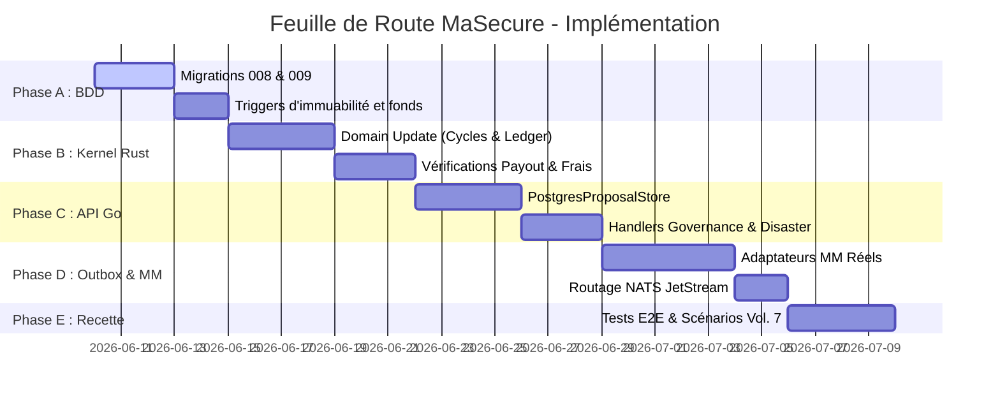

# Analyse de Conception - Vol. 8 : Feuille de Route d'Implémentation & Jalons
**Projet :** MaSecure — Infrastructure de Règlement Social Automatisé
**Auteur :** Antigravity AI
**Date :** Juin 2026

---

## 1. Contexte de Transition
Ce dernier volume fournit la feuille de route logique pour traduire nos spécifications d'analyses et de résolutions en tâches de développement concrètes. Le projet se découpe en 5 étapes successives de réalisation.

---

## 2. Plan d'Implémentation Séquentiel

### Étape 1 : Schéma et Persistance (PostgreSQL)
L'implémentation doit commencer par la couche de données pour offrir un socle stable aux services.
* **Tâche 1.1 : Migration 008 (Gouvernance)**
  * Créer les tables `proposals` et `proposal_votes` avec index uniques sur `(proposal_id, identity_id)` pour empêcher le double vote.
* **Tâche 1.2 : Migration 009 (Extensions Métier)**
  * Ajouter les colonnes de successeurs sur la table `members`.
  * Ajouter les colonnes de fractionnement et de frais de transactions sur `group_configs` et `ledger_entries`.
* **Tâche 1.3 : Déploiement des Triggers**
  * Installer le trigger `enforce_fonds_completion_before_payout` pour garantir l'atomicité de la règle de sécurité à la clôture du premier cycle.

### Étape 2 : Moteur de Décision (Kernel Rust)
Le Kernel financier doit être enrichi de la logique déterministe validée.
* **Tâche 2.1 : Mise à jour du Modèle de Cycle (`domain/cycle.rs`)**
  * Modifier les structures pour vérifier l'état du fonds de recouvrement avant d'autoriser la transition vers `payout_triggered`.
* **Tâche 2.2 : Logique de Frais Opérateurs (`application/payout_service.rs`)**
  * Implémenter le choix d'imputation des frais (déduction sur la cagnotte finale vs déduction sur le solde du fonds de recouvrement).
* **Tâche 2.3 : Traitement de l'Incapacité et du Décès**
  * Code Rust pour le calcul anticipé des cotisations et la désactivation du membre défaillant sans successeur.

### Étape 3 : Services de Gouvernance et d'API (Go)
* **Tâche 3.1 : Implémentation du Store de Proposition (`social/governance/repository.go`)**
  * Remplacer les stubs en mémoire par les requêtes SQL SQLX pour persister les propositions et les votes.
* **Tâche 3.2 : Validation des Votes Actifs**
  * Ajouter un middleware ou une validation dans `social/governance/service.go` pour rejeter les votes émanant de membres ayant un statut `SUSPENDED` ou `QUARANTINE`.
* **Tâche 3.3 : Enregistrement des Sinistres**
  * Exposer la route `/v1/groups/:id/members/:id/disaster` et coder la validation automatique des signatures des témoins requis.

### Étape 4 : Outbox Worker & Connecteurs de Paiement (Go)
* **Tâche 4.1 : Création de l'adaptateur de l'agrégateur Mobile Money réel**
  * Remplacer le mock du simulateur en implémentant l'interface `Provider` avec le protocole réel du partenaire sélectionné (Orange Money, Wave, Wizall).
* **Tâche 4.2 : Publication JetStream**
  * Brancher le dispatcher de messages Go sur le serveur NATS JetStream pour émettre les événements `MemberQuarantined` et `MemberSuspended` à destination du Gateway WhatsApp (pour les relances de relances).

### Étape 5 : Tests d'Intégration & Recette
* **Tâche 5.1 : Exécution des Scénarios 7.A à 7.E**
  * Écrire des scripts d'intégration simulant les retards de cotisations, la clôture, l'utilisation du fonds de recouvrement, le passage en quarantaine et la transition vers la suspension.
* **Tâche 5.2 : Rapport d'Intégrité de Fin de Cycle**
  * Lancer la commande `verify-ledger` après chaque scénario pour s'assurer que la chaîne de hachage SHA-256 ne présente aucune violation.

---

## 3. Prochaine Étape Recommandée
La suite logique immédiate est de **présenter ce dossier complet d'analyses et de conception à votre équipe technique** (développeurs Rust/Go et administrateur de base de données). Ce document servira de base de spécifications de développement pour initialiser la phase d'écriture des migrations PostgreSQL (Étape 1).
